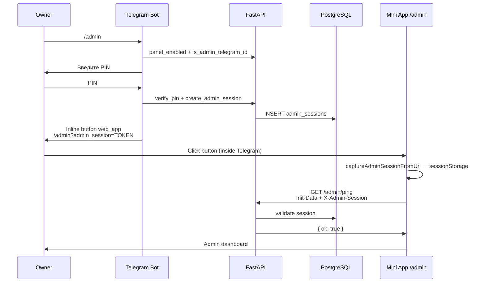
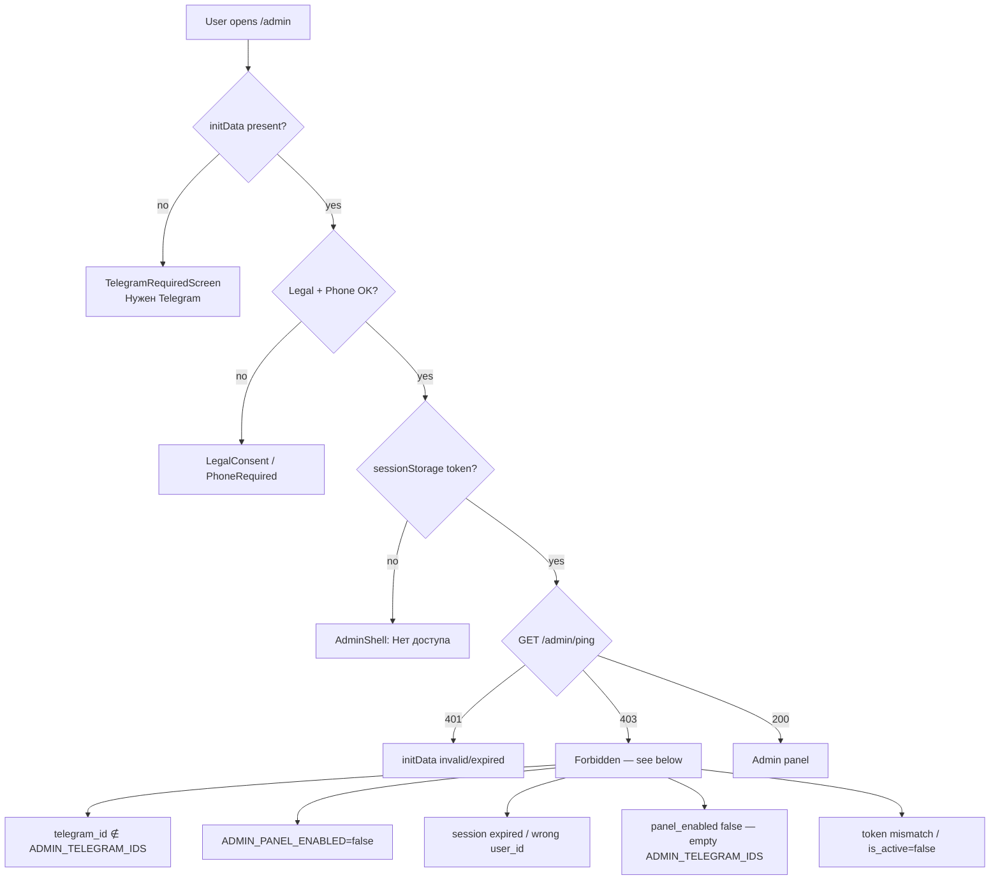

# Admin Panel Incident Audit

Аудит инцидента: **админка перестала работать и требует Telegram Login**.  
Репозиторий: `ai-food-family` · только анализ, **код не изменялся** (2026-06-03).

---

## Executive Summary

Админ-панель использует **двухфакторную схему доступа**:

1. **Telegram Mini App auth** (`X-Telegram-Init-Data`) — обязателен для **любого** экрана, включая `/admin`, через глобальный `AppGate`.
2. **Admin PIN session** (`X-Admin-Session`) — выдаётся ботом после `/admin` + PIN, хранится в `sessionStorage`.

Экран **«Нужен Telegram»** (`TelegramRequiredScreen`) появляется **до** проверки admin-сессии. Это не отдельный «Telegram Login widget», а блокировка приложения при отсутствии `initData` (открытие `/admin` в обычном браузере, вне Mini App).

Сообщение **«Нет доступа»** в `AdminShell` — другой слой: Telegram auth уже есть, но `GET /admin/ping` вернул 403 (нет/просрочена admin-сессия, ID не в whitelist, и т.д.).

---

## Карта доступа

```mermaid
flowchart TD
  U[User / Owner] --> TG{Telegram Mini App?}
  TG -->|нет| GATE_TG[[TelegramRequiredScreen<br/>Нужен Telegram]]
  TG -->|да| INIT[WebApp.initData]
  INIT --> API_AUTH[POST /auth/telegram<br/>validate HMAC]
  API_AUTH -->|fail| GATE_TG
  API_AUTH -->|ok| AG{AppGate}
  AG -->|no legal| GATE_LEGAL[[LegalConsentScreen]]
  AG -->|no phone| GATE_PHONE[[PhoneRequiredScreen]]
  AG -->|ok| ADMIN_UI[/admin/* AdminShell]

  BOT[Telegram Bot /admin] --> PIN_CHECK{ADMIN_TELEGRAM_IDS?}
  PIN_CHECK -->|нет| DENY_BOT[Откройте ПланАм через меню]
  PIN_CHECK -->|да| PIN[User enters ADMIN_PIN]
  PIN -->|ok| SESS[(admin_sessions)]
  SESS --> BTN[WebApp button<br/>/admin?admin_session=TOKEN]
  BTN --> CAPTURE[AdminSessionCapture<br/>sessionStorage]
  CAPTURE --> ADMIN_UI

  ADMIN_UI --> PING[GET /admin/ping]
  PING --> DEPS{require_admin_user}
  DEPS -->|403| DENY_UI[Нет доступа]
  DEPS -->|200 ok| PANEL[Admin Dashboard]

  classDef gate fill:#fce7f3,stroke:#db2777
  classDef deny fill:#fee2e2,stroke:#dc2626
  class GATE_TG,GATE_LEGAL,GATE_PHONE gate
  class DENY_BOT,DENY_UI deny
```

---

## 1. Admin routes (Frontend)

| Route | Page file | Component |
|-------|-----------|-----------|
| `/admin` | `apps/web/app/admin/page.tsx` | `AdminDashboard` (tab: summary) |
| `/admin/users` | `apps/web/app/admin/users/page.tsx` | `AdminDashboard` (tab: users) |
| `/admin/users/[id]` | `apps/web/app/admin/users/[id]/page.tsx` | `AdminUserDetailPage` |
| `/admin/families` | `apps/web/app/admin/families/page.tsx` | `AdminDashboard` (tab: families) |
| `/admin/families/[id]` | `apps/web/app/admin/families/[id]/page.tsx` | `AdminFamilyDetailPage` |
| `/admin/subscriptions` | `apps/web/app/admin/subscriptions/page.tsx` | `AdminDashboard` (tab: subscriptions) |
| `/admin/ams` | `apps/web/app/admin/ams/page.tsx` | `AdminDashboard` (tab: ams) |
| `/admin/openai` | `apps/web/app/admin/openai/page.tsx` | `AdminOpenAiPage` |
| `/admin/errors` | `apps/web/app/admin/errors/page.tsx` | `AdminErrorsPage` |

**Layout:** `apps/web/app/admin/layout.tsx` → `AdminShell` (единственный admin layout).

**Навигация:** табы в `AdminShell` (не bottom nav). Bottom nav **скрыта** (`HIDDEN_NAV_PREFIXES`: `/admin`).

---

## 2. Admin API endpoints (Backend)

Префикс: `/admin` · Router: `apps/api/app/routers/admin.py`  
**Все endpoints** защищены `Depends(require_admin_user)`.

| Method | Path |
|--------|------|
| GET | `/admin/ping` |
| GET | `/admin/summary` |
| GET | `/admin/users` |
| GET | `/admin/users/{user_id}` |
| DELETE | `/admin/users/{user_id}` |
| POST | `/admin/users/{user_id}/block` |
| POST | `/admin/users/{user_id}/unblock` |
| POST | `/admin/users/{user_id}/reset/onboarding` |
| POST | `/admin/users/{user_id}/reset/phone` |
| POST | `/admin/users/{user_id}/reset/legal` |
| POST | `/admin/users/{user_id}/reset/nutrition` |
| POST | `/admin/users/{user_id}/subscription/grant` |
| POST | `/admin/users/{user_id}/subscription/extend` |
| POST | `/admin/users/{user_id}/subscription/disable` |
| POST | `/admin/users/{user_id}/subscription/change-plan` |
| POST | `/admin/users/{user_id}/ams/add` |
| POST | `/admin/users/{user_id}/ams/remove` |
| POST | `/admin/users/{user_id}/ams/reset` |
| GET | `/admin/families` |
| GET | `/admin/families/{family_id}` |
| PATCH | `/admin/families/{family_id}` |
| POST | `/admin/families/{family_id}/block` |
| POST | `/admin/families/{family_id}/unblock` |
| DELETE | `/admin/families/{family_id}` |
| POST | `/admin/families/{family_id}/transfer-owner` |
| DELETE | `/admin/families/{family_id}/members/{member_id}` |
| POST | `/admin/families/{family_id}/subscription/grant` |
| POST | `/admin/families/{family_id}/subscription/extend` |
| POST | `/admin/families/{family_id}/subscription/disable` |
| POST | `/admin/families/{family_id}/subscription/change-plan` |
| POST | `/admin/families/{family_id}/ams/add` |
| POST | `/admin/families/{family_id}/ams/remove` |
| POST | `/admin/families/{family_id}/ams/reset` |
| GET | `/admin/subscriptions` |
| GET | `/admin/plans` |
| POST | `/admin/subscriptions/grant` |
| POST | `/admin/ams/grant` |
| POST | `/admin/ams/deduct` |
| POST | `/admin/ams/grant-family` |
| GET | `/admin/ams/summary` |
| GET | `/admin/ams/transactions` |
| GET | `/admin/openai` |
| GET | `/admin/errors` |
| GET | `/admin/ai-usage` |
| GET | `/admin/backups` |
| POST | `/admin/backups/create` |

**Клиент:** `apps/web/lib/admin/api.ts` — добавляет заголовки `X-Telegram-Init-Data`, `X-Admin-Session`, `X-App-Mode: personal`.

---

## 3. Role checks и auth dependencies

### Backend (`apps/api/app/deps.py`)

| Dependency | Назначение | Используется в admin |
|------------|------------|----------------------|
| `get_current_user` | `X-Telegram-Init-Data` → validate HMAC, user lookup | ✅ базовый слой |
| `get_verified_user` | + legal, phone, block checks | ❌ **не** для admin |
| `require_admin_user` | + `ADMIN_PANEL_ENABLED` + telegram_id ∈ whitelist + `X-Admin-Session` | ✅ все `/admin/*` |

```python
# require_admin_user (упрощённо)
if not settings.admin_panel_enabled_flag: → 403
if user.telegram_id not in ADMIN_TELEGRAM_IDS: → 403
require_valid_session(db, user, x_admin_session)  # → 403 if invalid
```

**Важно:** Admin API **не требует** phone/legal на backend, но frontend `AppGate` **требует** — расхождение слоёв.

### Frontend

| Компонент | Проверка |
|-----------|----------|
| `TelegramProvider` | `initData` → `POST /auth/telegram` |
| `AppGate` | Telegram / Legal / Phone |
| `AdminShell` | `pingAdmin()` → `GET /admin/ping` |
| `AdminSessionCapture` | `?admin_session=` → `sessionStorage` |

### Middleware / decorators

| Слой | Admin-specific? |
|------|-----------------|
| `AdminErrorLoggingMiddleware` (`main.py`) | Логирует 5xx в `admin_error_logs`, **не** auth |
| FastAPI `Depends(require_admin_user)` | ✅ единственная admin auth |
| Next.js `middleware.ts` | **отсутствует** |

**RBAC:** бинарная модель — пользователь либо в `ADMIN_TELEGRAM_IDS`, либо нет. Ролей `owner`/`moderator` нет.

---

## 4. Admin database tables

### `admin_sessions`

| Column | Purpose |
|--------|---------|
| `id` | PK |
| `user_id` | FK → `users.id` (must match initData user) |
| `telegram_id` | Admin telegram id |
| `session_token` | 32-byte url-safe token → `X-Admin-Session` |
| `is_active` | Default true |
| `created_at`, `expires_at`, `last_used_at` | TTL **12 hours** |

**Create:** `admin_auth.create_admin_session()` после успешного PIN в боте.  
**Validate:** `get_valid_session()` — token + user_id + active + not expired + `panel_enabled()`.

### `admin_login_attempts`

| Column | Purpose |
|--------|---------|
| `telegram_id` | Who tried PIN |
| `success` | bool |
| `created_at` | Timestamp |

**Rate limit:** 5 failed attempts / 15 min → lockout (`is_pin_locked`).

### `admin_actions`

Audit log: `action_type`, `admin_user_id`, `target_type`, `target_id`, `metadata_json`.  
Login записывается как `admin_login`.

### `admin_error_logs`

Server errors (5xx middleware + manual). **Не участвует в auth**, только observability.

**DDL:** `apps/api/app/database_migrations.py` (lines ~565–612) · Models: `apps/api/app/models/admin.py`.

---

## 5. Как должен работать вход (design intent)



**Требования по задумке:**

1. Owner `telegram_id` ∈ `ADMIN_TELEGRAM_IDS`
2. `ADMIN_PIN` задан на сервере и совпадает с вводом в боте
3. `ADMIN_PANEL_ENABLED=true` (default)
4. Вход **только через бота** (`/admin` → PIN → кнопка WebApp)
5. Mini App открыт **внутри Telegram** (для `initData`)
6. Пользователь прошёл **legal + phone** gates (`AppGate`)
7. Admin session **не истекла** (12h) и есть в `sessionStorage`

---

## 6. Как работает сейчас (as implemented)

### Provider stack (все routes, включая `/admin`)

```
TelegramProvider → AppGate → AppModeProvider → AppShell → page
                      ↑
              blocks BEFORE AdminShell
```

### AdminShell logic

1. Ждёт `initData` из `TelegramProvider`
2. Если `!initData` → сразу `allowed=false` → «Нет доступа»
3. Иначе `GET /admin/ping` с `X-Admin-Session` из `sessionStorage`
4. `200 + {ok:true}` → рендер панели

### Session capture

- URL: `{TELEGRAM_WEBAPP_URL}/admin?admin_session={token}` (`admin_auth.admin_webapp_url`)
- `AdminSessionCapture` пишет token в `sessionStorage` (`planam_admin_session`)
- Query param удаляется из URL (`history.replaceState`)

### Bot entry

- Command: `/admin` → `telegram_bot.py` → `admin_bot.handle_admin_command`
- PIN state: `awaiting_admin_pin` in `telegram_bot_sessions`
- Non-admin users: «Откройте ПланАм через меню» (same as disabled panel)

---

## 7. Где происходит отказ (failure points)



### HTTP codes на `/admin/ping`

| Code | Причина |
|------|---------|
| **401** | Нет/невалидный `X-Telegram-Init-Data` |
| **403** | Не admin ID / нет session / panel disabled / expired session |
| **200** | `{ "ok": true }` |

Frontend: любой non-OK на ping → `pingAdmin()` returns `false` → «Нет доступа».

---

## 8. Почему появляется «Telegram Login» / «Нужен Telegram»

В коде **нет** Telegram Login Widget. Пользователь видит `TelegramRequiredScreen`:

```tsx
// apps/web/components/auth/TelegramRequiredScreen.tsx
<h1>Нужен Telegram</h1>
<p>{message}</p>  // default: "Откройте приложение через Telegram"
```

**Триггеры (`TelegramProvider` + `AppGate`):**

| # | Условие | Сообщение |
|---|---------|-----------|
| 1 | Открыт `/admin` в **desktop/mobile browser** (не Mini App) | «Откройте приложение через Telegram» |
| 2 | `WebApp.initData` пустой (Telegram Desktop/WebK flaky load) | то же |
| 3 | `POST /auth/telegram` failed (wrong `TELEGRAM_BOT_TOKEN`, expired initData >24h) | текст ошибки валидации |
| 4 | Production site opened outside Telegram, dev-login disabled (`ENVIRONMENT=production`) | «Откройте приложение через Telegram» |

**Критично:** при `TelegramRequiredScreen` компонент `AdminShell` **не монтируется** → `AdminSessionCapture` **не выполняется** → `?admin_session=` из URL **теряется**, даже если пользователь кликнул кнопку бота, но открылся external browser.

---

## 9. Может ли владелец попасть в админку?

| Сценарий | Результат |
|----------|-----------|
| Bot `/admin` → PIN → кнопка WebApp **в Telegram** | ✅ **Должно работать** при корректных env |
| Закладка `https://domain/admin` в браузере | ❌ TelegramRequired |
| Закладка `/admin` в Telegram без PIN-сессии | ❌ «Нет доступа» |
| Повторный вход после закрытия Mini App (sessionStorage cleared) | ❌ нужен новый `/admin` + PIN |
| Dev localhost без `ADMIN_TELEGRAM_IDS=999999999` | ❌ 403 (dev user id = 999999999) |
| Owner с reset phone/legal (self or admin action) | ❌ AppGate блокирует до повторного consent |
| PIN lockout (5 fails / 15 min) | ❌ бот: «Слишком много попыток» |

**Вывод:** владелец **может** попасть, но **только** через полный bot flow внутри Telegram + completed onboarding gates. Прямой URL недоступен by design.

---

## 10. Environment variables

| Variable | Layer | Effect if missing/wrong |
|----------|-------|-------------------------|
| `ADMIN_TELEGRAM_IDS` | API + Bot | `panel_enabled()=false`, bot denies, API 403 |
| `ADMIN_PIN` | API + Bot | PIN always fails, sessions never created |
| `ADMIN_PANEL_ENABLED` | API | `require_admin_user` → 403 (default: `true`) |
| `TELEGRAM_BOT_TOKEN` | API | initData validation fails → TelegramRequired |
| `TELEGRAM_WEBAPP_URL` | Bot | Wrong admin button URL (`admin_webapp_url`) |
| `NEXT_PUBLIC_API_URL` | Web | ping hits wrong API / CORS issues |
| `BACKEND_CORS_ORIGINS` | API | Browser blocks admin API calls |
| `ENVIRONMENT` | API | `production` disables dev-login fallback |
| `DATABASE_URL` | API | sessions not persisted |

**Примеры:** `.env.example`, `.env.production.example`, `docs/DEPLOY_SAFE.md`.

---

## 11. Файлы, участвующие в процессе

### Frontend

| File | Role |
|------|------|
| `apps/web/components/AppProviders.tsx` | Wraps AppGate around all pages |
| `apps/web/components/TelegramProvider.tsx` | initData auth |
| `apps/web/components/auth/AppGate.tsx` | Telegram/Legal/Phone gates |
| `apps/web/components/auth/TelegramRequiredScreen.tsx` | «Нужен Telegram» UI |
| `apps/web/lib/telegram-webapp.ts` | WebApp loader + polling |
| `apps/web/lib/dev-auth.ts` | Dev fallback (localhost only) |
| `apps/web/app/admin/layout.tsx` | Admin layout |
| `apps/web/components/admin/AdminShell.tsx` | ping + access UI |
| `apps/web/components/admin/AdminSessionCapture.tsx` | URL token → storage |
| `apps/web/lib/admin/session.ts` | sessionStorage CRUD |
| `apps/web/lib/admin/api.ts` | Admin API client + headers |
| `apps/web/lib/api-base.ts` | API URL resolution |

### Backend

| File | Role |
|------|------|
| `apps/api/app/routers/admin.py` | All admin endpoints |
| `apps/api/app/deps.py` | `require_admin_user` |
| `apps/api/app/services/admin_auth.py` | PIN, sessions, lockout |
| `apps/api/app/services/admin_bot.py` | `/admin` bot flow |
| `apps/api/app/services/telegram_bot.py` | Routes `/admin` command |
| `apps/api/app/models/admin.py` | ORM models |
| `apps/api/app/database_migrations.py` | Table DDL |
| `apps/api/app/config.py` | Env settings |
| `apps/api/app/services/admin_audit.py` | Action logging |
| `apps/api/app/services/admin_errors.py` | Error logging (not auth) |

---

## 12. Сценарии, приводящие к отказу

| # | Scenario | Symptom | Layer |
|---|----------|---------|-------|
| 1 | Open `/admin` in Chrome/Safari directly | «Нужен Telegram» | AppGate |
| 2 | Bot button opens external browser (some clients) | «Нужен Telegram» + lost session token | AppGate + capture |
| 3 | Never ran `/admin` + PIN in bot | «Нет доступа» | Admin session |
| 4 | sessionStorage cleared (new WebView session) | «Нет доступа» | Admin session |
| 5 | Session expired (>12h) | «Нет доступа» | DB `admin_sessions` |
| 6 | `ADMIN_TELEGRAM_IDS` empty or wrong ID | Bot silent deny / API 403 | Config |
| 7 | `ADMIN_PIN` empty or changed | PIN fails, no session | Config |
| 8 | 5 wrong PINs in 15 min | Bot lockout | `admin_login_attempts` |
| 9 | `TELEGRAM_WEBAPP_URL` mismatch (http vs https, wrong domain) | Button opens wrong host | Config |
| 10 | `TELEGRAM_BOT_TOKEN` mismatch prod/staging | Auth error on initData | Telegram auth |
| 11 | Legal/phone not completed | LegalConsent / PhoneRequired | AppGate |
| 12 | Admin reset own phone/legal via panel | AppGate blocks | Self-inflicted |
| 13 | CORS / wrong `NEXT_PUBLIC_API_URL` | ping fails silently → «Нет доступа» | Network |
| 14 | User blocked (`is_blocked=true`) | 403 on initData user | get_current_user |
| 15 | Dev mode: telegram_id 999999999 not in ADMIN_TELEGRAM_IDS | «Нет доступа» | Config |

---

## Diagnostic SQL (read-only)

```sql
-- Active admin sessions
SELECT id, user_id, telegram_id, is_active, created_at, expires_at, last_used_at
FROM admin_sessions
WHERE is_active = TRUE AND expires_at > NOW()
ORDER BY created_at DESC;

-- Recent PIN attempts (lockout check)
SELECT telegram_id, success, created_at
FROM admin_login_attempts
WHERE created_at > NOW() - INTERVAL '15 minutes'
ORDER BY created_at DESC;

-- Owner user record
SELECT id, telegram_id, username, is_blocked, accepted_terms, phone_number, phone_skipped
FROM users
WHERE telegram_id = <YOUR_TELEGRAM_ID>;

-- Recent admin logins
SELECT * FROM admin_actions
WHERE action_type = 'admin_login'
ORDER BY created_at DESC LIMIT 10;
```

---

## Root Cause Analysis

### Наиболее вероятная причина

**Открытие `/admin` вне Telegram Mini App** (прямой URL в браузере, закладка, или кнопка WebApp открыла external browser) → `WebApp.initData` отсутствует → `AppGate` показывает **`TelegramRequiredScreen` («Нужен Telegram»)** до любой admin-проверки.

Это **ожидаемое поведение текущей архитектуры**, воспринимаемое пользователем как «админка требует Telegram Login». Админка **никогда не была** standalone browser app — только Mini App + bot PIN flow.

**Уровень уверенности: высокий (≈85%)** — подтверждается порядком `AppProviders` → `AppGate` перед `AdminShell`, отсутствием bypass для `/admin`, и отсутствием Telegram Login Widget в коде.

### Альтернативные причины

| # | Cause | Symptom | Confidence |
|---|-------|---------|------------|
| A | **Потеря admin session** (sessionStorage, expiry 12h, не повторили `/admin`+PIN) | «Нет доступа» (не «Нужен Telegram») | Высокая (~75%) |
| B | **`ADMIN_TELEGRAM_IDS` / `ADMIN_PIN` не заданы или сброшены** при деплое | Bot «Откройте ПланАм» / API 403 | Средне-высокая (~70%) |
| C | **`TELEGRAM_WEBAPP_URL` или `NEXT_PUBLIC_API_URL` mismatch** после смены домена | Auth или ping fails | Средняя (~60%) |
| D | **AppGate legal/phone** блокирует owner после reset | Legal/Phone screen, не admin | Средняя (~55%) |
| E | **PIN lockout** (5 fails) | Bot: «15 минут» | Средняя (~50%) |
| F | **initData validation fail** (bot token rotation, clock skew) | TelegramRequired с текстом ошибки | Низкая-средняя (~40%) |
| G | **`admin_session` URL not captured** (race: AppGate blocks before capture) | Token in URL lost | Средняя (~50%) при external open |

### Что маловероятно

- Баг в `admin_sessions` DDL (таблицы создаются idempotent migration)
- `AdminErrorLoggingMiddleware` блокирует доступ (только логирует)
- Отсутствие RBAC role «owner» (by design — whitelist IDs)

---

## Minimal Recovery Plan

**Без изменения кода.** Операционные шаги для восстановления доступа владельца.

### Phase 1 — Verify environment (5 min)

1. На сервере API проверить `.env`:
   ```bash
   # Must be set (replace with real values)
   ADMIN_TELEGRAM_IDS=<owner_telegram_id>
   ADMIN_PIN=<secret_pin>
   ADMIN_PANEL_ENABLED=true
   TELEGRAM_BOT_TOKEN=<bot_token>
   TELEGRAM_WEBAPP_URL=https://<production_domain>
   ENVIRONMENT=production
   ```
2. Узнать свой Telegram ID: `@userinfobot` или поле `telegram_id` в таблице `users`.
3. После изменения `.env`: `docker compose -f docker-compose.prod.yml restart api`.

### Phase 2 — Correct login procedure (2 min)

1. Открыть **чат с ботом** (не браузер).
2. Отправить **`/admin`**.
3. Ввести **PIN** (из `ADMIN_PIN`).
4. Нажать inline-кнопку **«📊 Открыть админ-панель»** (открывается Mini App **внутри Telegram**).
5. **Не** копировать URL в браузер и **не** использовать закладку `/admin`.

### Phase 3 — If still «Нужен Telegram»

1. Убедиться, что Mini App открывается через **кнопку бота**, не через Menu Button «Открыть ПланАм» → ручной переход на `/admin`.
2. Обновить Telegram client (Desktop/Mobile).
3. Проверить `TELEGRAM_BOT_TOKEN` совпадает с ботом, через которого открываете Mini App.
4. Пройти legal consent + phone в основном приложении (`/`), затем повторить Phase 2.

### Phase 4 — If «Нет доступа» (Telegram OK)

1. Повторить `/admin` + PIN (создаёт новую `admin_sessions` запись).
2. Проверить SQL: active sessions для вашего `user_id` (см. выше).
3. Проверить lockout: `admin_login_attempts` — подождать 15 min или убедиться в правильном PIN.
4. Проверить browser devtools → Network → `GET /admin/ping`:
   - Headers: `X-Telegram-Init-Data`, `X-Admin-Session` present?
   - Status 403 → сверить `ADMIN_TELEGRAM_IDS` с вашим `telegram_id`.

### Phase 5 — If CORS/API issues

1. `curl -s https://<domain>/api/health` — API alive.
2. `NEXT_PUBLIC_API_URL` на web-контейнере = `https://<domain>/api`.
3. `BACKEND_CORS_ORIGINS` включает `https://<domain>`.

### Phase 6 — Emergency DB inspection (read-only)

```sql
SELECT telegram_id, success, COUNT(*) 
FROM admin_login_attempts 
WHERE created_at > NOW() - INTERVAL '1 hour'
GROUP BY 1, 2;
```

Если lockout подтверждён — подождать 15 минут (код не меняем, записи не удаляем без явного решения).

### Success criteria

- `GET /admin/ping` → `200 {"ok":true}` с headers Init-Data + Admin-Session
- Admin dashboard renders with tabs
- `admin_actions` содержит свежую запись `admin_login`

### Post-recovery recommendations (documentation only)

- Document canonical entry: **bot `/admin` only**, not browser URL
- Add `ADMIN_PIN` to `DEPLOY_SAFE.md` checklist (currently omits PIN)
- After deploy, verify `ADMIN_TELEGRAM_IDS` not overwritten by empty `env.backup` restore
- Consider monitoring: count of 403 on `/admin/ping` in `admin_error_logs`

---

## Related docs

- [`docs/SCREEN_MAP.md`](SCREEN_MAP.md) — admin screens table
- [`docs/NAVIGATION_GRAPH.md`](NAVIGATION_GRAPH.md) — admin subgraph
- [`docs/DEPLOY_SAFE.md`](DEPLOY_SAFE.md) — deploy + `ADMIN_TELEGRAM_IDS`
- [`docs/TEST_CHECKLIST.md`](TEST_CHECKLIST.md) — admin test cases (items 23–25)
