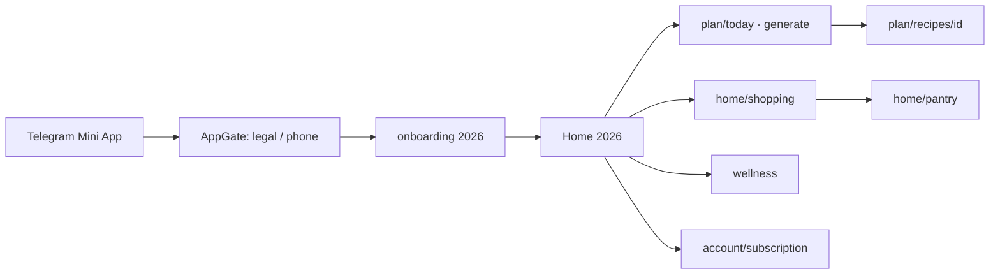

# PLANAM 2026 — Beta Readiness Audit

**Дата:** 2026-06-03  
**Ветка:** `sprint-0/planam-2026-foundation`  
**Метод:** статический аудит кода (`apps/web`, `apps/api`) и отчётов Sprint 0–9; **код не менялся**.

**Эталоны:** [`PLANAM_UX_UI_2026_MASTER_SPEC.md`](PLANAM_UX_UI_2026_MASTER_SPEC.md) · [`PLANAM_CONVERSION_FUNNEL_2026.md`](PLANAM_CONVERSION_FUNNEL_2026.md) · [`PLANAM_PAYMENT_ARCHITECTURE_2026.md`](PLANAM_PAYMENT_ARCHITECTURE_2026.md) · [`SECURITY_FIX_ROADMAP.md`](SECURITY_FIX_ROADMAP.md) · [`SPRINT_0_6_AUDIT.md`](SPRINT_0_6_AUDIT.md) (устарел частично — см. Sprint 7–9)

**Целевая конфигурация закрытой беты (рекомендуется):**

```env
NEXT_PUBLIC_PLANAM_UI_2026=true
NEXT_PUBLIC_PLANAM_ROUTE_REDIRECTS=true
NEXT_PUBLIC_PLANAM_DEFER_PHONE_GATE=true
TELEGRAM_WEBHOOK_SECRET=<set>
ADMIN_PIN=<set>
```

---

## Итоговые оценки (0–10)

| Область | Оценка | Кратко |
|---------|--------|--------|
| **UX** | **7** | Основной цикл 2026 закрыт; разрывы на legacy-периферии и deep links без redirects |
| **Architecture** | **7** | Strangler Fig + flags работают; двойной UI и legacy-компоненты в репо |
| **Performance** | **7** | Без тяжёлых графиков; Home/Wellness — 5–6 параллельных запросов на вход |
| **Security** | **4** | P0-3, P0-4, P0-5 не закрыты; P0-1 частично |
| **Monetization** | **6** | UX и trial готовы; оплаты и AMS packs — заглушки (ожидаемо) |
| **Admin** | **6** | Работает при PIN + `admin_session`; legacy UI; зависит от `initData` |
| **Beta Readiness** | **6** | Закрытая бета с условиями — да; открытый prod — нет |

### Вердикт: **GO WITH CONDITIONS**

| Решение | Когда |
|---------|--------|
| **GO WITH CONDITIONS** | Закрытая бета (10–50 доверенных пользователей), оба UI-флага включены, webhook secret и admin PIN на staging/prod, ops знают про security gaps |
| **NO GO** | Публичный запуск, открытый prod без Phase 0 security, включение только `UI_2026` без `ROUTE_REDIRECTS`, массовый маркетинг |

---

## 1. UX — путь нового пользователя

### Целевой маршрут (при флагах выше)



### Пошаговая проверка

| Шаг | Маршрут | Статус | Комментарий |
|-----|---------|--------|-------------|
| 1 | Auth + legal | ✅ | `TelegramProvider` → `AppGate` |
| 2 | Onboarding WOW | ✅* | `Onboarding2026Flow` только при `UI_2026`; redirect только если `is_new` **и** нет `planam_wow_complete` |
| 3 | Home | ✅ | `Home2026`, `GET /menus/overview`, Hero, rail, snapshot, monetization banner |
| 4 | Plan today | ✅ | `PlanToday2026`, timeline, replace, outcome |
| 5 | Plan generate | ✅ | `PlanGenerate2026` |
| 6 | Recipe | ✅ | Каталог + immersive detail, sheets add/replace |
| 7 | Shopping | ✅ | `Shopping2026` при `/home/shopping` |
| 8 | Pantry | ✅ | `Pantry2026` |
| 9 | Wellness | ✅ | `WellnessHome2026` (Sprint 8) |
| 10 | Subscription | ✅ | `SubscriptionHub2026`, `AmsHub2026`, checkout stub |

\* **Разрыв:** существующий пользователь (`is_new=false`) без `planam_wow_complete` **не** принудительно ведётся в `/onboarding` — попадает сразу на Home. Для returning beta-тестеров это может быть ок; для «чистого» first-time UX на 2026 — только новые в БД.

### Разрывы сценариев (Critical / High для UX беты)

| # | Разрыв | Severity | Условие |
|---|--------|----------|---------|
| U1 | `/menu` рендерит **legacy `MenuHub`** | **Critical** | `UI_2026=true`, **`ROUTE_REDIRECTS=false`** (дефолт в `.env.example`) |
| U2 | `/shopping`, `/shopping/pantry` — **legacy UI** | **Critical** | То же — без middleware redirect |
| U3 | `/plan/favorites`, `/plan/collections` в migration map — **страниц нет** | High | Redirect с `/menu/favorites` → 404 |
| U4 | Account: **Профиль / Семья / Уведомления / Настройки** — legacy `ScreenLayout` | High | Визуальный и IA-разрыв с 2026 |
| U5 | `/account/nutrition`, `/profile/nutrition` — **нет 2026-экрана** | Medium | CTA «настроить питание» ведут на legacy |
| U6 | Два insight на Home (Wellness chip + `AIInsight2026` из меню) | Low | Не блокер, возможна избыточность |
| U7 | `?meal_outcome=1` на Home и `?outcome=1` на Plan — два входа | Low | Оба работают |

**Митигация U1–U2 для беты:** обязательно `NEXT_PUBLIC_PLANAM_ROUTE_REDIRECTS=true` в env сборки beta.

---

## 2. Feature flags — поведение при включении «по умолчанию»

Источник: `apps/web/lib/planam/feature-flags.ts`, `apps/web/.env.example`, `middleware.ts`.

| Flag | Default в `.env.example` | Если включить только этот |
|------|------------------------|----------------------------|
| `NEXT_PUBLIC_PLANAM_UI_2026` | `false` | **2026 shell** (`AppShell2026`), Home/Plan/Дом/Wellness/Account monetization; **но** старые URL `/menu`, `/shopping` остаются legacy без второго флага |
| `NEXT_PUBLIC_PLANAM_ROUTE_REDIRECTS` | `false` | **Ничего**, пока `UI_2026=false` (middleware требует оба) |
| `NEXT_PUBLIC_PLANAM_DEFER_PHONE_GATE` | `true` | Телефон **после** WOW (`shouldBlockForPhone` + `isWowComplete`) |

### Рекомендуемый «beta default»

```env
NEXT_PUBLIC_PLANAM_UI_2026=true
NEXT_PUBLIC_PLANAM_ROUTE_REDIRECTS=true
NEXT_PUBLIC_PLANAM_DEFER_PHONE_GATE=true
```

### Что сломается / удивит при массовом включении без подготовки

- Пользователи с закладками на `/menu`, `/health`, `/subscription` попадут на 2026 только с **обоими** флагами.
- Bot Web App URL должен открывать сборку с **build-time** `UI_2026=true` (Next public env).
- `select-plan` на checkout stub по-прежнему меняет тариф в БД — не путать с реальной оплатой.

---

## 3. Карта legacy vs 2026

Условие: **`NEXT_PUBLIC_PLANAM_UI_2026=true`**.

| Маршрут / зона | Класс | Реализация |
|----------------|-------|------------|
| `/` | **Новый** | `Home2026` |
| `/onboarding` | **Новый** | `Onboarding2026Flow` |
| `/home/shopping` | **Новый** | `Shopping2026` |
| `/home/pantry` | **Новый** | `Pantry2026` |
| `/plan`, `/plan/today`, `/plan/generate` | **Новый** | `plan-2026/*` |
| `/plan/recipes`, `/plan/recipes/[id]` | **Новый** | `RecipeCatalog2026`, `RecipeDetail2026` |
| `/wellness`, `/wellness/chat` | **Новый** | `WellnessHome2026`, `WellnessChat2026` |
| `/account` | **Новый** (hub) | `AccountHub2026` |
| `/account/subscription`, `/account/ams`, checkout | **Новый** | `monetization-2026/*` |
| `/menu/current`, `/menu/generate` | **Redirect** | page-level → plan (flag on) |
| `/health/*`, `/progress`, `/subscription` | **Redirect** | page-level → wellness / account |
| `/menu` (hub) | **Legacy*** | `MenuHub` без redirect страницы |
| `/shopping`, `/shopping/pantry` | **Legacy*** | без redirect страницы |
| `/profile`, `/family`, `/notifications`, `/settings` | **Legacy** | старые экраны, tab Account |
| `/admin/*` | **Legacy** | намеренно вне 2026 DS |
| `AmaConfirmDialog`, `NutritionistChat` | **Частично** | legacy UI внутри 2026 flows |
| `PaywallSheet2026` | **Новый** | + `PaywallProvider` |
| `/dev/planam-2026` | **Новый** | preview DS |

\* При `ROUTE_REDIRECTS=true` → middleware переводит на `/plan`, `/home/shopping` и т.д.

---

## 4. Security — P0-1 … P0-5

По [`SECURITY_FIX_ROADMAP.md`](SECURITY_FIX_ROADMAP.md) и коду на ветке.

| ID | Статус | Блокирует закрытую бету? | Детали |
|----|--------|---------------------------|--------|
| **P0-1** Admin + AppGate | **Частично закрыт** | **Условно** | `AppGate` bypass для `/admin`; `captureAdminSessionFromUrl` в `AppProviders` + `AppGate`; `AdminSessionCapture`. `AdminShell` всё ещё требует `initData` для `pingAdmin` — без Telegram Mini App панель не откроется |
| **P0-2** initData diagnostics | **Не закрыт** | Нет | Нет обязательного dev-only логирования в roadmap sense |
| **P0-3** Webhook fail-closed | **Не закрыт** | **Да (prod)** | `telegram_bot.py`: если `TELEGRAM_WEBHOOK_SECRET` пуст — **валидация пропускается** (`return` без проверки) |
| **P0-4** Debug webhook GET | **Не закрыт** | **Да (prod)** | Публичные `GET /telegram/webhook/info`, `/webhook/url` |
| **P0-5** Recipes global write | **Не закрыт** | **Да (широкая бета)** | `POST /recipes` — любой `get_verified_user`, без draft-only guard |

**Phase 0 exit (roadmap):** P0-1 + P0-3 + P0-5 + P0-6 — **не выполнен полностью**.

### Для закрытой беты (минимум ops)

1. Задать `TELEGRAM_WEBHOOK_SECRET` на окружении beta/prod.
2. Ограничить доступ к `/telegram/webhook/info` на nginx или закрыть в коде до беты.
3. Не приглашать недоверенных пользователей, пока P0-5 открыт (или отключить `POST /recipes` на API gateway).
4. Проверить `/admin` flow: bot PIN → `admin_session` → панель.

---

## 5. Payments — реально vs заглушка

| Возможность | Статус | API / UI |
|-------------|--------|----------|
| Просмотр тарифа, Амов, trial days | **Работает** | `GET /subscriptions/me` |
| Списание Амов на AI-действия | **Работает** | server + `AmaConfirmDialog` / чат |
| Выбор тарифа без оплаты | **Заглушка (staging)** | `POST /subscriptions/select-plan` → `PaymentStub2026` |
| Checkout / ЮKassa / Stars | **Нет** | Phase B в PAYMENT_ARCHITECTURE |
| Покупка пакетов Амов | **Нет** | UI «Скоро» в `AmsHub2026` |
| Paywall UX | **Работает** | `PaywallSheet2026`, причины `no_amas`, `pro_feature`, `trial_*` |
| PRO server gating | **Частично** | UI paywall есть; **P2-1 audit не завершён** |

Для закрытой беты монетизация **информативная**, не коммерческая — соответствует scope Sprint 9.

---

## 6. Admin

| Проверка | Статус |
|----------|--------|
| Маршруты `/admin/*` | ✅ вне 2026 shell |
| AppGate bypass | ✅ |
| `admin_session` в URL → sessionStorage | ✅ `lib/admin/session.ts` |
| PIN + bot flow | ✅ (по дизайну `admin_auth`, `AdminSessionCapture`) |
| UI | Legacy stone theme, не PLANAM 2026 DS |
| Зависимость от Telegram `initData` | ✅ `pingAdmin(initData)` |

**Риск:** false negative «Нужен Telegram» при race SDK (P0-2 / P1-4) — для ops, не для mass users.

---

## 7. Performance

Оценка **клиентских** waterfall (не SQL N+1 на сервере в рамках этого аудита).

| Экран | Запросы на load (типично) | Риск |
|-------|---------------------------|------|
| **Home** | overview + progress + water + checkins + profile (5 parallel) | Medium — приемлемо для TMA; кэш `session-cache` для overview |
| **Wellness** | overview + progress + profile + water + checkins + history (6 parallel) | Medium |
| **Recipes** | filters, затем list (2 sequential) | Low |
| **Shopping** | list + categories (2 parallel) | Low |
| **Plan today** | selected menu + overview (2 parallel) | Low |
| **Pantry** | `GET /pantry/me` | Low |

Тяжёлых chart libs **нет**. Virtualization списков shopping — нет (типичный список ок).

**Потенциальные N+1 на API:** не выявлены в hot path overview; детальный SQL-аудит не входил в scope.

---

## 8. Mobile UX (Telegram Mini App)

| Критерий | Статус |
|----------|--------|
| Bottom navigation 2026 | ✅ 4 tabs, Дом в центре |
| Bottom sheets (replace, paywall, leftovers, outcome) | ✅ |
| Thumb zone — primary CTA внизу Hero / sheets | ✅ |
| Immersive recipe (скрыт header) | ✅ `isImmersiveRecipeDetailPath` |
| Onboarding без нижних tabs | ✅ `HIDDEN_NAV_PREFIXES` |
| Safe area | ✅ частично `env(safe-area-inset-top)` на Home header |
| Sub-tabs Plan/Дом | ✅; Wellness — один subtab «Сегодня» |

---

## 9. Release blockers

### Critical (до закрытой беты — исправить или зафиксировать ops-обход)

| ID | Item |
|----|------|
| C1 | Beta build **должен** иметь `UI_2026=true` **и** `ROUTE_REDIRECTS=true` |
| C2 | `TELEGRAM_WEBHOOK_SECRET` обязателен на сервере (P0-3 обход иначе) |
| C3 | Осознанный риск **P0-5** (catalog write) для состава тестеров |
| C4 | Закрыть или nginx-block **P0-4** debug webhook на публичном API |

### High (желательно до расширения беты)

| ID | Item |
|----|------|
| H1 | Legacy Account periphery (`/profile`, `/settings`, …) — ожидания тестеров |
| H2 | `/plan/favorites` и др. migration targets без страниц |
| H3 | Onboarding только для `is_new` — документировать для returning users |
| H4 | P2-1 server paywall audit не завершён |
| H5 | `POST /subscriptions/select-plan` доступен — не путать с prod billing |

### Medium (после запуска закрытой беты)

| ID | Item |
|----|------|
| M1 | Сократить parallel fetch Home/Wellness (BFF `overview` / wellness aggregate) |
| M2 | Replace hint UI; week plan thumbnails |
| M3 | Единый стиль для `AmaConfirmDialog` → 2026 sheet |
| M4 | D3 outcome sheet из funnel (мягкая конверсия trial) |
| M5 | Shopping: add item 2026 |

---

## 10. Go / No-Go — обязательно до беты vs после

### Обязательно до закрытой беты

1. Env: **`NEXT_PUBLIC_PLANAM_UI_2026=true`** + **`NEXT_PUBLIC_PLANAM_ROUTE_REDIRECTS=true`** в beta deployment.
2. **`TELEGRAM_WEBHOOK_SECRET`** и **`ADMIN_PIN`** на сервере; проверка admin + bot deep links (`/plan/today`, `/plan/generate` в `bot_menu.py`).
3. Runbook: checkout stub **не** реальная оплата; `select-plan` только staging.
4. Решение по **P0-5**: принять риск для N тестеров **или** hotfix API.
5. Smoke manual: полный путь §1 на staging TMA.
6. Legal gates: terms + privacy приняты.

### Можно после запуска закрытой беты

- 2026-экраны `/profile`, `/notifications`, `/account/nutrition`
- `/plan/favorites`, collections
- Payment Phase B, AMS packs
- P2-1 полный server gating audit
- P0-2, P1-3/P1-4 polish
- BFF endpoints для снижения запросов
- Удаление legacy компонентов из bundle (не влияет при redirects)

### NO GO для

- Открытый production launch без Phase 0 security closure
- Включение только `UI_2026` без redirects при рассылке старых ссылок
- Публичная реклама с реальной оплатой

---

## Сводка по спринтам 0–9 (актуализация SPRINT_0_6)

| Область | Sprint 0–6 audit | Сейчас (0–9) |
|---------|------------------|--------------|
| `/plan/today`, `/plan/generate` | stub | ✅ реализовано (S7) |
| `/wellness` | stub | ✅ реализовано (S8) |
| `/account/subscription` | отсутствовал | ✅ реализовано (S9) |
| Дом shopping/pantry | ✅ S6 | ✅ |

---

## Рекомендуемый beta checklist (1 страница)

- [ ] Env flags: UI_2026 + ROUTE_REDIRECTS + DEFER_PHONE_GATE  
- [ ] Webhook secret set; debug webhook not public  
- [ ] Admin PIN + owner smoke `/admin`  
- [ ] New user: onboarding → home → generate → today → recipe  
- [ ] Shopping toggle → pantry  
- [ ] Wellness + chat (AMS)  
- [ ] Subscription + AMS + paywall on replace with 0 balance  
- [ ] Bot buttons → `/plan/today`, `/plan/generate`  
- [ ] Known issue doc for legacy profile/settings screens  

---

*Аудит выполнен без изменения кода. Следующий шаг по продукту: закрыть Phase 0 security minimum или принять письменный risk acceptance для ограниченной беты.*
