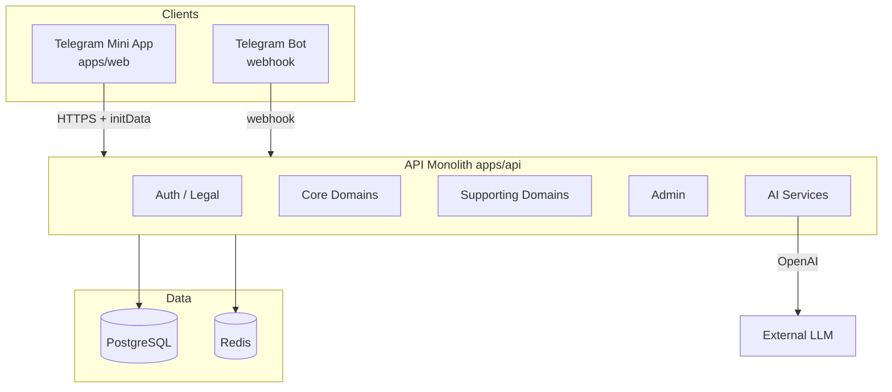
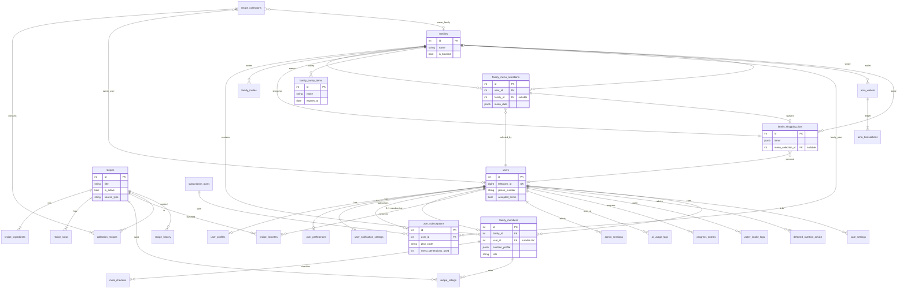
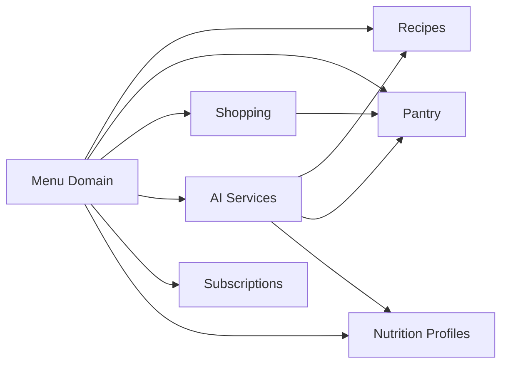
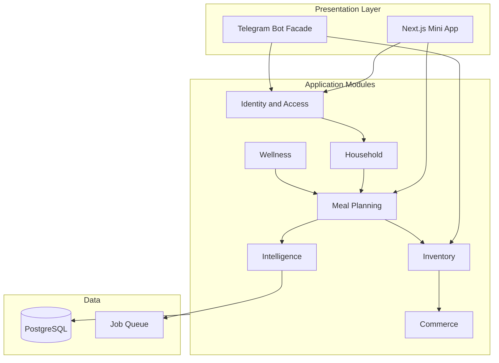

# Domain Architecture — ПланАм (MASTER AUDIT)

**Дата:** 2026-06-03  
**Режим:** только документация — код и БД не изменялись.

**Связанные документы:** [`CODEBASE_INDEX.md`](CODEBASE_INDEX.md), [`SCREEN_MAP.md`](SCREEN_MAP.md), [`NAVIGATION_GRAPH.md`](NAVIGATION_GRAPH.md), [`PRODUCT_VISION.md`](PRODUCT_VISION.md), [`SECURITY_AUDIT.md`](SECURITY_AUDIT.md).

---

## 1. Обзор системы

ПланАм — **Telegram Mini App** (Next.js) + **FastAPI monolith** (PostgreSQL, Redis). Пользователь идентифицируется через **Telegram `initData`**; контекст работы — **personal** или **family** (`X-App-Mode` + `AppScope`).

**Сквозные оси:**

| Ось | Реализация |
|-----|------------|
| Identity | `users.telegram_id`, `X-Telegram-Init-Data` |
| Scope | `user_preferences.active_mode`, `AppScope` (`apps/api/app/services/app_scope.py`) |
| Monetization | `user_subscriptions`, `ama_wallets`, server paywall |
| Intelligence | `ai.py`, `ai_context.py`, `ai_usage_logs` |

---

## 2. Карта доменов (сводка)

| Домен | Тип* | Таблиц | API prefix | Frontend hub |
|-------|------|--------|------------|----------------|
| Users | Core | 4+ | `/auth`, `/users`, `/legal`, `/onboarding` | `/`, `/onboarding`, `/settings` |
| Families | Core | 3 | `/families` | `/family` |
| Family Members | Core | (в `family_members`) | `/families/{id}/members/*` | `/family`, `/profile/nutrition` |
| Recipes | Core | 9+ | `/recipes` | `/recipes`, `/recipes/[id]` |
| Recipe Collections | Supporting | 2+ | `/collections` | `/menu/collections` |
| Menu | Core | 1 (+ JSONB) | `/menus`, `/meal-checkins` | `/menu/*` |
| Shopping Lists | Core | 2 | `/shopping-lists`, `/shopping-categories` | `/shopping` |
| Pantry / Inventory | Core | 1 | `/pantry` | `/pantry`, `/shopping/pantry` |
| Health | UX aggregate | 5+ | `/progress`, `/meal-checkins`, `/nutritionist/water` | `/health/*` |
| Nutrition | Core bridge | 1+ | `/nutrition-profile`, `/onboarding` | `/profile/nutrition` |
| Notifications | Supporting | 1 | `/notifications` | `/notifications` |
| Subscriptions | Supporting (critical $) | 5 | `/subscriptions` | `/subscription` |
| AI | Supporting (critical cost) | 1 log | (внутри menu, nutritionist, bot) | чаты, generate |
| Admin | Supporting (ops) | 4 | `/admin` | `/admin/*` |

\*Типы раскрыты в §8.

---

## 3. Домены (детально)

### 3.1 Users

**Назначение:** идентичность Telegram-пользователя, юридическое согласие, телефон, онбординг, режим приложения (personal/family), интеграция с ботом.

| Категория | Элементы |
|-----------|----------|
| **Таблицы БД** | `users`, `user_profiles`, `user_preferences`, `user_notification_settings`, `telegram_bot_sessions` |
| **API** | `POST /auth/telegram`, `POST /auth/dev-login`; `GET|PATCH /users/me/app-context`; `GET|POST /legal/*`; `GET|PUT /onboarding/me`; `GET|PUT /nutrition-profile/me` (см. Nutrition) |
| **Экраны** | `/`, `/onboarding`, `/settings`, `/settings/account`, `/settings/documents`, `/settings/delete-data` |
| **Связи** | → Families (0..1 membership); → Subscriptions (1:N); → все scope-aware домены через `user_id`; Bot sessions для PIN/invite/voice |

**Ключевые поля `users`:** `telegram_id`, legal flags, `phone_number`, `is_blocked`, `is_deleted`.

---

### 3.2 Families

**Назначение:** общий контекст «домохозяйства» — имя, блокировка, приглашения, передача админа, настройки редактирования профилей.

| Категория | Элементы |
|-----------|----------|
| **Таблицы БД** | `families`, `family_invites` |
| **API** | `POST /families`, `GET|PATCH|DELETE /families/me`, `POST /families/me/leave`, `POST /families/me/transfer-admin`, `PATCH /families/me/allow-admin-edit`; `POST|GET /families/{id}/invites*`, `POST /families/{id}/invite-by-phone` |
| **Экраны** | `/family` |
| **Связи** | ← Users (members); → Family Members; → Menu, Shopping, Pantry (scope `family_id`); → Subscriptions (`user_subscriptions.family_id`); Admin CRUD |

---

### 3.3 Family Members

**Назначение:** участники семьи (реальные с `user_id` или виртуальные), роли, цели, ограничения, **nutrition_profile** (JSONB) для меню и AI.

| Категория | Элементы |
|-----------|----------|
| **Таблицы БД** | `family_members` |
| **API** | `POST /families/{id}/members`, `POST .../members/virtual`, `PATCH|DELETE .../members/{member_id}`, `PUT .../members/{member_id}/nutrition` |
| **Экраны** | `/family`, `/profile/nutrition` (свой профиль vs член семьи) |
| **Связи** | → Users (optional `user_id` unique); → Menu/AI (person count, restrictions); → `meal_checkins.family_member_id`; → `recipe_ratings`; `family_recipe_preferences` |

**Роли:** `admin`, `adult`, `child` (`FamilyRole`).

---

### 3.4 Recipes

**Назначение:** глобальный каталог блюд (ингредиенты, шаги, теги, аллергены, KБЖУ), избранное, оценки семьи, рекомендации, связь с меню и покупками.

| Категория | Элементы |
|-----------|----------|
| **Таблицы БД** | `recipes`, `recipe_ingredients`, `recipe_steps`, `recipe_tags`, `recipe_allergens`, `recipe_restrictions`, `recipe_ratings`, `recipe_favorites`, `recipe_import_jobs` |
| **API** | `GET /recipes`, `GET /recipes/{id}`, `POST /recipes`, `PATCH /recipes/{id}`, filters, recommendations, `from-pantry`, `why`, `evaluate`, `improve`, `favorite`, `rate`, `cooked`, `history`, `add-to-shopping`, `add-to-menu`, scenarios (feature flag) |
| **Экраны** | `/recipes`, `/recipes/[id]`; входы с `/menu/recipes` (redirect) |
| **Связи** | ← Menu (`recipe_id` in JSONB meals); → Shopping (ingredients); ← Pantry (`from-pantry`); → Recipe Collections; → AI (catalog slice in prompts); Admin import pipeline (scripts, not HTTP user API) |

**Примечание:** отдельной таблицы `menus` нет — план хранится в `family_menu_selections.menu_data` (JSONB).

---

### 3.5 Recipe Collections

**Назначение:** пользовательские/семейные подборки рецептов (пины, динамические коллекции), связь many-to-many с каталогом.

| Категория | Элементы |
|-----------|----------|
| **Таблицы БД** | `recipe_collections`, `collection_recipes`, (+ engine: `recipe_scenarios`, `recipe_explanations`, `family_recipe_preferences`, `recipe_history`) |
| **API** | `GET|POST /collections`, `GET|PATCH|DELETE /collections/{id}`, `POST|DELETE .../recipes` |
| **Экраны** | `/menu/collections`, `/menu/collections/[id]`, `/menu/favorites`, `/menu/scenarios` |
| **Связи** | → Recipes; scope via `owner_user_id` / `owner_family_id`; Menu UX hub |

---

### 3.6 Menu

**Назначение:** генерация плана питания (AI + правила), выбор варианта, обзор дня, чекины приёмов пищи, остатки блюд, event-меню.

| Категория | Элементы |
|-----------|----------|
| **Таблицы БД** | `family_menu_selections` (`menu_data` JSONB), `meal_checkins`, `meal_eating_schedules`, `meal_leftovers`, `event_plans` |
| **API** | `POST /menus/generate`, `replace-dish`, `select`, `GET /menus/selected`, `overview`, `quick-action`; `GET|POST /meal-checkins`; `GET|POST|PATCH|DELETE /meal-leftovers`; `POST|GET /event-plans` |
| **Экраны** | `/menu`, `/menu/current`, `/menu/generate`, `/menu/settings`, `/menu/leftovers`, `/menu/event` (orphan в UI), `/` (план дня) |
| **Связи** | → Recipes, Pantry, Shopping (`menu_selection_id`); → Subscriptions (quota); → AI; → Health (checkins); → Nutrition (targets vs actual) |

**Высокая связанность:** Menu — **hub** между Recipes, Pantry, Shopping, AI, Subscriptions.

---

### 3.7 Shopping Lists

**Назначение:** список покупок (JSONB items), синхронизация с меню, категории, переход «куплено» → запасы.

| Категория | Элементы |
|-----------|----------|
| **Таблицы БД** | `family_shopping_lists`, `shopping_categories` |
| **API** | `GET /shopping-lists/me`, `POST /sync`, CRUD items; `GET|POST /shopping-categories` |
| **Экраны** | `/shopping`, `/shopping/pantry`, `/shopping/leftovers` |
| **Связи** | → Pantry (on toggle); ← Menu; ← Recipes (`add-to-shopping`); Bot voice/receipt (pending); → Event plans (`create-shopping-list`) |

---

### 3.8 Pantry / Inventory

**Назначение:** что есть дома (срок годности, источник: manual/shopping/voice/OCR), влияние на меню и рекомендации.

| Категория | Элементы |
|-----------|----------|
| **Таблицы БД** | `family_pantry_items` |
| **API** | `GET /pantry/me`, `POST|PATCH|DELETE /pantry/items` |
| **Экраны** | `/pantry`, `/shopping/pantry` |
| **Связи** | ← Shopping; → Menu/AI (`format_leftovers_for_prompt`); → Recipes `from-pantry`; scope `user_id` \| `family_id` |

---

### 3.9 Health

**Назначение (продуктовый слой):** единая точка входа «Здоровье» — факт питания сегодня, вода, прогресс, чат; агрегирует несколько backend-доменов.

| Категория | Элементы |
|-----------|----------|
| **Таблицы БД** | `meal_checkins`, `water_intake_logs`, `progress_entries`, `training_entries`, `nutrition_targets`, `deferred_nutrition_advice` |
| **API** | `/meal-checkins/*`, `/nutritionist/water/*`, `/progress/*`, `/nutritionist/deferred-advice/*` |
| **Экраны** | `/health`, `/health/today`, `/health/chat`, `/health/care`; `/progress`; redirect `/nutritionist` → `/health` |
| **Связи** | → Menu (planned vs actual); → Nutrition profiles; → Subscriptions (PRO gates on progress); ↔ Care (дубли URL с `/nutritionist/care`) |

**Не отдельный bounded context в БД** — UX-фасад над Nutrition + Menu facts + Progress.

---

### 3.10 Nutrition

**Назначение:** профиль питания, цели, ограничения, советы нутрициолога, чат AI, отложенные рекомендации.

| Категория | Элементы |
|-----------|----------|
| **Таблицы БД** | `user_profiles`, `family_members.nutrition_profile`, `deferred_nutrition_advice`, `nutrition_targets` |
| **API** | `GET|PUT /nutrition-profile/me`, `GET|PUT /onboarding/me`; `POST /nutritionist/ask`; deferred-advice CRUD; (water under nutritionist router) |
| **Экраны** | `/profile/nutrition`, `/nutritionist/chat`, `/health/chat`, `/nutritionist/care`, `/health/care` |
| **Связи** | → AI; → Menu generation context; → Health UI; duplicate data risk: profile vs member JSONB (см. [`UX_PROBLEMS.md`](UX_PROBLEMS.md)) |

---

### 3.11 Notifications

**Назначение:** настройки push-напоминаний (готовка, покупки и т.д.) — отдельно от Care.

| Категория | Элементы |
|-----------|----------|
| **Таблицы БД** | `user_notification_settings` |
| **API** | `GET|PUT /notifications/settings` |
| **Экраны** | `/notifications` |
| **Связи** | → Users; scheduler `notification_scheduler.py`; **overlap** с Care (`/care/notifications`) — UX debt |

---

### 3.12 Subscriptions

**Назначение:** планы Free/PRO, квоты генерации меню, кошелёк **Амов (AMS)**, учёт AI-расходов, семейный биллинг.

| Категория | Элементы |
|-----------|----------|
| **Таблицы БД** | `subscription_plans`, `user_subscriptions`, `ama_wallets`, `ama_transactions`, `ai_usage_logs` |
| **API** | `GET /subscriptions/me`, `POST /subscriptions/select-plan`; Admin grant/extend/AMS |
| **Экраны** | `/subscription` |
| **Связи** | → Menu (`assert_menu_generation_allowed`); → AI (cost); → Users/Families (billing user); Admin |

---

### 3.13 AI

**Назначение:** генерация меню, замена блюда, чат нутрициолога, улучшение рецепта, vision (чеки), голос (бот) — через OpenAI.

| Категория | Элементы |
|-----------|----------|
| **Таблицы БД** | `ai_usage_logs` (audit/cost); нет таблицы «prompts» |
| **API** | Нет отдельного `/ai` router — вызовы из `/menus/*`, `/nutritionist/ask`, `/recipes/{id}/improve`, bot services |
| **Модули** | `services/ai.py`, `ai_client.py`, `ai_context.py`, `menu_ai_*`, `voice_input`, `receipt_ocr` |
| **Экраны** | `/menu/generate`, `/health/chat`, recipe improve modals |
| **Связи** | Почти все core домены (reads Users, Profiles, Pantry, Recipes, Menu) |

---

### 3.14 Admin

**Назначение:** операционная панель — пользователи, семьи, подписки, AMS, OpenAI stats, ошибки, бэкапы.

| Категория | Элементы |
|-----------|----------|
| **Таблицы БД** | `admin_sessions`, `admin_login_attempts`, `admin_actions`, `admin_error_logs` |
| **API** | `/admin/*` (~40+ endpoints) — см. [`CODEBASE_INDEX.md`](CODEBASE_INDEX.md) |
| **Экраны** | `/admin`, `/admin/users`, `/admin/families`, `/admin/subscriptions`, `/admin/ams`, `/admin/openai`, `/admin/errors` |
| **Связи** | Cross-cutting read/write на Users, Families, Subscriptions; Bot `/admin` + PIN; **open issue:** AppGate vs admin session ([`ADMIN_PANEL_INCIDENT_AUDIT.md`](ADMIN_PANEL_INCIDENT_AUDIT.md)) |

---

### 3.15 Care (смежный supporting)

**Назначение:** «забота» — шаблоны уведомлений (вода, белок, меню), тест push.

| Таблицы | `care_settings`, `care_notifications`, `care_events` |
| API | `/care/settings`, `/care/notifications`, `/care/tips`, `/care/test-notification` |
| UI | `/health/care`, `/nutritionist/care` (duplicate) |

---

## 4. Cross-domain: AppScope

Паттерн **dual scope** (personal \| family) повторяется в:

| Сущность | `user_id` | `family_id` |
|----------|-----------|-------------|
| `family_menu_selections` | required | optional |
| `family_shopping_lists` | xor unique | xor unique |
| `family_pantry_items` | optional | optional |
| `meal_checkins` | personal | family |
| `recipe_collections` | owner_user | owner_family |
| `user_subscriptions` | billing user | optional family plan |

**Заголовок:** `X-App-Mode: personal|family` + `get_app_scope` в API.

---

## 5. Mermaid ER Diagram

### 5.1 Обязательные связи

| Связь | Почему обязательна |
|-------|-------------------|
| `users` → `user_profiles` | Онбординг / AI / меню |
| `users` → auth (telegram_id) | Весь продукт |
| `family_members.family_id` → `families` | Семейный режим |
| `recipe_*` → `recipes` | Каталог |
| `collection_recipes` → `recipes` + `recipe_collections` | Коллекции |
| `user_subscriptions.user_id` → `users` | Paywall |

### 5.2 Опциональные связи

| Связь | Когда |
|-------|--------|
| `family_members.user_id` | Виртуальный участник |
| `family_menu_selections.family_id` | Personal mode (null) |
| `family_shopping_lists.menu_selection_id` | Ручной список без меню |
| `user_subscriptions.family_id` | Семейная подписка |
| `meal_checkins.family_member_id` | Чекин «для кого» |
| `event_plans` | Редкие события |

### 5.3 Точки высокой связанности (coupling hotspots)

| Hotspot | Риск |
|---------|------|
| **Menu ↔ AI** | Изменение prompt/schema ломает generate/select |
| **Menu JSONB** | Нет нормализованных `menu_meals` — сложные отчёты и миграции |
| **Shopping.items JSONB** | Массовые обновления, race при sync |
| **Nutrition dual store** | `user_profiles` vs `family_members.nutrition_profile` |
| **Health UX facade** | 4 API prefixes, дубли экранов |
| **AppScope** | Ошибка `X-App-Mode` → запись в чужой scope |

### 5.4 Потенциальные узкие места (bottlenecks)

| Узкое место | Масштабирование |
|-------------|-----------------|
| `POST /menus/generate` + OpenAI | Latency, cost, rate limits |
| `recipes` table + search | Full table scan без сильных индексов на search |
| `family_menu_selections.menu_data` | Large JSONB per family/user |
| `ai_usage_logs` append-only | Рост объёма, нужен retention |
| `meal_checkins` by date | Индекс `(family_id, planned_date)` есть — OK |
| Monolithic deploy | Все домены в одном API process |
| Redis | Пока minimal use — scheduler/cache headroom |

---

## 6. Интеграционный слой (не отдельный продуктовый домен)

| Компонент | Роль |
|-----------|------|
| Telegram Bot (`telegram_bot.py`, `services/telegram_bot.py`) | Phone, invites, `/admin`, voice, receipt, WebApp buttons |
| Legal (`/legal`) | GDPR-style consent |
| Auth (`/auth`) | Bootstrap session via initData |
| Redis | Infra (scheduler, future cache) |
| `backend/scripts/*` | Offline recipe pipeline (не runtime API) |

---

## 7. Классификация доменов

### 7.1 Core domain (ядро продукта)

Домены, без которых **ценность ПланАм** не существует:

| Домен | Обоснование |
|-------|-------------|
| **Users** | Identity + gate |
| **Families + Family Members** | Мультиперсонное питание ([`PRODUCT_VISION.md`](PRODUCT_VISION.md)) |
| **Recipes** | Каталог — источник блюд |
| **Menu** | Главный цикл «план питания» |
| **Shopping Lists** | Закрытие цикла покупок |
| **Pantry** | «Что есть дома» → меню |
| **Nutrition** (profiles) | Персонализация меню и AI |

**Core loop:** Profile → Pantry → Menu → Shopping → Pantry.

### 7.2 Supporting domain (поддерживающие)

| Домен | Роль |
|-------|------|
| Recipe Collections | Организация каталога |
| Health (UX) | Агрегация UX, не отдельная БД |
| Notifications | Engagement |
| Care | PRO-напоминания |
| Subscriptions + AMS | Монетизация |
| AI | Реализация intelligence (можно вынести) |
| Admin | Ops |
| Event plans | Нишевые сценарии |
| Progress / Training | PRO-метрики |

### 7.3 Что можно выделить в отдельный сервис (будущее)

| Кандидат | Триггер выделения | Граница API |
|----------|-------------------|-------------|
| **Recipe Catalog Service** | >100k recipes, тяжёлый import/enrichment | `recipes`, import jobs, search, collections read |
| **AI Inference Service** | Cost isolation, multi-model, queue | `/menus/generate`, `/nutritionist/ask`, vision |
| **Billing Service** | Реальные платежи (ЮKassa/Stripe) | subscriptions, AMS, webhooks billing |
| **Notification Delivery** | FCM/APNs + Telegram push at scale | settings + scheduler workers |
| **Admin / Ops API** | Отдельная команда support | `/admin/*` |
| **Telegram Gateway** | Много ботов / шардов webhook | webhooks only |

**Оставить в monolith дольше всего:** Users, Families, AppScope, Menu orchestration (тонкий coordinator).

### 7.4 Сущности, критичные для масштабирования

| Сущность | Почему |
|----------|--------|
| `users` | Sharding key candidate (telegram_id) |
| `recipes` + children tables | Read-heavy, CDN/cache catalog |
| `family_menu_selections.menu_data` | Write per generation; size growth |
| `family_shopping_lists.items` | Frequent PATCH |
| `meal_checkins` | Daily volume per active family |
| `ai_usage_logs` | Cost accounting; partition by month |
| `recipe_history` | Append-only analytics |
| `ama_transactions` | Financial audit trail |

---

## 8. Domain Dependency Matrix

|  | Users | Families | Recipes | Menu | Shop | Pantry | Nutrition | Sub | AI | Admin |
|--|:---:|:---:|:---:|:---:|:---:|:---:|:---:|:---:|:---:|:---:|
| **Users** | — | m | r | r | r | r | rw | rw | r | rw |
| **Families** | m | — | r | rw | rw | rw | rw | rw | r | rw |
| **Recipes** | r | r | — | rw | w | r | r | — | r | r |
| **Menu** | r | rw | rw | — | w | r | rw | r | rw | — |
| **Shopping** | r | rw | w | r | — | w | — | — | — | — |
| **Pantry** | r | rw | r | r | r | — | — | — | r | — |
| **Subscriptions** | rw | rw | — | w | — | — | — | — | w | rw |
| **AI** | r | r | r | w | — | r | r | w | — | r |

`r` read · `w` write · `m` membership · `rw` read/write

---

## 9. Recommended Product Architecture 2026

Предложение **после UX Redesign** ([`UX_PROBLEMS.md`](UX_PROBLEMS.md), [`PRODUCT_VISION.md`](PRODUCT_VISION.md), [`SECURITY_FIX_ROADMAP.md`](SECURITY_FIX_ROADMAP.md)) — не требует немедленного split микросервисов, но задаёт **продуктовую** и **модульную** цель.

### 9.1 Принципы 2026

1. **Один цикл — один hub:** «Дом» (`/`) = Pantry snapshot + Today plan + Shopping progress (убрать дубли `/` vs `/menu`).
2. **Три столпа навигации** (вместо 5+ равных вкладок):
   - **План** (Menu + Recipes)
   - **Дом** (Pantry + Shopping)
   - **Здоровье** (Nutrition + Progress + Care unified)
3. **Семья опциональна** — personal path без трения; family — overlay в header.
4. **PRO как слой**, не отдельный раздел-долина: badges на Plan/Health, не изолированный `/subscription` только по кризису.
5. **Admin / Bot** — ops channel, не часть user mental model.

### 9.2 Целевая модульная архитектура (logical, still monolith OK)

| Module | Includes (current) | Public API surface |
|--------|------------------|-------------------|
| **Identity & Access** | auth, legal, users, app-context | `/auth`, `/legal`, `/users` |
| **Household** | families, members, invites | `/families` |
| **Meal Planning** | menus, checkins, leftovers, event-plans | `/menus`, `/meal-*`, `/event-plans` |
| **Inventory** | pantry, shopping | `/pantry`, `/shopping-*` |
| **Catalog** | recipes, collections, recipe engine | `/recipes`, `/collections` |
| **Wellness** | nutrition-profile, progress, water, deferred advice, care, notifications (merged settings) | `/nutrition-profile`, `/progress`, `/nutritionist`, `/care`, `/notifications` |
| **Commerce** | subscriptions, AMS | `/subscriptions` |
| **Intelligence** | ai_*, voice, ocr | internal + rate limits |
| **Ops** | admin | `/admin` |

### 9.3 UX Redesign → domain mapping

| UX проблема (audit) | Архитектурный ответ 2026 |
|---------------------|---------------------------|
| `/health` vs `/nutritionist` duplicate | **Wellness module** — один route tree `/wellness/*` |
| Care vs Notifications split | **Unified Notification Preferences** — одна таблица/API, channels в JSON |
| Menu plan on `/` and `/menu` | **Single source:** `GET /menus/overview` only; home = widget |
| Checkin vs leftover confusion | **Meal Planning:** one «Meal outcome» API (status enum) |
| Dual nutrition profile stores | **Household:** `NutritionProfile` entity linked to User OR FamilyMember |
| 47 pages | Target **~25 routes** via nested layouts |

### 9.4 Data architecture 2026

| Сейчас | Рекомендация |
|--------|--------------|
| `menu_data` JSONB only | Добавить **normalized** `menu_days` / `menu_meals` (optional projection) для аналитики; JSONB оставить как cache |
| `shopping lists.items` JSONB | Постепенно `shopping_list_items` rows для concurrent edits |
| `recipe` global write by users | `recipes` system + `user_recipe_drafts` |
| No referral tables | При запуске — отдельный **Growth** schema ([`SECURITY_AUDIT.md`](SECURITY_AUDIT.md) §10) |

### 9.5 Deployment topology 2026 (evolutionary)

| Phase | Topology |
|-------|----------|
| **Now** | Monolith API + Next + Postgres + Redis |
| **H1 2026** | Background worker container (import, notifications, AI queue) |
| **H2 2026** | Optional **Catalog read replica** + CDN for static recipe media |
| **2027** | AI Inference service if token spend > threshold |

### 9.6 Success metrics (architecture)

| Metric | Target |
|--------|--------|
| Domains with clear API prefix | 8 modules (table §9.2) |
| Cross-domain calls per menu generate | Documented < 12 DB round-trips |
| Pages per user journey (onboarding → first menu) | ≤ 5 screens |
| p95 `/menus/generate` | < 15s with queue fallback |
| Admin access | AppGate fix + zero TelegramRequired false positives |

---

## 10. Appendix: API router map

| Router file | Prefix | Primary domain |
|-------------|--------|----------------|
| `auth.py` | `/auth` | Users |
| `legal.py` | `/legal` | Users |
| `users.py` | `/users` | Users |
| `onboarding.py` | `/onboarding` | Nutrition |
| `nutrition_profile.py` | `/nutrition-profile` | Nutrition |
| `families.py` | `/families` | Families |
| `menus.py` | `/menus` | Menu |
| `meal_checkins.py` | `/meal-checkins` | Menu / Health |
| `meal_leftovers.py` | `/meal-leftovers` | Menu |
| `recipes.py` | `/recipes` | Recipes |
| `collections.py` | `/collections` | Recipe Collections |
| `event_plans.py` | `/event-plans` | Menu |
| `shopping_lists.py` | `/shopping-lists` | Shopping |
| `shopping_categories.py` | `/shopping-categories` | Shopping |
| `pantry.py` | `/pantry` | Pantry |
| `nutritionist.py` | `/nutritionist` | Nutrition / Health |
| `progress.py` | `/progress` | Health |
| `subscriptions.py` | `/subscriptions` | Subscriptions |
| `notifications.py` | `/notifications` | Notifications |
| `care.py` | `/care` | Care |
| `admin.py` | `/admin` | Admin |
| `telegram_bot.py` | `/telegram`, `/bot` | Integration |

---

*Документ отражает состояние репозитория на 2026-06-03. При изменении моделей или роутеров обновлять §3, §5 и [`CODEBASE_INDEX.md`](CODEBASE_INDEX.md).*
