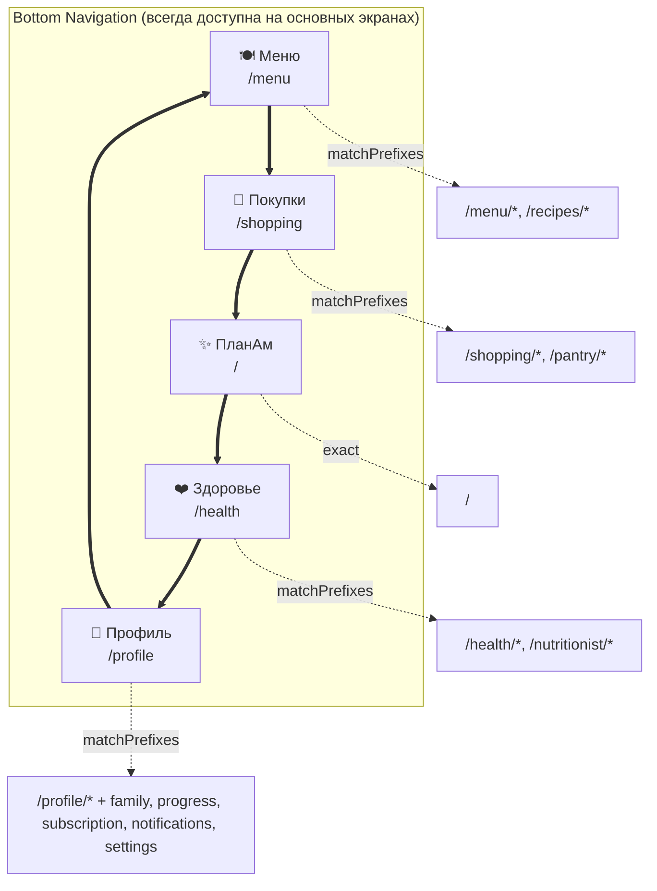
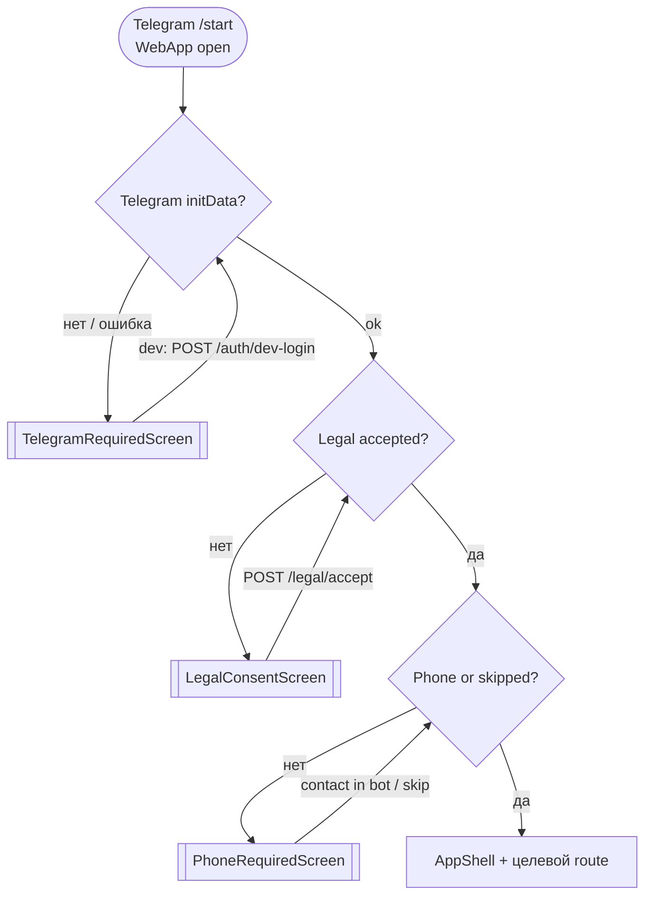

# Граф навигации ПланАм

Полная карта переходов Telegram Mini App. Построено по коду **без изменений** (2026-06-03).

**Источники:** `apps/web/app/**`, `apps/web/components/**`, `apps/web/lib/navigation/nav-config.ts`, `apps/api/app/services/bot_menu.py`, `apps/api/app/services/care.py`.

---

## Легенда (Mermaid)

| Стиль / форма | Значение |
|---------------|----------|
| `[Screen]` | Обычный экран (route) |
| `{{Redirect}}` | Server-side `redirect()` |
| `[[Auth Gate]]` | Блокирующий оверлей `AppGate` |
| `(Modal/Sheet)` | Модальный слой поверх экрана |
| `-->` | Навигация (Link / router.push) |
| `-.->` | Redirect или modal open |
| `==>` | Bottom navigation (любая вкладка) |
| `:::legacy` | Legacy URL (сохранён redirect) |
| `:::orphan` | Orphan — нет входа из UI |
| `:::admin` | Админка |
| `:::gate` | Auth gate |

```mermaid
flowchart LR
  classDef legacy fill:#fef3c7,stroke:#d97706
  classDef orphan fill:#fee2e2,stroke:#dc2626
  classDef admin fill:#e0e7ff,stroke:#4338ca
  classDef gate fill:#fce7f3,stroke:#db2777
  classDef modal fill:#f0fdf4,stroke:#16a34a,stroke-dasharray:5
```

---

## 1. Bottom Navigation (5 вкладок)

Нижняя панель: `BottomNavigation` + `nav-config.ts`. Скрыта на `/onboarding*`, `/admin*`.



**Примечание:** `==>` означает «переключение вкладки с любого экрана зоны» — не отдельный route, а глобальный UI.

---

## 2. Auth Gates (до любого экрана)



**Условия:** `AppGate.tsx` · dev-auth только при `ENVIRONMENT=development`.

---

## 3. Legacy Redirects

```mermaid
flowchart LR
  R1{{/recipes}} -->|redirect| MREC[/menu/recipes]
  R2{{/pantry}} -->|redirect| SP[/shopping/pantry]
  R3{{/menu/leftovers}} -->|redirect| SL[/shopping/leftovers]
  R4{{/menu/scenarios}} -->|redirect| MREC
  R5{{/nutritionist}} -->|redirect| H[/health]
  R6{{/nutritionist/chat}} -->|redirect| HC[/health/chat]
  R7{{/nutritionist/care}} -->|redirect| HCARE{{/health/care}}
  HCARE -->|redirect| NOTIF[/notifications]
  R8{{/health/care}} -->|redirect| NOTIF
  R9{{/onboarding}} -->|redirect| PN[/profile/nutrition]

  class R1,R2,R3,R4,R5,R6,R7,R8,R9 legacy
```

**Bot legacy:** бот всё ещё открывает `/nutritionist`, `/pantry` — redirect срабатывает на клиенте.

---

## 4. Главный граф (overview)

```mermaid
flowchart TB
  subgraph HOME["ПланАм /"]
    H0[/]
  end

  subgraph MENU["Меню"]
    M0[/menu]
    MGEN[/menu/generate]
    MCUR[/menu/current]
    MSET[/menu/settings]
    MREC[/menu/recipes]
    MFAV[/menu/favorites]
    MCOL[/menu/collections]
    MCOLD["/menu/collections/id"]
    MEVT["/menu/event ⚠"]
    RID["/recipes/id"]
  end

  subgraph SHOP["Покупки"]
    S0[/shopping]
    SP[/shopping/pantry]
    SL[/shopping/leftovers]
  end

  subgraph HEALTH["Здоровье"]
    HE0[/health]
    HT[/health/today]
    HCH[/health/chat]
  end

  subgraph PROF["Профиль и настройки"]
    P0[/profile]
    PN[/profile/nutrition]
    FAM[/family]
    PROG[/progress]
    SUB[/subscription]
    NOTIF[/notifications]
    SET[/settings]
    SETA[/settings/account]
    SETD[/settings/documents]
    SETDEL[/settings/delete-data]
    SETS[/settings/support]
    SETAB[/settings/about]
  end

  H0 --> M0 & S0 & HCH
  M0 --> MGEN & MCUR & MSET
  M0 -.->|MenuQuickActionsSheet| MSET
  M0 -.->|replace_dish API| MCUR
  MGEN --> MCUR
  MREC & MFAV & MCOL --> RID
  MCOL --> MCOLD --> RID
  MCUR --> SL & RID
  MEVT --> S0

  S0 --> SP & SL
  SP --> S0
  SL --> MCUR

  HE0 --> HT & PN & PROG & HCH
  HT --> PN & MCUR & MGEN & MREC & S0 & PROG & HCH

  P0 --> PN & FAM & SUB & PROG & NOTIF & SETAB & SET
  SET --> SETA & SETD & SETDEL & SETS & SETAB
  SETS --> NOTIF

  HCH --> SUB
  MGEN --> SUB
  PROG --> SUB

  class MEVT orphan
```

---

## 5. Sub-tabs: Меню

```mermaid
flowchart LR
  subgraph MENU_TABS["MenuSubTabs (SegmentedTabs)"]
    T1[/menu<br/>Моё меню]
    T2[/menu/recipes]
    T3[/menu/favorites]
    T4[/menu/collections]
  end
  T1 <--> T2
  T2 <--> T3
  T3 <--> T4
  T4 <--> T1

  T1 --> MGEN[/menu/generate]
  T1 --> MCUR[/menu/current]
  T2 --> RID[/recipes/id]
  T3 --> RID
  T4 --> CID[/menu/collections/id] --> RID
```

---

## 6. Sub-tabs: Покупки

```mermaid
flowchart LR
  subgraph SHOP_TABS["ShoppingSubTabs"]
    S1[/shopping]
    S2[/shopping/pantry]
    S3[/shopping/leftovers]
  end
  S1 <--> S2
  S2 <--> S3
  S3 <--> S1

  S1 --> MENU[/menu]
  S2 --> S1
  S3 --> MCUR[/menu/current]
```

---

## 7. Модальные и sheet-переходы

Модалки **не меняют URL** (кроме query, напр. `?replace=1`).

```mermaid
flowchart TB
  subgraph MODALS["Overlays"]
    MQA(MenuQuickActionsSheet)
    AMA(AmaConfirmDialog)
    RDM(ReplaceDishModal)
    MIS(ShoppingItemSheet)
    MCS(ShoppingCategorySheet)
    PIF(PantryItemForm)
    RFS(RecipeFiltersSheet)
    SCS(ScenarioChips Sheet)
    MDS(MenuDayOverview Sheet)
    RDS(RecipeDetail Sheet Ещё)
    APS(AddPersonSheet)
    INV(InviteSheet)
    FMS(FamilyManageSheet)
    VMN(VirtualMemberNutritionForm)
    ADM(AdminConfirmDialog)
  end

  MenuHub[/menu] -.-> MQA
  MenuHub -.-> AMA
  MQA -->|quick actions| AMA
  MQA --> MSET[/menu/settings]

  MenuHub -->|POST quick-action replace_dish| MCUR[/menu/current?replace=1]
  MCUR -.-> RDM
  MCUR -.-> AMA
  MCUR -.-> MDS
  MDS --> RID[/recipes/id]

  S0[/shopping] -.-> MIS & MCS
  SP[/shopping/pantry] -.-> PIF

  MREC[/menu/recipes] -.-> RFS & SCS
  MREC --> RID
  RID -.-> RDS & AMA

  HCH[/health/chat] -.-> AMA
  FAM[/family] -.-> APS & INV & FMS & VMN

  ADMIN[/admin/*] -.-> ADM

  AMA -->|insufficient Ams| SUB[/subscription]
```

---

## 8. Admin routes

Доступ: bot `/admin` + PIN → `X-Admin-Session`. Bottom nav **скрыта**.

```mermaid
flowchart TB
  BOT_ADMIN([Telegram /admin + PIN]) --> ADM_GATE{pingAdmin?}
  ADM_GATE -->|нет| DENY[[Нет доступа]]
  ADM_GATE -->|да| A0[/admin]

  subgraph ADMIN["AdminShell tabs"]
    A0
    AU[/admin/users]
    AUD["/admin/users/id"]
    AF[/admin/families]
    AFD["/admin/families/id"]
    AS[/admin/subscriptions]
    AM[/admin/ams]
    AO[/admin/openai]
    AE[/admin/errors]
  end

  A0 --> AU & AF & AS & AM
  AU --> AUD --> AU
  AF --> AFD --> AF
  A0 --> AO & AE

  class A0,AU,AUD,AF,AFD,AS,AM,AO,AE admin
```

---

## 9. Внешние входы (Telegram Bot)

```mermaid
flowchart LR
  BOT([Telegram Bot]) -->|web_app /| H0[/]
  BOT -->|web_app /menu| M0[/menu]
  BOT -->|web_app /shopping| S0[/shopping]
  BOT -->|web_app /pantry| SP{{redirect}} --> PAN[/shopping/pantry]
  BOT -->|web_app /nutritionist| HE{{redirect}} --> HE0[/health]
  BOT -->|web_app /family| FAM[/family]
  BOT -->|web_app /settings| SET[/settings]
  BOT -->|web_app /settings/documents| SETD[/settings/documents]
  BOT -->|care notifications| CARE_PATH["/profile/nutrition, /menu, /shopping, /pantry→redirect, /family, /nutritionist→redirect"]
  BOT -->|scheduler| S0 & M0
  BOT -->|quick:leftover| BOT_FLOW[Bot FSM leftover<br/>no WebApp route]
  BOT -->|/admin| ADMIN[/admin/*]

  class SP,HE legacy
```

---

## 10. Полный список экранов и исходящих переходов

| Screen | Исходящие переходы |
|--------|-------------------|
| `/` | `/menu`, `/shopping`, `/health/chat` + bottom nav |
| `/menu` | `/menu/generate`, `/menu/current`, `/menu/settings` (sheet), `/`, `/subscription` (402/AMA), quick→`/menu/current?replace=1` + sub-tabs + bottom nav |
| `/menu/generate` | `/menu`, `/menu/current?saved=1`, `/subscription`, `/` + preview modal |
| `/menu/current` | `/menu`, `/shopping/leftovers`, `/recipes/[id]` + ReplaceDishModal, AmaConfirmDialog |
| `/menu/settings` | `/menu/generate`, `/menu` |
| `/menu/recipes` | `/recipes/[id]`, `/menu/generate` + filters sheet + sub-tabs |
| `/menu/favorites` | `/recipes/[id]`, `/menu/recipes` + sub-tabs |
| `/menu/collections` | `/menu/collections/[id]` + sub-tabs |
| `/menu/collections/[id]` | `/menu/collections`, `/recipes/[id]` |
| `/menu/event` ⚠ | `/menu`, `/shopping` |
| `/recipes/[id]` | `/menu/recipes` + sheets |
| `/shopping` | `/menu`, sub-tabs + item/category sheets |
| `/shopping/pantry` | `/shopping` + PantryItemForm |
| `/shopping/leftovers` | `/menu/current` + sub-tabs |
| `/health` | `/health/today`, `/profile/nutrition?returnTo`, `/progress?returnTo`, `/health/chat` + bottom nav |
| `/health/today` | `/profile/nutrition`, `/menu/current`, `/menu/generate`, `/menu/recipes`, `/shopping`, `/progress`, `/health/chat` |
| `/health/chat` | `/health`, `/subscription` + AmaConfirmDialog |
| `/profile` | `/settings`, `/profile/nutrition`, `/family`, `/subscription`, `/progress`, `/notifications`, `/settings/about` + mode switch |
| `/profile/nutrition` | `returnTo` or `/profile` |
| `/family` | `/profile`, `/`, `/menu/generate`, `/profile/nutrition` + family sheets |
| `/progress` | `returnTo` (default `/profile`), `/subscription` (PRO lock) |
| `/subscription` | `/profile` |
| `/notifications` | `/profile`, `/` |
| `/settings` | `/settings/account`, `/documents`, `/delete-data`, `/support`, `/about` |
| `/settings/*` | back → `/settings` or external t.me |

---

## Аудит навигации

### 1. Dead Ends

| Экран / состояние | Почему dead end |
|-------------------|-----------------|
| `/settings/about` | Только «← Настройки», нет forward CTA |
| `/settings/delete-data` | После отправки запроса — сообщение, дальше только back |
| `/settings/documents` | Accordion + external URL, нет in-app продолжения |
| `/settings/account` | Инфо + «Открыть бота» (external) |
| `/subscription` | «Купить Амы» — **заглушка**, нет checkout flow |
| `/menu/event` ⚠ | После «Добавить в покупки» → `/shopping`; **нет входа** в wizard |
| `TelegramRequiredScreen` | Без Telegram — тупик (кроме dev-login) |
| `AdminConfirmDialog` success | Остаётся на той же admin-странице |
| Bot `quick:leftover` FSM | Завершается в чате, **не** открывает `/shopping/leftovers` |

### 2. Circular Flows

| Цикл | Описание | Оценка |
|------|----------|--------|
| **Bottom nav** | Любая вкладка ⇄ любая вкладка | Норма (hub pattern) |
| **Menu sub-tabs** | 4 вкладки ⇄ друг друга | Норма |
| **Shopping sub-tabs** | 3 вкладки ⇄ друг друга | Норма |
| **Menu loop** | `/menu` → `/menu/current` → `/menu` → generate → `/menu/current` | Рабочий core loop |
| **Health loop** | `/health` ⇄ `/health/today` ⇄ `/health/chat` | Дублирует «хаб + детали» |
| **Settings ⇄ Profile** | ⚙️ `/settings` ↔ `/profile` + «О приложении» в обоих местах | Избыточность |
| **Subscription bounce** | AI/генерация → `/subscription` → `/profile` → снова AI | Paywall loop (намеренный) |
| **returnTo chains** | `/health` → `/profile/nutrition?returnTo=/health` → back | Норма (controlled return) |
| **Legacy redirect** | `/nutritionist` → `/health` → … → bot снова шлёт `/nutritionist` | Мягкий цикл через bot |

**Нет жёстких бесконечных redirect-циклов** (новые URL не редиректят обратно на legacy).

### 3. Redundant Navigation

| Избыточность | Пути |
|--------------|------|
| Два входа в «О приложении» | `/profile` → `/settings/about` и `/settings` → `/settings/about` |
| Два входа в AI-чат | `/` → `/health/chat` и `/health` → `/health/chat` (минуя hub) |
| Два входа в каталог рецептов | Sub-tab `/menu/recipes` и legacy `/recipes` → redirect |
| Два входа в запасы | Sub-tab `/shopping/pantry` и legacy `/pantry`, bot `/pantry` |
| Два входа в «Здоровье» | Tab `/health` и legacy `/nutritionist` |
| Profile vs Settings hub | Перекрывающиеся зоны ответственности |
| «Настроить меню» | Sheet quick actions **и** `/menu/settings` **и** `/menu/generate` |
| Back на recipe detail | Всегда `/menu/recipes`, даже если пришли из favorites/collections |

### 4. Duplicate User Journeys

| Сценарий | Дублирующие пути |
|----------|------------------|
| **Заполнить профиль питания** | `/onboarding`→redirect `/profile/nutrition`; карточка на `/profile`; баннер `/health/today`; `MemberCard` → nutrition; care bot → `/profile/nutrition` |
| **Открыть меню** | `/` HubTile; bottom nav; bot «Моё меню»; care → `/menu` |
| **Список покупок** | `/` HubTile; bottom nav; bot; care scheduler |
| **AI-вопрос** | `/` → `/health/chat`; `/health` hub; `/health/today` |
| **Care-настройки** | Раньше `/nutritionist/care`, `/settings/care` (не существует); сейчас всё в `/notifications` |
| **Остатки блюда** | UI `/shopping/leftovers` vs bot FSM (без WebApp) vs чекин → link leftovers |
| **Смена тарифа** | `/subscription`; `/profile`; AmaConfirmDialog → `/subscription`; `/health/chat` error link |
| **Юридические документы** | `LegalConsentScreen` (gate) vs `/settings/documents` |

### 5. Screens reachable only by direct URL

| Route | Как попасть |
|-------|-------------|
| `/menu/event` | **Только прямой URL** (нет Link в UI, нет bot web_app) |
| `/admin` и `/admin/*` | Bot `/admin` + PIN (не bottom nav, не profile) |
| Legacy aliases | Закладки, bot (`/nutritionist`, `/pantry`), external links |
| `/onboarding` | Старые ссылки → redirect на `/profile/nutrition` |
| `/menu/scenarios` | Query alias → redirect `/menu/recipes?scenario=…` |

### 6. Screens hidden behind feature flags или auth

| Барьер | Что скрыто / ограничено |
|--------|-------------------------|
| **AppGate: Telegram** | Все экраны без initData |
| **AppGate: Legal** | Все экраны до `POST /legal/accept` |
| **AppGate: Phone** | Все экраны до phone/skip |
| **Admin PIN session** | Весь `/admin/*` |
| **PRO subscription** | `ProgressProLocked` на `/progress` (targets, расширенная аналитика) |
| **AMA balance** | `AmaConfirmDialog` блокирует AI-действия → redirect `/subscription` |
| **Backend feature flags** | `RECIPE_COLLECTIONS`, `RECIPE_HISTORY`, `RECIPE_SCENARIOS`, `RECIPE_EXPLAINABILITY`, `FAMILY_RECIPE_PREFERENCES` — UI tabs/кнопки **видны**, API может вернуть 403/404 при `false` |
| **ENVIRONMENT=development** | `POST /auth/dev-login`, dev banner |
| **Family mode** | `/family` meaningful только при family scope; mode switch на `/profile` |
| **Bot `user_can_access_app`** | Bot menu не работает без legal+phone |

---

## UX Simplification Opportunities

### Какие экраны можно объединить

| Кандидаты | Предложение |
|-----------|-------------|
| `/health` + `/health/today` | Один экран «Здоровье»: hub уже cache-only, «Сегодня» содержит реальный контент — убрать лишний tap |
| `/notifications` (dual panel) | Объединить `CareSettingsPanel` + `NotificationSettingsForm` в один wizard/секции с ясной иерархией |
| `/menu/settings` + шаги `/menu/generate` | Один источник правды для персон/режима (сейчас localStorage + wizard) |
| `/settings` + `/profile` | Profile = identity + mode; Settings = legal/account — убрать дубли «О приложении» |
| `/menu/event` + `/menu/generate` | Event как тип плана в мастере (если фича нужна) |

### Какие экраны можно удалить

| Кандидат | Обоснование |
|----------|-------------|
| `/menu/event` | Orphan, дублирует generate + event-plans API без UX входа |
| `/onboarding` route | Уже redirect; удалить route, оставить только `/profile/nutrition` |
| Legacy redirects (после grace period) | `/recipes`, `/pantry`, `/menu/leftovers`, `/nutritionist*` — обновить bot/care URLs |
| Dead components (не routes) | `OnboardingWizard`, `HomeQuickActions`, `HomeTodayCard`, … — код без навигации |
| `/health/care`, `/nutritionist/care` | Двойной redirect → `/notifications`; можно убрать промежуточные routes |
| `/menu/scenarios` | Только redirect; сценарии = query на `/menu/recipes` |

### Какие сценарии сократить

| Сценарий | Сейчас | Сокращение |
|----------|--------|------------|
| **Первый запуск** | Gate legal → gate phone → profile nutrition | Inline gates + один combined profile screen |
| **Замена блюда** | Menu → sheet → confirm AMA → current → modal → pick meal → confirm AMA | Single flow на `/menu/current` |
| **Recipe detail back** | Всегда `/menu/recipes` | Dynamic back: favorites / collections / menu day sheet |
| **Добавить остаток** | Bot FSM **или** WebApp tab **или** из чекина | Bot quick:leftover → open `/shopping/leftovers?prefill=…` |
| **AI вопрос** | Home skips health hub | OK для power users; иначе unify entry |
| **Care onboarding** | Bot шлёт на `/nutritionist` (2 redirects) | Bot URLs → `/health`, `/shopping/pantry` |
| **Paywall** | subscription из 4+ мест | Единый `AmaConfirmDialog` + один upsell sheet |
| **Admin** | 9 страниц | OK для admin; user app не затрагивать |

---

## Сводка метрик

| Метрика | Значение |
|---------|----------|
| Уникальных render routes | 38 |
| Redirect routes | 9 |
| Auth gates | 3 |
| Admin routes | 9 |
| Bottom nav tabs | 5 |
| Menu sub-tabs | 4 |
| Shopping sub-tabs | 3 |
| Modal/sheet types (major) | 14 |
| Orphan screens | 1 (`/menu/event`) |
| Legacy redirect chains | 9 |
| Bot web_app entry points | 8+ |

---

## Связанные документы

- [`docs/SCREEN_MAP.md`](SCREEN_MAP.md) — таблицы экранов, API, кнопки
- [`docs/CODEBASE_INDEX.md`](CODEBASE_INDEX.md) — индекс проекта
- [`docs/NAVIGATION_MAP.md`](NAVIGATION_MAP.md) — историческая карта переходов (до refinement)
