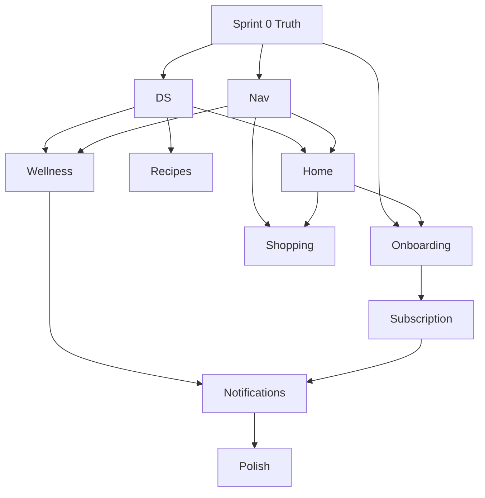
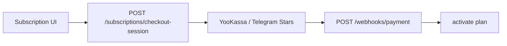

# PLANAM 2026 — Implementation Roadmap

**Дата:** 2026-06-03  
**Тип:** технический и проектный план внедрения (не продукт / UX / дизайн)  
**Режим:** только план — код, БД, миграции **не создавались** в рамках этого документа.

**Главный документ внедрения.** Связанные спеки: [`PLANAM_FINAL_PRODUCT_REVIEW.md`](PLANAM_FINAL_PRODUCT_REVIEW.md) · [`PLANAM_UX_UI_2026_MASTER_SPEC.md`](PLANAM_UX_UI_2026_MASTER_SPEC.md) · [`PLANAM_DESIGN_SYSTEM_2026.md`](PLANAM_DESIGN_SYSTEM_2026.md) · [`SECURITY_FIX_ROADMAP.md`](SECURITY_FIX_ROADMAP.md)

---

## 0. Стратегия перехода

### 0.1 Принципы

| Принцип | Реализация |
|---------|------------|
| **Без остановки продукта** | Strangler Fig: новые routes рядом со старыми, feature flag `PLANAM_UI_2026` |
| **Без переписывания backend** | Monolith остаётся; точечные **расширения** API (overview, опционально media) — отдельные PR |
| **Без потери функций** | Grace redirects 6 мес.; parity checklist по [`SCREEN_MAP.md`](SCREEN_MAP.md) |
| **Инкрементальный rollout** | Staging → beta cohort → % production → marketing |

### 0.2 Целевая схема

```mermaid
flowchart LR
  subgraph phase1 [Phase 1 Parallel]
    OLD[/menu /shopping /health]
    NEW[/plan /home /wellness /account]
  end
  OLD -.->|redirect| NEW
  FLAG{feature flag} --> NEW
  FLAG --> OLD
```

### 0.3 Репозитории (scope)

| Layer | Path | Изменения |
|-------|------|-----------|
| Web TMA | `apps/web/` | Основной объём |
| API | `apps/api/` | Минимальные (overview, trial seeds, security P0) |
| Bot | `apps/api/app/services/bot_*.py` | Deep links |
| Admin | `apps/web/app/admin/` | P0-1, DS tokens optional |
| Infra | `deploy/`, CDN | Photos, secrets |

---

## ЧАСТЬ 1 — Инвентаризация экранов

### 1.1 Сводная таблица

| Current (as-is) | Future (2026) | Reuse % | Risk | API ready | API gap |
|-----------------|---------------|---------|------|-----------|---------|
| `/` `PlanAmHome` | `/` `Home2026` | 25% | Med | Partial | overview fields, recipe_id in today |
| `/onboarding` redirect | Welcome overlay G1–G5 | 15% | Med | Yes | — |
| `/menu` `MenuHub` | `/plan` week view | 40% | Med | Yes | — |
| `/menu/current` | `/plan/today` | 50% | Med | Yes | — |
| `/menu/generate` | `/plan/generate` wizard | 55% | High | Yes | async queue optional |
| `/menu/recipes` | `/plan/recipes` | 60% | Med | Yes | — |
| `/recipes/[id]` | `/plan/recipes/[id]` | 65% | Med | Yes | — |
| `/menu/favorites` | `/plan/favorites` | 70% | Low | Yes | — |
| `/menu/collections/*` | `/plan/collections/*` | 75% | Low | Yes | — |
| `/shopping` | `/home/shopping` | 70% | Low | Yes | — |
| `/shopping/pantry`, `/pantry` | `/home/pantry` | 65% | Low | Yes | — |
| `/shopping/leftovers` | `MealOutcomeSheet` + plan | 50% | Med | Yes | unified UX only |
| `/health` + `/health/today` | `/wellness` | 45% | Med | Yes | single advice rule |
| `/health/chat` | `/wellness/chat` | 80% | Low | Yes | — |
| `/progress` | `/wellness/progress` | 75% | Low | Yes | PRO gate server |
| `/profile` + `/settings/*` | `/account/*` | 50% | Med | Yes | — |
| `/family` | Account sheet + wizard | 60% | Med | Yes | — |
| `/subscription` | `/account/subscription` | 55% | Med | Partial | checkout absent |
| `/notifications` + care | `/account/notifications` | 60% | Med | Yes | unified backend later |
| `/menu/event` | wizard step / delete | 10% | Low | Yes | orphan |
| `/admin/*` | `/admin/*` (unchanged) | 90% | High | Yes | P0-1 gate |

**Reuse %** = оценка переиспользования **логики/API/компонентов** (не вёрстки). Вёрстка 2026 — в основном **новая** (DS).

---

### 1.2 Детализация по экранам 2026

#### `/` — Home 2026

| | |
|--|--|
| **Старый** | `apps/web/app/page.tsx` → `components/home/PlanAmHome.tsx`, `HomeTodayCard`, `HubTile` |
| **Переиспользовать** | `GET /menus/overview` consumer pattern; `AppScope`/mode; shopping/pantry fetch hooks из home |
| **Удалить (UI)** | HubTile grid, emerald home cards, duplicate quick actions |
| **Объединить** | Today preview + shopping strip + wellness chip в один scroll |
| **API готовы** | `GET /menus/overview`, `GET /shopping-lists/me`, `GET /pantry/me`, `GET /users/me/app-context`, `GET /meal-checkins/today`, `GET /nutrition-profile/me` |
| **API отсутствуют / расширить** | `next_action` enum; `today_meals[].recipe_id`, `image_url`; optional `shopping_summary`, `pantry_alerts[]` в overview |

#### Onboarding overlay

| | |
|--|--|
| **Старый** | `apps/web/app/onboarding/page.tsx` → redirect `/profile/nutrition` |
| **Переиспользовать** | `PUT /nutrition-profile/me`; `POST /menus/generate`, `POST /menus/select`; `ChipSelect` из onboarding forms |
| **Удалить** | Standalone onboarding route (после grace) |
| **Объединить** | Legal/phone gates + welcome в `AppGate` orchestration |
| **API** | Готовы |

#### `/plan/today`

| | |
|--|--|
| **Старый** | `apps/web/app/menu/current/page.tsx` → `MenuCurrentView` |
| **Переиспользовать** | `GET /menus/selected`, `POST /menus/replace-dish`, meal checkins, `ReplaceDishModal` logic |
| **Удалить** | Menu sub-tabs wrapper на этом flow |
| **API** | Готовы |

#### `/plan/generate`

| | |
|--|--|
| **Старый** | `apps/web/app/menu/generate/page.tsx` → `MenuPlanner` |
| **Переиспользовать** | `POST /menus/generate`, `POST /menus/select`; subscription/AMA checks |
| **Удалить** | localStorage persons drift — server `menu/settings` or unified state |
| **API** | Готовы; worker notify — future |

#### `/plan/recipes` + `/plan/recipes/[id]`

| | |
|--|--|
| **Старый** | `menu/recipes`, `recipes/[id]` → `RecipesView`, `RecipeDetailModal`, `RecipeCard` |
| **Переиспользовать** | `GET /recipes`, filters, favorite, add-to-shopping/menu; `RecipeDetailModal` data layer |
| **Удалить** | Stone/emerald cards; modal-as-route pattern optional |
| **API** | Готовы; batch images — ops |

#### `/home/shopping`

| | |
|--|--|
| **Старый** | `apps/web/app/shopping/page.tsx`, `ShoppingSubTabs` |
| **Переиспользовать** | `shopping-lists` CRUD, `ShoppingItemSheet` |
| **Удалить** | 3 sub-tabs; redirect `/pantry` tab |
| **API** | Готовы |

#### `/home/pantry`

| | |
|--|--|
| **Старый** | `shopping/pantry/page.tsx`, `pantry/page.tsx` |
| **Переиспользовать** | `PantryItemForm`, `GET /pantry/me` |
| **Удалить** | Duplicate route |
| **API** | Готовы |

#### `/wellness`

| | |
|--|--|
| **Старый** | `health/page.tsx`, `health/today/page.tsx` |
| **Переиспользовать** | water API, progress, deferred-advice |
| **Объединить** | Single scroll |
| **API** | Готовы; advice dedup — client rule |

#### `/account/*`

| | |
|--|--|
| **Старый** | `profile/page.tsx`, `settings/*`, `family/page.tsx`, `subscription/page.tsx`, `notifications/page.tsx` |
| **Переиспользовать** | `SubscriptionDashboard`, `NotificationSettingsForm`, `CareSettingsPanel`, `NutritionProfileForm` |
| **Объединить** | Account shell + sections |
| **API** | Готовы |

#### Meal Outcome Sheet (new component)

| | |
|--|--|
| **Старый** | checkins on menu/current; `shopping/leftovers` |
| **Переиспользовать** | `POST /meal-checkins`, `POST /meal-leftovers` |
| **Объединить** | One sheet UI |
| **API** | Готовы (2 endpoints) |

---

### 1.3 Компоненты — переиспользование

| Component (as-is) | 2026 | Action |
|-------------------|------|--------|
| `components/ui/Sheet.tsx` | All sheets | Extend props |
| `AppShell`, `AppGate` | Shell | Modify gate order (CR3) |
| `BottomNavigation` | 3-tab nav | Replace config |
| `RecipeCard` | Photo grid | Rebuild with DS |
| `AmaConfirmDialog` | `PaywallSheet` | Wrap/refactor |
| `MenuPlanner` | Generate wizard | Refactor steps |
| `SectionHub` / `HubTile` | Remove from Home | Plan internal only |
| `OnboardingWizard` | Unused | Wire or delete |

---

### 1.4 API inventory (backend — без переписывания)

| Domain | Ready for 2026 | Extension needed |
|--------|----------------|------------------|
| Auth / legal / users | ✅ | initData retry (P1-4) |
| Menus | ✅ | Overview schema extend (CR2) |
| Recipes | ✅ | Media URLs; P0-5 write guard |
| Shopping / pantry | ✅ | — |
| Families | ✅ | — |
| Meal checkins / leftovers | ✅ | — |
| Nutrition / nutritionist | ✅ | Advice ownership |
| Subscriptions / AMS | ✅ | Trial params (CR1); checkout later |
| Notifications / care | ✅ | Unified API optional |
| Admin | ✅ | P0-1 session |
| Telegram bot | ✅ | URL migration |

---

## ЧАСТЬ 2 — Critical Gaps (из Final Review)

### CR1 — Trial decision

| | |
|--|--|
| **Проблема** | Docs: 3d / 50 AMS; backend: 14d / 200 AMS ([`subscription_catalog.py`](../apps/api/app/services/subscription_catalog.py)) |
| **Решение** | Зафиксировать `PLANAM_2026_DECISION_RECORD.md`: **продукт = 3d / 50 AMS**; PR в `TRIAL_DAYS`, `PLAN_SEEDS trial.monthly_ams`, welcome grant; admin override для legacy users |
| **Сложность** | **S** (1–2 PR API + seed migration script) |
| **Риск** | Med — existing trial users mid-flight |
| **Зависимости** | Sprint 4; monetization copy; notification §4.5 |

### CR2 — Home contract

| | |
|--|--|
| **Проблема** | `MenuOverviewResponse` без `next_action`, `recipe_id` в `today_meals` ([`menu_overview.py`](../apps/api/app/services/menu_overview.py), [`meal_attendance.py`](../apps/api/app/services/meal_attendance.py)) |
| **Решение A (мин.)** | Extend `MenuTodayMeal` + `extract_today_meals` from menu JSON `recipe_id`; add `HomeNextAction` enum computed in `get_menu_overview` |
| **Решение B** | Client-side rule engine + parallel fetches (временно Sprint 3, tech debt) |
| **Сложность** | **M** (API) + **S** (web) |
| **Риск** | High perf if B — N+1 recipes |
| **Зависимости** | Sprint 0 spec; Sprint 3 Home |

### CR3 — AppGate flow

| | |
|--|--|
| **Проблема** | Phone/legal block before WOW ([`AppGate.tsx`](../apps/web/components/layout/AppGate.tsx)) |
| **Решение** | `first_run_completed` flag in sessionStorage; WOW before phone; phone banner post-reveal; или defer phone to day 2 push |
| **Сложность** | **M** |
| **Риск** | High — compliance/legal review |
| **Зависимости** | Sprint 4; legal product sign-off |

### CR4 — Parallax conflict

| | |
|--|--|
| **Проблема** | Master Spec parallax vs DS ban |
| **Решение** | **No parallax** — статичный hero 16:9; правка Master Spec (docs only) |
| **Сложность** | **XS** |
| **Риск** | Low |
| **Зависимости** | Sprint 5 recipe detail |

### CR5 — Payment scope

| | |
|--|--|
| **Проблема** | `select-plan` без checkout |
| **Решение** | Phase A: UI + `select-plan` staging only; Phase B: payment provider adapter interface (`PaymentProvider`); Phase C: prod keys — **out of 2026 UI sprints** unless dedicated sprint |
| **Сложность** | **L** (payments) / **S** (UI-only) |
| **Риск** | Critical for revenue |
| **Зависимости** | Sprint 8 UI; go-live Phase 3 gate |

---

## ЧАСТЬ 3 — Sprint Plan

**Длительность спринта:** 2 недели (рекомендация).  
**Параллельный track:** Security Phase 0 — Sprint 0–1.

---

### Sprint 0 — Truth & Foundation

| | |
|--|--|
| **Цель** | Единые решения CR1–CR5; контракт overview; feature flag; security P0 старт |
| **Задачи** | `PLANAM_2026_DECISION_RECORD.md`; OpenAPI/schema draft for overview extension; `PLANAM_UI_2026` env flag; P0-1 admin session, P0-3 webhook, P0-5 recipes, P0-6 secrets |
| **Файлы (web)** | `lib/feature-flags.ts`, `middleware.ts` redirects stub |
| **Файлы (api)** | `menu_overview.py`, `schemas/menu_overview.py`, `routers/telegram_bot.py`, `routers/recipes.py`, `AppGate` spec only |
| **Риски** | Legal delay on CR3 |
| **DoD** | Decision record approved; overview RFC merged; admin opens in TG; flag toggles old/new shell |

---

### Sprint 1 — Design System

| | |
|--|--|
| **Цель** | Токены Light/Dark, primitives, Storybook/Ladle optional |
| **Задачи** | CSS variables §DS; `darkMode: 'class'`; `Button`, `Card`, `Skeleton`, `EmptyState`; lucide; ban emerald in new dirs |
| **Файлы** | `tailwind.config.ts`, `globals.css`, `components/ui/Button.tsx`, `Card.tsx`, `ThemeProvider.tsx` |
| **Риски** | Telegram theme clash |
| **DoD** | 5 primitives; dark parity; no new stone/emerald in `components/ui/*` |

---

### Sprint 2 — Navigation + Shell

| | |
|--|--|
| **Цель** | 3-tab nav + center Home; route stubs + redirects |
| **Задачи** | New `nav-config-2026.ts`; `BottomNavigation2026`; routes `app/plan/layout.tsx`, `app/home/layout.tsx`, `app/wellness/layout.tsx`; redirects `menu→plan`, `shopping→home/shopping` |
| **Файлы** | `nav-config.ts`, `BottomNavigation.tsx`, `AppShell.tsx`, `app/**/page.tsx` stubs |
| **Риски** | Active tab detection with redirects |
| **DoD** | Flag on: 3 tabs work; old URLs redirect; admin unaffected |

---

### Sprint 3 — New Home

| | |
|--|--|
| **Цель** | Home 2026 с Hero + photo rail |
| **Задачи** | `Home2026Page`, `HomeHero`, `TodayDishRail`, `ShoppingStrip`; overview consumer; client rule engine v1 or API CR2; prefetch recipes |
| **Файлы** | `app/page.tsx`, `components/home-2026/*`, `lib/home/next-action.ts` |
| **Риски** | N+1 photos; overview latency |
| **DoD** | Hero 1 CTA; 3+ today cards with L0/L1; loading skeleton; dark mode |

---

### Sprint 4 — Onboarding + Trial

| | |
|--|--|
| **Цель** | WOW path; trial 3d/50 AMS backend |
| **Задачи** | Welcome overlay; mini nutrition sheet; generate reveal; CR1 API PR; CR3 gate reorder; trial copy |
| **Файлы** | `components/onboarding-2026/*`, `AppGate.tsx`, `subscription_catalog.py`, `subscription.py` |
| **Риски** | Legal phone order |
| **DoD** | Staging: new user → plan < 5 screens; trial grants 50 AMS; phone not blocking WOW |

---

### Sprint 5 — Recipes + Photos

| | |
|--|--|
| **Цель** | Catalog grid + immersive detail; photo pipeline v1 |
| **Файлы** | `app/plan/recipes/*`, `components/recipes-2026/*`, `RecipePhoto.tsx` |
| **Задачи** | 2-col grid; detail 16:9; L1 fallbacks; ops script spec for 1000 images |
| **Риски** | Low catalog coverage |
| **DoD** | Grid 100% L0/L1; detail steps; no parallax; CR4 done |

---

### Sprint 6 — Shopping + Pantry

| | |
|--|--|
| **Цель** | Single shopping screen; pantry; Meal Outcome Sheet |
| **Файлы** | `app/home/shopping/page.tsx`, `app/home/pantry/page.tsx`, `components/meal-outcome/MealOutcomeSheet.tsx` |
| **Задачи** | Remove shopping sub-tabs; pantry expiry strip; integrate sheet with checkins/leftovers |
| **Риски** | User education pantry toggle |
| **DoD** | One shopping path; sheet works from Home and Plan |

---

### Sprint 7 — Wellness

| | |
|--|--|
| **Цель** | Merge health/today → wellness scroll |
| **Файлы** | `app/wellness/page.tsx`, merge `HealthTodayView` logic |
| **Задачи** | Single advice rule; chat link; PRO progress teaser |
| **Риски** | Duplicate advice |
| **DoD** | `/health/*` redirects; one insight card |

---

### Sprint 8 — Subscription

| | |
|--|--|
| **Цель** | Outcome subscription UI; PaywallSheet; AMS display (no payment) |
| **Файлы** | `app/account/subscription/page.tsx`, `components/paywall/PaywallSheet.tsx`, refactor `AmaConfirmDialog` |
| **Задачи** | CR5 architecture doc; family tariff gate; trial outcome sheet D3 |
| **Риски** | select-plan confusion |
| **DoD** | All 402 paths use PaywallSheet; outcome copy; no fake checkout |

---

### Sprint 9 — Notifications

| | |
|--|--|
| **Цель** | Unified notifications UI; bot deep links 2026 |
| **Файлы** | `app/account/notifications/page.tsx`, `bot_menu.py`, `care.py` URLs |
| **Задачи** | Merge forms; scheduler priority doc implement in care service |
| **Риски** | Dual API until merge |
| **DoD** | Push scenarios §4 point to new URLs; settings one screen |

---

### Sprint 10 — Polish

| | |
|--|--|
| **Цель** | Perf, a11y, redirects cleanup, default flag on |
| **Задачи** | Overview batch endpoint; image CDN; remove dead components; P1 security; analytics events |
| **Риски** | Regression in legacy flag off |
| **DoD** | Lighthouse TMA acceptable; parity checklist 100%; beta ready |

---

### Sprint dependency graph



---

## ЧАСТЬ 4 — Photo Implementation

### 4.1 Внедрение в UI (без БД — фаза 1)

| Step | Work |
|------|------|
| 1 | `RecipePhoto` component: srcset 400/800/1200, WebP, skeleton |
| 2 | Use `recipe.image_url` from existing API |
| 3 | L1 illustrations by `meal_type` in `public/images/fallback/` |
| 4 | Prefetch today `recipe_ids` when CR2 shipped |

### 4.2 Изменения БД (фаза 2 — отдельные миграции, не в UI sprints)

| Change | Purpose | Required? |
|--------|---------|-----------|
| `recipes.image_url` backfill | Already exists | No schema |
| `recipes.image_style_version` INT default 1 | Style v1/v2 | **Recommended** |
| `recipes.image_thumb_url` | CDN thumb | Optional (can derive URL) |
| `recipes.media_updated_at` | Cache bust | Optional |

### 4.3 API (фаза 2)

| Endpoint | Purpose |
|----------|---------|
| `GET /recipes/{id}` | Already returns `image_url` — add `thumb_url`, `style_version` when columns exist |
| `GET /menus/overview` | Include `image_url` per today meal (CR2) |
| `POST /admin/recipes/{id}/media` | Upload/regenerate (admin) |
| `GET /recipes?has_image=false` | Ops backfill queue |

### 4.4 Миграция текущих рецептов

| Phase | Action |
|-------|--------|
| Audit | SQL count `image_url IS NULL` / broken URLs |
| Normalize | Download broken → regenerate queue |
| v1 style | Batch AI/stock through prompt § [`PLANAM_RECIPE_MEDIA_ARCHITECTURE.md`](PLANAM_RECIPE_MEDIA_ARCHITECTURE.md) |
| QA | 10% sample human review |
| Activate | Only `is_active=true` with L0 or approved L1 |

### 4.5 Первые 1000 рецептов

| Priority | Source |
|----------|--------|
| 1 | All recipes in active menus (last 30 days) |
| 2 | Top 500 by `popularity_score` / favorites |
| 3 | Remaining active catalog |

**Ops script (planned):** `scripts/media_backfill_queue.py` — read IDs, call generation worker, write `image_url`, invalidate CDN.

**Sprint owner:** Sprint 5 + Sprint 10; **not blocking** Home if L1 fallback ready.

---

## ЧАСТЬ 5 — Admin Panel

### 5.1 Проблема входа (P0-1)

| | |
|--|--|
| **Симптом** | `TelegramRequiredScreen` after PIN; `admin_session` lost ([`ADMIN_PANEL_INCIDENT_AUDIT.md`](ADMIN_PANEL_INCIDENT_AUDIT.md)) |
| **Fix** | `AdminSessionBootstrap` before `AppGate` on `/admin/*`; or dedicated `app/admin/layout.tsx` bypass |
| **Файлы** | `AppProviders.tsx`, `AppGate.tsx`, `AdminSessionCapture.tsx`, optional `admin/layout.tsx` |
| **Sprint** | 0 (parallel security) |

### 5.2 Встройка в PLANAM 2026

| Decision | Detail |
|----------|--------|
| Scope | Admin **outside** 3-tab user shell |
| Routes | `/admin/*` unchanged |
| DS | Phase G: optional sage tokens, keep dense tables |
| Flag | `PLANAM_UI_2026` does not affect admin |

### 5.3 Партнёрский кабинет (подготовка)

| Phase | Work | Code |
|-------|------|------|
| Prep | Data model doc: `partner_accounts`, promo codes | No code now |
| Admin | Extend `admin/users` with `promo_note` → partner tab | Sprint 10+ |
| UI | Separate `/admin/partners` route | Post-2026 |

### 5.4 Реферальная система (подготовка)

| Gate | Requirement |
|------|-------------|
| Security | P3-4 threat model ([`SECURITY_AUDIT.md`](SECURITY_AUDIT.md) §10) |
| UI | `/account/invite` stub only after gate |
| Backend | Tables `referral_codes`, `referral_events` — **future migration** |
| Sprint | Not in 0–10; track after go-live |

---

## ЧАСТЬ 6 — Monetization (архитектура, без платежей)

### 6.1 Target parameters (2026 product)

| Param | Value |
|-------|-------|
| Trial | **3 days** |
| Welcome AMS | **50** |
| Post-trial | Freemium: shopping/pantry + 1 gen/week |

### 6.2 Backend touchpoints (planned PRs)

| File | Change |
|------|--------|
| `subscription_catalog.py` | `TRIAL_DAYS=3`, trial `monthly_ams=50` |
| `subscription.py` | Welcome grant 50; trial expiry messaging hooks |
| `routers/subscriptions.py` | No change for UI-only |
| Feature flags per plan | Already in seeds |

### 6.3 Тарифы (reuse seeds)

| Code | UI 2026 |
|------|---------|
| `personal` | Default upsell |
| `shared` | «Вдвоём» |
| `family` | Requires household gate |
| `pro` | Layer on Plan/Wellness |

### 6.4 AMS architecture

```
User action → estimateAmaCost(action) → PaywallSheet
  → sufficient: proceed API
  → insufficient: offer packs (future) or subscription
```

| Layer | Responsibility |
|-------|----------------|
| `lib/subscription/ama-costs.ts` | Mirror `AMA_COSTS` from API |
| `PaywallSheet` | Single UI |
| Server | Authoritative deduct ([`subscription.py`](../apps/api/app/services/subscription.py)) |

### 6.5 PRO gating

| | |
|--|--|
| **Now** | Client `ProgressProLocked` + server gaps (P2-1) |
| **Sprint 8** | Audit checklist all PRO endpoints |
| **Rule** | No PRO UI without server 402 |

### 6.6 Payment provider (future — not implemented)



**Sprint 8:** interface only + stub 501 endpoint optional.

---

## ЧАСТЬ 7 — Go-Live Plan

### Этап 1 — Staging

| Step | Action |
|------|--------|
| 1 | Deploy with `PLANAM_UI_2026=true` internal only |
| 2 | CR2 overview on staging |
| 3 | P0 security complete |
| 4 | QA parity checklist vs SCREEN_MAP |
| 5 | Photo audit report on staging catalog |

**Exit:** Team dogfood 1 week; no P0 bugs.

---

### Этап 2 — Beta

| Step | Action |
|------|--------|
| 1 | Feature flag 5–10% users (telegram_id hash) |
| 2 | Monitor: overview p95, error rate, AMS burn |
| 3 | P1 security (checkins IDOR, initData retry) |
| 4 | Bot links 50% to new routes |
| 5 | Collect D0 activation, D1 retention |

**Exit:** Activation ≥ 50%; no critical regressions; rollback flag tested.

---

### Этап 3 — Production

| Step | Action |
|------|--------|
| 1 | 50% → 100% flag over 2 weeks |
| 2 | Legacy redirects active |
| 3 | Trial 3d/50 live (CR1) |
| 4 | P2-1 paywall server audit before **paid** marketing |
| 5 | CDN for images in prod |

**Exit:** 100% on 2026 UI; old components deprecated.

**Hard gate:** No broad paid ads without checkout decision (CR5 Phase B) or explicit «free beta» messaging.

---

### Этап 4 — Marketing launch

| Step | Action |
|------|--------|
| 1 | Referral only if P3-4 approved |
| 2 | Push campaigns per notification doc |
| 3 | Content: 1000 images L0 ≥ 70% |
| 4 | Support playbooks (scope, trial, AMS) |

---

### Rollback plan

| Trigger | Action |
|---------|--------|
| Error rate +5% | Flag off → old UI |
| Overview down | Home fallback bundle client-side |
| Payment incident | Disable subscription CTAs |

---

## ЧАСТЬ 8 — Parity checklist (не потерять функции)

| Function | Verified by route | Sprint |
|----------|-------------------|--------|
| Generate menu | `/plan/generate` | 4 |
| Replace dish | `/plan/today` + sheet | 3, 6 |
| Shopping list | `/home/shopping` | 6 |
| Pantry | `/home/pantry` | 6 |
| Leftovers | Meal outcome | 6 |
| Family / invites | `/account` | 8 |
| Nutrition profile | `/account/nutrition` | 4, 7 |
| Notifications | `/account/notifications` | 9 |
| Subscription / AMS | `/account/subscription` | 8 |
| PRO progress | `/wellness/progress` | 7 |
| AI chat | `/wellness/chat` | 7 |
| Collections / favorites | `/plan/*` | 5 |
| Bot OCR/voice | bot | 9 |
| Admin | `/admin` | 0 |

---

## ЧАСТЬ 9 — Риски проекта (top 10)

| # | Risk | Mitigation |
|---|------|------------|
| 1 | Overview gap blocks Home | Sprint 0 CR2; client fallback |
| 2 | Photo coverage low | L1 + backfill parallel |
| 3 | Trial mismatch confuses users | CR1 before beta |
| 4 | Security P0 open | Sprint 0 parallel |
| 5 | Legal phone order | CR3 sign-off |
| 6 | N+1 recipe fetch | Batch endpoint Sprint 10 |
| 7 | Dual advice spam | Client dedup Sprint 7 |
| 8 | No checkout revenue | CR5 explicit defer |
| 9 | Flag rollback complexity | Keep old UI 1 release |
| 10 | Scope creep 10 sprints | Freeze after Sprint 10 |

---

## ЧАСТЬ 10 — Что делать команде (quick start)

| Role | First actions |
|------|----------------|
| **PM** | Approve CR1 Decision Record; prioritize CR3 legal |
| **Tech Lead** | Overview RFC; feature flag; Sprint 0 security |
| **Frontend** | Sprint 1 DS + Sprint 2 nav |
| **Backend** | CR2 overview PR; CR1 trial; P0 security |
| **Growth** | Bot URL map; notification copy review Sprint 9 |
| **Ops** | Photo audit SQL; CDN plan |

---

## Связанные документы

| Doc | Use |
|-----|-----|
| [`PLANAM_FINAL_PRODUCT_REVIEW.md`](PLANAM_FINAL_PRODUCT_REVIEW.md) | Gates, scores |
| [`CODEBASE_INDEX.md`](CODEBASE_INDEX.md) | File index |
| [`SCREEN_MAP.md`](SCREEN_MAP.md) | Parity |
| [`SECURITY_FIX_ROADMAP.md`](SECURITY_FIX_ROADMAP.md) | P0–P3 |
| [`DOMAIN_ARCHITECTURE.md`](DOMAIN_ARCHITECTURE.md) | Modules |

---

*Implementation Roadmap — единый порядок работ AS-IS → PLANAM 2026. Обновлять по завершении каждого спринта.*
