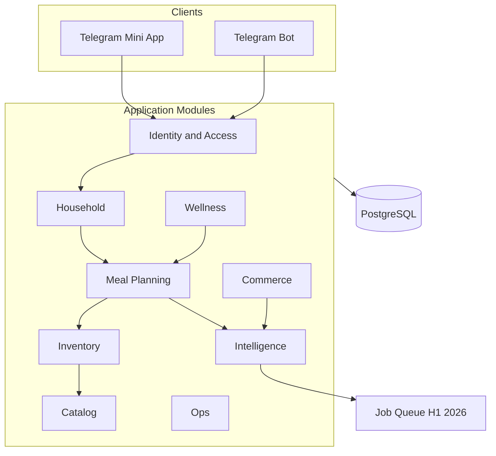
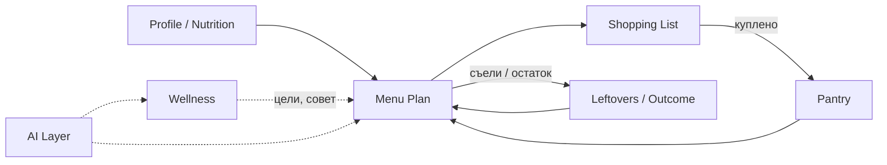

# PLANAM 2026 — Product Blueprint

**Дата:** 2026-06-03  
**Статус:** финальная продуктовая концепция (документ)  
**Режим:** только документация — код не изменялся.

**Источники (MASTER AUDIT):** [`CODEBASE_INDEX.md`](CODEBASE_INDEX.md) · [`SCREEN_MAP.md`](SCREEN_MAP.md) · [`NAVIGATION_GRAPH.md`](NAVIGATION_GRAPH.md) · [`DOMAIN_ARCHITECTURE.md`](DOMAIN_ARCHITECTURE.md) · [`UX_FLOW_MAP.md`](UX_FLOW_MAP.md) · [`UI_SYSTEM_AUDIT.md`](UI_SYSTEM_AUDIT.md) · [`SECURITY_AUDIT.md`](SECURITY_AUDIT.md) · [`PRODUCT_VISION.md`](PRODUCT_VISION.md) · [`SECURITY_FIX_ROADMAP.md`](SECURITY_FIX_ROADMAP.md)

---

## 1. Product Vision

**ПланАм 2026** — AI-помощник по бытовому циклу питания в Telegram: **понять, что есть дома → спланировать меню → купить недостающее → учесть остатки → двигаться к целям** без дневника ради дневника.

| Принцип | Смысл для 2026 |
|---------|----------------|
| **Дом, не дневник** | Главный экран отвечает на «что сегодня» и «что сделать дальше», а не на каталог функций |
| **Семья опциональна** | Личный режим — путь по умолчанию; семья/пара/группа — overlay, не обязательный онбординг |
| **AI за кулисами** | Интеллект встроен в план, покупки и заботу; чат — канал, не продукт |
| **PRO — слой глубины** | Спорт, метрики, аналитика поверх того же цикла, без отдельной «долины» |
| **Telegram-native** | Mini App — основной UI; бот — быстрый ввод (чек, голос), уведомления, приглашения |

**Границы (без изменений):** не заменяет врача; не требует семью; не дублирует «купил → внеси в запасы» для типовых продуктов.

**North Star (2026):** пользователь открывает ПланАм **один раз в день**, видит **один следующий шаг**, выполняет его за **≤2 тапа**, и доверяет рекомендациям, потому что они учитывают **реальный дом** (запасы, остатки, профили всех, кого кормим).

---

## 2. Core Value Proposition

### Для одного человека

«Скажи, что приготовить и что докупить — с учётом того, что уже в холодильнике и моих целей.»

### Для семьи / пары

«Один план и один список покупок на всех, у каждого — свой профиль питания (включая детей без Telegram).»

### Для PRO

«Вижу прогресс к цели, нагрузку и семейную сводку — без второго приложения.»

### Отличие от конкурентов

| Конкурентный паттерн | ПланАм 2026 |
|---------------------|-------------|
| Калорийный трекер | Закрытие **бытового цикла** (меню ↔ покупки ↔ запасы) |
| Рецепт-база | **План на период** с заменой блюда и учётом остатков |
| Чат с диетологом | **Панель заботы** + контекст дома, не generic chatbot |
| Отдельное приложение | **Telegram** — там, где уже живёт пользователь |

---

## 3. Product Architecture

### 3.1 Текущее состояние (as-is)

- **Клиент:** Next.js 14 Mini App (`apps/web`), ~47 маршрутов, 5 вкладок bottom nav
- **API:** FastAPI monolith (`apps/api`), ~170 endpoints, PostgreSQL + Redis
- **Идентичность:** `X-Telegram-Init-Data`; контекст **personal / family** через `X-App-Mode` + `AppScope`
- **Монетизация:** `user_subscriptions`, `ama_wallets`, server paywall (402), **без реальной оплаты** в UI
- **AI:** меню, нутрициолог, бот (OCR/голос); логи в `ai_usage_logs`

### 3.2 Целевая логическая архитектура (2026)

Один monolith допустим; границы модулей — для команды, API и будущего split.



| Модуль | Включает (сейчас) | Публичный API |
|--------|-------------------|---------------|
| **Identity & Access** | auth, legal, users, app-context | `/auth`, `/legal`, `/users` |
| **Household** | families, members, invites, nutrition per member | `/families`, `/nutrition-profile` |
| **Meal Planning** | menus, checkins, leftovers, event-plans | `/menus`, `/meal-*`, `/event-plans` |
| **Inventory** | pantry, shopping | `/pantry`, `/shopping-*` |
| **Catalog** | recipes, collections, recipe engine | `/recipes`, `/collections` |
| **Wellness** | progress, water, nutritionist, care, notifications (unified) | `/progress`, `/nutritionist`, `/care`, `/notifications` |
| **Commerce** | subscriptions, AMS | `/subscriptions` |
| **Intelligence** | ai_*, voice, ocr, care scheduler | internal + quotas |
| **Ops** | admin | `/admin` |

### 3.3 Ключевые API-контракты 2026

| Контракт | Назначение |
|----------|------------|
| `GET /menus/overview` | **Единый источник** «сегодня»: блюда, совет, CTA; Home — только виджет |
| `GET /household/context` *(новый, логический)* | Режим, семья, активные профили для планирования |
| `POST /meals/outcome` *(объединение)* | Чекин + остаток — один enum статуса приёма пищи |
| Unified notification preferences | Одна модель вместо Care + Notifications |

### 3.4 Deployment evolution

| Фаза | Топология |
|------|-----------|
| **Сейчас** | Monolith + Next + Postgres + Redis |
| **H1 2026** | Worker container: import, notifications, AI queue |
| **H2 2026** | Catalog read replica + CDN для медиа рецептов |
| **2027+** | AI Inference service при превышении порога token spend |

**Предусловие:** Phase 0 [`SECURITY_FIX_ROADMAP.md`](SECURITY_FIX_ROADMAP.md) до масштабирования фич и оплат.

---

## 4. Information Architecture

### 4.1 Проблема as-is

- **47 routes**, дубли «сегодня» на `/`, `/menu`, `/health/today`
- **5 равноправных вкладок** — когнитивная нагрузка
- Legacy redirects: `/recipes`, `/pantry`, `/nutritionist/*`
- Profile tab = «свалка» (семья, подписка, прогресс, настройки)

### 4.2 Целевая IA: три столпа + аккаунт

| Столп | Ментальная модель | Route tree (целевой) | Содержимое |
|-------|-------------------|----------------------|------------|
| **План** | «Что готовить» | `/plan/*` (alias `/menu/*` grace) | Текущее меню, генерация, рецепты, коллекции, замена блюда |
| **Дом** | «Что есть и что купить» | `/home` или `/` + `/home/*` | **Dashboard** + покупки + запасы + остатки |
| **Здоровье** | «Как я себя чувствую и к чему иду» | `/wellness/*` (alias `/health/*`) | Сегодня, цели, вода, чат, прогресс (PRO) |
| **Аккаунт** | «Кто я и как платить» | Sheet / `/account/*` | Профиль, режим, семья, подписка, legal — **не** bottom tab |

**Целевое число user-facing routes:** ~25 (nested layouts, redirects grace 6 мес).

### 4.3 Карта миграции маршрутов

| As-is | To-be |
|-------|-------|
| `/` PlanAmHome | `/` **Home Dashboard** (Дом) |
| `/menu/*` | `/plan/*` |
| `/shopping/*`, `/pantry` | `/home/shopping/*`, `/home/pantry` |
| `/health/*`, `/nutritionist/*` | `/wellness/*` |
| `/profile`, `/settings`, `/subscription` | `/account/*` или bottom sheet «⋯» |
| `/menu/event` | Удалить или встроить в wizard генерации |
| `/onboarding` | Удалить route; Welcome sheet + `/account/nutrition` |

### 4.4 Bot deep links (синхронизация)

Обновить `bot_menu.py` и care URLs: `/wellness`, `/home/shopping`, `/plan` — без цепочек legacy redirect.

---

## 5. UX Architecture

### 5.1 Сквозной цикл (core loop)



### 5.2 Приоритетные потоки 2026

| # | Сценарий | As-is friction | 2026 target |
|---|----------|----------------|-------------|
| 1 | Первый запуск | Пустой home; phone в боте | Welcome sheet (3 поля) → «Первое меню» |
| 2 | Семья | Отдельный flow invite | Wizard на Доме: имя → 1 участник → family mode |
| 3 | Профиль питания | 6 аккордеонов; dual forms | Progressive + shared `ProfileFields` |
| 4 | Генерация меню | 402 opaque; localStorage | Единые настройки плана; PaywallSheet с ценой Амов |
| 5 | Покупки | 5 путей добавления | 1 FAB «Добавить» + bot prefill |
| 6 | Остатки / чекин | Две сущности | Один «Итог приёма пищи» |
| 7 | Уведомления | Care vs Notifications | Unified preferences wizard |
| 8 | Подписка | select-plan без оплаты | Checkout + понятный баланс Амов |

### 5.3 Новый Home (Дом) — детальная спецификация

**Роль:** единственная точка «что делать сейчас»; **не** дублирует полноценный `/plan` или `/wellness`.

#### Структура экрана (сверху вниз)

| Блок | Содержимое | Источник данных | Действие |
|------|------------|-----------------|----------|
| **Header** | Приветствие, режим (личный/семья), switcher scope | `GET /users/me/app-context` | Tap → sheet смены режима / семья |
| **Hero — Next Step** | Один CTA: «Составить меню» / «Открыть сегодня» / «Докупить 3 позиции» / «Заполнить профиль» | Rule engine по состоянию | 1 tap → целевой flow |
| **Today Plan** (compact) | 1–3 блюда на сегодня, статус готовки | `GET /menus/overview` | Tap → `/plan/current` |
| **Shopping progress** | «5 из 12 куплено» + топ-3 позиции | `GET /shopping-lists/me` | Tap → `/home/shopping` |
| **Pantry alerts** | «Скоро истекает: …» (max 3) | `GET /pantry` + expiry | Tap → `/home/pantry` |
| **Wellness glance** | Вода %, streak, один совет (не дубль menu advice) | wellness aggregate | Tap → `/wellness` |
| **Quick capture** | «Чек» / «Голос» → открыть бот | deep link bot | Не дублировать OCR в TMA |

#### Правила Hero (приоритет next step)

1. Нет nutrition profile (минимум) → «Настроить питание» (3 поля inline sheet)
2. Нет активного меню → «Составить первое меню»
3. Есть незакрытые покупки на сегодня → «Докупить N позиций»
4. Есть expiry в запасах → «Использовать до …»
5. Иначе → «Что готовим сегодня» → plan/current

#### Чего НЕ должно быть на Home

- Полный hub из 6+ равноправных плиток (текущий `HubTile` pattern без иерархии)
- Дубль AI-чата (только ссылка «Спросить» при необходимости)
- Полная форма подписки / админки

#### Wireframe (логический)

```
┌─────────────────────────────────┐
│ Привет, Анна    [Личный ▾]      │
├─────────────────────────────────┤
│ ▶ Докупить 3 позиции сегодня    │  ← Hero (единственный акцент)
├─────────────────────────────────┤
│ Сегодня: овсянка, салат…   →    │
│ Покупки: ████░░ 5/12       →    │
│ Запасы: молоко 2 дня       →    │
│ Здоровье: вода 60% · совет →    │
├─────────────────────────────────┤
│ [📷 Чек]  [🎤 Голос в боте]     │
└─────────────────────────────────┘
│  План  │  Дом  │  Здоровье  │ ⋯ │
└─────────────────────────────────┘
```

### 5.4 Структура вкладок (bottom navigation)

#### As-is (5 вкладок)

`Меню` · `Покупки` · `ПланАм (/)` · `Здоровье` · `Профиль`

#### To-be (3 вкладки + overflow)

| Tab | Icon / label | Active zone | Заметки |
|-----|--------------|-------------|---------|
| **План** | 🍽 | `/plan/*` | Sub-tabs: Сегодня · Неделя · Рецепты · Настройки (sheet) |
| **Дом** | 🏠 | `/`, `/home/*` | **Центральная** вкладка — Home Dashboard |
| **Здоровье** | ❤️ | `/wellness/*` | Объединить `/health` + `/health/today` в один scroll |
| **⋯** | overflow | sheet | Профиль, подписка, уведомления, настройки, поддержка |

**Обоснование:** 3 столпа = 3 ментальные модели из [`DOMAIN_ARCHITECTURE.md`](DOMAIN_ARCHITECTURE.md) §9; профиль уходит в overflow, чтобы не конкурировать с ежедневными задачами.

#### Sub-navigation внутри столпов

**План**

| Sub-tab | Route |
|---------|-------|
| Сегодня | `/plan/current` |
| План | `/plan` (hub / неделя) |
| Рецепты | `/plan/recipes` |
| *(настройки)* | Sheet, не route |

**Дом**

| Sub-tab | Route |
|---------|-------|
| Сводка | `/` |
| Покупки | `/home/shopping` |
| Запасы | `/home/pantry` |
| Остатки | `/home/leftovers` |

**Здоровье**

| Секция (scroll) | Route anchor |
|-----------------|--------------|
| Сегодня (вода, чекин, совет) | `/wellness` top |
| Цели и профиль | link → nutrition |
| Чат | `/wellness/chat` |
| Прогресс PRO | `/wellness/progress` (gated) |

### 5.5 Auth & gates (UX)

| Gate | 2026 UX |
|------|---------|
| Telegram initData | Retry + single loading; admin_session до AppGate (P0-1) |
| Legal | Один раз; краткий summary + ссылка |
| Phone | Deep link «Открыть бот» → auto-return TMA |
| Welcome | После gates — sheet, не отдельный `/onboarding` redirect chain |

---

## 6. Design System

### 6.1 As-is оценка

- Readiness **2.5/5** ([`UI_SYSTEM_AUDIT.md`](UI_SYSTEM_AUDIT.md))
- Две палитры: **sage/cream/graphite** (`.pa-*`) vs **emerald/stone** (nav, home, auth)
- ~6 primitives в `components/ui/`; 7+ кастомных overlay; emoji в nav

### 6.2 Design System 2026

| Слой | Решение |
|------|---------|
| **Tokens** | Единственный semantic слой: `cream`, `sage`, `olive`, `graphite`, `warm` — **запрет** новых `stone-*`/`emerald-*` в product |
| **Primitives** | `Button`, `Card`, `Input`, `EmptyState`, `Spinner`, `Dialog`/`Sheet` |
| **Patterns** | `SectionHub` + `HubTile` только внутри столпов; Home использует **Hero + compact rows**, не равные плитки |
| **Typography** | Шкала h1/h2/body/caption в Tailwind (Manrope) |
| **Motion** | Sheet 300ms; skeleton на overview endpoints |
| **Paywall** | Единый `PaywallSheet` (402, AMS, PRO) |

### 6.3 Migration (Strangler)

Следовать Phase A–H из UI audit: сначала nav + home (Phase D), затем overlays (C), forms (E), paywall (F).

**Definition of Done:** bottom nav + home + plan в одной палитре; 100% overlays через `Sheet`; 0 новых legacy colors в product PR.

---

## 7. AI Strategy

### 7.1 Роль AI в продукте

| Принцип | Реализация |
|---------|------------|
| **AI = orchestrator, не главный экран** | Генерация меню, замена блюда, совет дня, разбор чека — без обязательного чата |
| **Контекст дома** | Промпт включает: nutrition profiles (all active), pantry, leftovers, shopping, goals |
| **Прозрачная стоимость** | Амы с preview до действия; подписка даёт пакет/скидку |
| **Care, не спам** | AI Care System: тишина, отказы, эскалация только high-value |

### 7.2 Карта AI-возможностей

| Возможность | Канал | Монетизация | 2026 приоритет |
|-------------|-------|-------------|----------------|
| Генерация меню | TMA `/plan/generate` | Амы / PRO quota | P0 — core |
| Замена блюда | TMA | Амы per action | P0 |
| Совет дня (один) | Overview API | Free (1/day) | P0 — убрать dual advice |
| Чат нутрициолога | `/wellness/chat` | Амы | P1 |
| OCR чека | Bot → pantry | Амы | P0 |
| Голос в запасы | Bot | Амы | P1 |
| Recipe explainability | Catalog | PRO / flag | P2 |
| Event menu | Wizard | Амы | P2 (если не удалить orphan) |

### 7.3 Техническая стратегия

| Тема | 2026 |
|------|------|
| **Queue** | H1: async generate с polling / push «меню готово» |
| **Validation** | Schema menu JSON; allowlist `recipe_id` (P2-2) |
| **Drafts** | User recipes → `user_recipe_drafts`, не global catalog (P0-5, P2-4) |
| **Limits** | Per-telegram_id rate limits на AI endpoints |
| **Models** | Скрыты от пользователя; A/B в admin, не в UI |

### 7.4 Unified advice rule

**Один совет на день** из `GET /menus/overview` (или wellness aggregate), не `MenuOverview` + `pickMainAdvice` параллельно.

---

## 8. Monetization

### 8.1 As-is

- Тарифы: **Личный · Совместный · Семейный · PRO** (логика в `subscription_plans`)
- **Амы** — внутренняя валюта за AI-действия
- `POST /subscriptions/select-plan` — **без платёжного шлюза** в UI
- Paywall размазан: `AmaConfirmDialog`, 402 strings, `ProgressProLocked`, links на `/subscription`

### 8.2 Monetization 2026

#### Тарифная лестница

| Тариф | Аудитория | Включено | Upsell |
|-------|-----------|----------|--------|
| **Free** | Trial / ограниченный | 1 профиль, 1 gen/нед, базовый список | Амы докупка |
| **Личный** | 1 человек | Полный цикл, N Амов/мес | PRO |
| **Совместный** | 2 профиля | Общий контекст | PRO |
| **Семейный** | Семья + virtual | Все household features | PRO |
| **PRO** | Layer | Progress, targets, sport, family analytics | — |

#### Амы (AMS)

| Правило | Деталь |
|---------|--------|
| Видимость | Баланс в header overflow + перед каждым AI-действием |
| Пакеты | Докупка пакетов Амов (ЮKassa / Telegram Stars — решение H1) |
| Подписчики | Скидка 30–50% на Амы или включённый monthly pool |

#### Paywall UX (единый)

```
Trigger (402 / insufficient AMS / PRO feature)
  → PaywallSheet
      → «Докупить Амы» | «Перейти на PRO» | «Выбрать тариф»
      → returnTo preserved
```

#### Server enforcement (обязательно до оплат)

P2-1 audit: каждый PRO/AMS endpoint — `require_pro` / `assert_*` на сервере.

### 8.3 Revenue milestones

| Milestone | Критерий |
|-----------|----------|
| M1 | Реальный checkout (хотя бы 1 провайдер) |
| M2 | 30% MAU видели PaywallSheet с понятной ценой |
| M3 | ARPPU по PRO + AMS split в admin analytics |

---

## 9. Referral System

### 9.1 As-is

**Нет кода** referral ([`SECURITY_AUDIT.md`](SECURITY_AUDIT.md) §10). Только design-time риски REF-01–05.

### 9.2 Referral 2026 (product design)

**Цель:** привлечение через **доверие** (семья, друзья), не paid ads на старте.

| Элемент | Спецификация |
|---------|--------------|
| **Механика** | «Пригласи в ПланАм» → персональная ссылка `t.me/bot?start=ref_{code}` |
| **Награда inviter** | +N Амов после **qualifying event** приглашённого (первое меню + profile) |
| **Награда invitee** | +M Амов на welcome (cap 1 per telegram_id) |
| **Anti-fraud** | phone verified; min 7 days activity; no self-ref; velocity limits (P3-5) |
| **UI** | `/account/invite` + share sheet Telegram |
| **Ledger** | `referral_codes`, `referral_events` — idempotent grants |

### 9.3 Launch gate

Referral code **только после** P3-4 threat model sign-off + P0 security baseline.

---

## 10. Partner System

### 10.1 Типы партнёров (2026–2027)

| Тип | Пример | Модель |
|-----|--------|--------|
| **Content** | Блогеры, нутрициологи | Promo code → extended trial |
| **B2B2C** | Фитнес-клубы, школы | Family plan bulk |
| **Retail** | Сети продуктов | Deep link «список покупок» (будущее) |

### 10.2 Partner portal (фаза 2)

- Admin: уже есть `promo_note` на users — расширить до `partner_accounts`
- KYC + manual approval перед payout (REF-05)
- Dashboard: conversions, clawback, fraud flags

### 10.3 2026 scope

**Q3–Q4:** manual partner onboarding через admin; **не** self-serve portal до PMF.

---

## 11. Mobile App Evolution

### 11.1 Стратегия платформы

| Период | Платформа | Обоснование |
|--------|-----------|-------------|
| **2026** | Telegram Mini App **primary** | CAC ≈ 0, initData auth, привычка аудитории |
| **2026 H2** | Bot as **companion** | OCR, voice, push-style care |
| **2027** | Optional **PWA / native shell** | Только при retention >40% D30 и запросе push вне TG |

### 11.2 Mini App technical evolution

| Направление | Действие |
|-------------|----------|
| Performance | Overview API + edge cache; lazy routes |
| Offline | Read-only today plan cache (localStorage → structured) |
| Telegram SDK | Retry initData; MainButton для primary CTA на generate |
| iOS/Android QA | Screenshot CI на 5 routes после design migration |

### 11.3 Bot evolution

| Функция | 2026 |
|---------|------|
| Menu button | Всегда `web_app` → Home |
| Care URLs | Прямые `/wellness`, `/home/shopping` |
| Quick actions | `leftover`, `receipt`, `invite` prefill |
| Notifications | Unified scheduler из одной preferences table |

**Не делать в 2026:** отдельный native app ради feature parity — только если Telegram limits блокируют оплату/камеру.

---

## 12. Launch Roadmap

### Phase 0 — Foundation (недели 1–4)

**Цель:** безопасность + admin + стабильный auth.

| Deliverable | Ссылка |
|-------------|--------|
| Admin AppGate fix | P0-1 |
| Webhook fail-closed | P0-3 |
| Recipe catalog integrity | P0-5 |
| Prod secrets | P0-6, P0-7 |

**Exit:** owner открывает `/admin` с первого раза; нет critical security open items.

### Phase 1 — UX Core (недели 5–10)

| Deliverable | User-visible |
|-------------|--------------|
| Home Dashboard v1 | Hero + overview API |
| 3-tab navigation | План / Дом / Здоровье |
| Welcome sheet | 3-field profile + first menu CTA |
| Unified PaywallSheet | Понятные Амы |
| Design Phase D | Nav + home одна палитра |

**Exit:** onboarding → first menu ≤5 screens; один «today» на Home.

### Phase 2 — Commerce (недели 11–16)

| Deliverable | User-visible |
|-------------|--------------|
| Payment provider | Реальная покупка тарифа |
| AMS packs | Докупка Амов |
| Server paywall audit | P2-1 complete |
| Session model decision | P2-5 |

**Exit:** первый платящий пользователь end-to-end.

### Phase 3 — Growth (недели 17–24)

| Deliverable | User-visible |
|-------------|--------------|
| Referral v1 | Invite + rewards |
| Family wizard | Дом → семья за 3 шага |
| Worker + AI queue | «Меню готовится» async |
| Wellness merge | `/wellness` единый scroll |

**Exit:** referral live with fraud controls; K-factor измерим.

### Phase 4 — PRO depth (2027 H1)

| Deliverable | User-visible |
|-------------|--------------|
| Progress analytics | PRO dashboards |
| Partner manual program | 5+ partners |
| Catalog scale | CDN + replica |

---

## 13. Risks

| # | Риск | Вероятность | Impact | Митигация |
|---|------|-------------|--------|-----------|
| R1 | AppGate / initData race | High | Critical | P0-1, P1-4; единый loading |
| R2 | Запуск оплат без server paywall | Medium | High | P2-1 gate before M1 |
| R3 | Referral fraud | Medium | High | P3-4, REF checklist; delayed payout |
| R4 | AI cost overrun | Medium | High | AMS + rate limits + queue |
| R5 | Visual regression при DS migration | Medium | Medium | Phase PRs; screenshot CI |
| R6 | Scope creep (47→25 routes) | High | Medium | Strangler redirects 6 mo |
| R7 | Catalog pollution | Medium | High | P0-5 drafts model |
| R8 | Telegram policy / WebView limits | Low | High | Bot fallback; PWA eval 2027 |
| R9 | Dual advice / confused UX | High | Medium | Overview API single advice |
| R10 | No payment → no revenue | High | Critical | Phase 2 приоритет после P0 |

**Операционные:** `ADMIN_PIN`, webhook secret — см. [`SECURITY_FIX_ROADMAP.md`](SECURITY_FIX_ROADMAP.md).

---

## 14. Success Metrics

### 14.1 North Star

**Weekly Active Planners (WAP):** пользователи, открывшие Home и выполнившие ≥1 из: просмотр today plan / toggle shopping / generate или replace menu.

### 14.2 Product metrics

| Metric | Baseline (audit) | Target 2026 |
|--------|------------------|-------------|
| Onboarding → first menu | >7 screens, частый отвал | ≤5 screens, >60% completion |
| Home → action | 3+ равных hub tiles | 1 Hero CTR >40% |
| D7 retention | TBD | +15% vs Q1 baseline |
| Menu generate success | p95 unknown | p95 <15s or async notified |
| Shopping → pantry理解 | скрытый toggle | >70% users see explainer once |
| Paywall conversion | select-plan only | >5% checkout start → >2% paid |
| Referral K-factor | 0 | >0.15 post Phase 3 |
| Support tickets «где X» | high (47 routes) | -50% после 3-tab IA |

### 14.3 Technical metrics

| Metric | Target |
|--------|--------|
| Admin false «Нужен Telegram» | 0 |
| Critical security open | 0 post Phase 0 |
| User routes | ≤25 |
| New `emerald/stone` in product PR | 0 |
| AI endpoints with server quota | 100% |

### 14.4 Business metrics

| Metric | Target H2 2026 |
|--------|----------------|
| Paid subscribers | 500+ (adjust per market) |
| ARPU | Track PRO vs AMS |
| AI cost / paying user | <30% gross margin drain |
| Partner-led signups | 10% of new (Phase 4) |

---

## 15. Recommended Next 12 Months

### Q2 2026 (Apr–Jun): Fix & Focus

| Month | Focus |
|-------|-------|
| Apr | Phase 0 security; admin usable |
| May | Home Dashboard + `GET /menus/overview`; 3-tab nav behind flag |
| Jun | Welcome sheet; PaywallSheet UI; Design Phase D complete |

### Q3 2026 (Jul–Sep): Ship Commerce

| Month | Focus |
|-------|-------|
| Jul | Payment integration; P2-1 paywall audit |
| Aug | AMS packs; session model (P2-5) |
| Sep | Beta 50–100 users; measure WAP + D7 |

### Q4 2026 (Oct–Dec): Grow

| Month | Focus |
|-------|-------|
| Oct | Referral v1 (post threat model) |
| Nov | Family wizard; bot URL migration |
| Dec | AI queue worker; wellness route merge |

### Q1 2027 (Jan–Mar): PRO & Partners

| Month | Focus |
|-------|-------|
| Jan | PRO analytics depth |
| Feb | Manual partner program (5 partners) |
| Mar | Evaluate PWA / retention; catalog CDN decision |

### Team sequencing rule

```
Security P0 → Home/IA → Paywall truth → Payments → Referral → PRO depth
```

Не параллелить **referral** и **payments** без P2-1 и P3-4.

### Документация (поддержка blueprint)

| Документ | Когда обновлять |
|----------|-----------------|
| `SCREEN_MAP.md` | После каждого route change |
| `NAVIGATION_GRAPH.md` | После tab IA |
| `DOMAIN_ARCHITECTURE.md` §9 | После module API changes |
| `UX_FLOW_MAP.md` | После flow changes |
| `UI_SYSTEM_AUDIT.md` | После Phase D/F DoD |

---

## Executive Summary

*(≈1 страница — для стейкхолдеров и команды)*

### Что такое PLANAM 2026

**ПланАм** остаётся AI-помощником по **бытовому циклу питания** в Telegram, но в 2026 году продукт переходит от **«каталога из 47 экранов»** к **трём столпам**: **План** (что готовить), **Дом** (что купить и что есть), **Здоровье** (цели и забота). Семья и PRO — **опциональные слои**, не отдельные вселенные.

### Главное изменение для пользователя

**Новый Home (вкладка «Дом»)** — один экран с **единственным главным действием** (Hero): «докупить», «составить меню», «настроить питание» или «открыть сегодня». Остальное — компактные строки (план, покупки, запасы, взгляд на здоровье), без шести равноправных плиток. Данные «сегодня» приходят из **одного API** (`/menus/overview`), а не дублируются на menu и health.

### Навигация

**5 вкладок → 3 + меню «⋯»**. Профиль, подписка и настройки уходят в overflow. Целевой объём маршрутов: **~25** (с grace-period редиректами). Бот и care получают **прямые deep links** без цепочек `/nutritionist` → `/health`.

### Роль AI

AI — **оркестратор** меню, покупок и совета дня, а не обязательный чат. **AI Care System** доставляет напоминания дозированно. **Амы** показываются **до** действия; подписка даёт пакет и скидки. Технически: очередь генерации, валидация выхода модели, черновики рецептов отдельно от каталога.

### Семейный режим

Личный режим по умолчанию. Семья подключается **wizard с Дома**: название → один участник (реальный/виртуальный) → family scope → семейное меню. Виртуальные участники без Telegram сохраняются как ключевая дифференциация.

### Деньги

До конца 2026: **реальная оплата** тарифов + докупка Амов, единый **PaywallSheet**, **100% server-side** gating (Phase 2 audit). Free tier — ограниченный trial, не вечный полный продукт.

### Growth loop

```
Invite / bot share → друг регистрируется → Welcome + первое меню
  → inviter + invitee получают Амы (после qualifying event)
  → семья расширяет household → семейный тариф
  → care напоминания возвращают в TMA → Home Hero
```

Referral **не запускать** до закрытия security Phase 0 и threat model (REF-01–05).

### Технический фундамент

Monolith остаётся; модули Identity, Household, Meal Planning, Inventory, Wellness, Commerce, Intelligence. **H1:** worker для AI/notifications. **Предусловие:** admin AppGate, webhook secret, catalog write protection — [`SECURITY_FIX_ROADMAP.md`](SECURITY_FIX_ROADMAP.md) Phase 0.

### Design

Миграция на **единую sage/cream палитру** и primitives (`Button`, `Sheet`, `PaywallSheet`). Readiness с 2.5/5 → **4/5** к концу Q2 2026.

### Roadmap в одной строке

**Q2:** безопасность + Home + 3 tabs · **Q3:** оплаты · **Q4:** referral + family wizard · **Q1 2027:** PRO + partners.

### Риски, которые нельзя игнорировать

Auth/initData, отсутствие оплаты, AI cost, referral fraud, расползание scope. Метрика успеха: **WAP** (weekly active planners) и **≤5 экранов** до первого меню.

### Решение для команды

PLANAM 2026 — это не новый продукт, а **фокусировка существующего**: один Home, три вкладки, один совет, один paywall, один цикл **профиль → меню → покупки → запасы**, с AI и монетизацией **внутри** цикла, а не рядом с ним.

---

## Appendix: Traceability Matrix

| Blueprint section | Primary source doc |
|-------------------|-------------------|
| §3 Architecture | `DOMAIN_ARCHITECTURE.md` §7–9 |
| §4 IA | `NAVIGATION_GRAPH.md`, `DOMAIN_ARCHITECTURE.md` §9.1 |
| §5 UX / Home / Tabs | `UX_FLOW_MAP.md`, `NAVIGATION_GRAPH.md` §UX Simplification |
| §6 Design | `UI_SYSTEM_AUDIT.md` |
| §7 AI | `PRODUCT_VISION.md`, `DOMAIN_ARCHITECTURE.md` §3.12 |
| §8 Monetization | `PRODUCT_VISION.md` §9, `UX_FLOW_MAP.md` §12 |
| §9–10 Referral/Partner | `SECURITY_AUDIT.md` §10 |
| §11 Mobile | `CODEBASE_INDEX.md`, `TELEGRAM_SETUP.md` |
| §12 Roadmap | `SECURITY_FIX_ROADMAP.md`, `ROADMAP_V1.md` |
| §13 Risks | `SECURITY_AUDIT.md`, `UX_FLOW_MAP.md` Top 20 |
| §14 Metrics | `DOMAIN_ARCHITECTURE.md` §9.6 |

---

*Документ синтезирует MASTER AUDIT на 2026-06-03. При реализации обновлять связанные docs и этот blueprint (версия в заголовке).*
