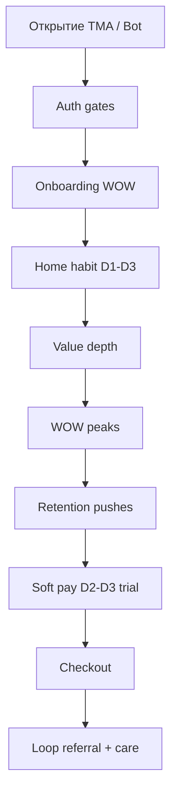

# PLANAM Conversion Funnel 2026

**Дата:** 2026-06-03  
**Режим:** продуктовая воронка — код, API, БД не менялись.

**Основа:** [`PLANAM_UX_UI_2026_MASTER_SPEC.md`](PLANAM_UX_UI_2026_MASTER_SPEC.md) §7–10 · [`PLANAM_2026_PRODUCT_BLUEPRINT.md`](PLANAM_2026_PRODUCT_BLUEPRINT.md) §8 · [`UX_FLOW_MAP.md`](UX_FLOW_MAP.md)

**Продуктовые параметры триала 2026 (целевые):**

| Parameter | Value 2026 |
|-----------|------------|
| Длительность | **3 дня** |
| Стартовые Амы | **50** |
| Философия | Ценность до оплаты; **без** агрессивных paywall |

**As-is backend (справочно):** `TRIAL_DAYS = 14`, `monthly_ams = 200` для plan `trial` — [`subscription_catalog.py`](../apps/api/app/services/subscription_catalog.py). Синхронизация каталога — отдельная задача реализации; воронка описывает **целевой UX**.

---

## 1. North Star воронки

| Уровень | Метрика |
|---------|---------|
| Activation | Первый **план с фото** сохранён (D0) |
| Habit | WAP — Weekly Active Planners (Home Hero tap) |
| Revenue | Trial → paid в **D14–D30** |
| Long-term | Retention 12 мес — «операционная система питания» |

**Бизнес-цель:** продукт настолько полезен, что подписка воспринимается как **сохранение ритма**, а не покупка функций.

---

## 2. Карта воронки (обзор)



---

## 3. D0 — Первый день (Activation)

### Цель

**Первый WOW:** персональный план с фото и автосписок покупок.

| Step | Действие | Экран | API / событие |
|------|----------|-------|---------------|
| 0 | Open WebApp | TMA load | `POST /auth/telegram` |
| 1 | Legal / phone | Gates (phone **не** блокер WOW) | legal, skip-phone optional |
| 2 | Welcome G1–G2 | Overlay | — |
| 3 | Mini nutrition | Sheet 3 поля | `PUT /nutrition-profile/me` |
| 4 | Generate + select | Wizard | `POST /menus/generate`, `POST /menus/select` |
| 5 | Reveal | Fullscreen Hero photos | — |
| 6 | Home | Hero P2 или P5 | `GET /menus/overview` |

### Точки WOW (D0)

| ID | WOW | Эмоция |
|----|-----|--------|
| **W0** | «Ваш план готов» + 3 фото блюд | Удивление, забота |
| **W0b** | Список покупок уже заполнен | Облегчение |

### Точки удержания (D0)

| ID | Механика |
|----|----------|
| **R0** | Push через 2ч: «Завтрак по плану» → `/plan/today` |
| **R0b** | In-app: toast «Куплено → в запасах» при первом toggle |

### Точки оплаты (D0)

**Нет.** Только Micro: «Пробный период 3 дня» в Account, не на Home.

### Запрещено D0

- Paywall перед generate
- Тарифы в онбординге
- Countdown timer trial

---

## 4. D1 — Привычка «утро»

### Цель

Второй заход: Home → **один** Hero → действие.

| Сценарий | Hero | CTA |
|----------|------|-----|
| Утро | P5 «Что готовим» | `/plan/today` |
| После работы | P2 «Докупить N» | `/home/shopping` |

### WOW

| ID | WOW |
|----|-----|
| **W1** | Фото блюда в push + открытие Today |

### Удержание

| ID | Канал | Copy direction |
|----|-------|----------------|
| **R1** | Care | «Овсянка по плану — 10 мин» |
| **R1b** | Home | Shopping strip progress |

### Оплата

Нет. Trial badge в Account: «2 дня осталось».

---

## 5. D2 — Глубина ценности

### Цель

Пользователь пробует **второй цикл**: покупки → запасы **или** замена блюда.

| Действие | WOW |
|----------|-----|
| Toggle shopping → pantry | **W2** «Молоко в запасах» |
| Bot чек (optional) | **W2b** «Чек разобран» |
| Replace dish | **W3** новое фото блюда |

### AMS (50 Амов)

| Действие | Стоимость (as-is costs) | UX |
|----------|-------------------------|-----|
| Первая gen | Включена в trial | Без dialog |
| Replace | 3 Ама | Preview «3 Ама · осталось 47» |
| Чек OCR | 4 Ама | Bot, soft confirm |

**Правило:** показывать остаток Амов **до** действия, не после отказа.

### Удержание

| ID | Trigger |
|----|---------|
| **R2** | Pantry expiry → push |
| **R2b** | Meal outcome reminder вечером |

### Оплата (мягкая)

| Touchpoint | Подача |
|------------|--------|
| **P2** | После W3 replace: Insight «С PRO замены дешевле» — **Ghost** link, не блок |
| **P2b** | Account: «Вы сэкономили ~2ч на планировании» (estimate) |

---

## 6. D3 — Закрытие триала (конверсия без давления)

### Цель

Пользователь **осознал ритм**; предложить сохранить его подпиской.

| Момент | UX |
|--------|-----|
| Утро D3 | Home banner soft: «Завтра пробный период заканчивается» |
| Вечер D3 | Sheet **outcome**, не paywall: |

```
┌──────────────────────────────────────┐
│  За 3 дня вы:                        │
│  · 1 план на неделю                  │
│  · N блюд приготовили по плану       │
│  · M позиций в покупках              │
│  [ Сохранить ритм — Личный ]         │  Primary
│  [ Продолжить бесплатно ]            │  Ghost → freemium
└──────────────────────────────────────┘
```

### Точки оплаты (D3)

| ID | Type | Aggressive? |
|----|------|-------------|
| **P3** | Outcome sheet | **No** — secondary Ghost |
| **P3b** | `/account/subscription` | Outcome-first layout |

### После триала (D4+ freemium)

| Capability | Free |
|------------|------|
| Shopping / pantry | ✅ |
| 1 gen / неделя | ✅ |
| AMS | Докупка пакетов |
| Replace / OCR | AMS или подписка |

**Нет** hard lock данных пользователя.

---

## 7. Триал: 3 дня · 50 Амов

### 7.1 Что входит

| Benefit | Detail |
|---------|--------|
| Полный цикл | Меню, покупки, запасы, базовый нутрициолог |
| 50 Амов | ~10–15 AI-действий (gen + replace + 1–2 OCR) |
| 3 дня | Достаточно для W0–W3, не для «забыли» |

### 7.2 Расход Амов (ориентир as-is `AMA_COSTS`)

| Action | Cost | Fits 50? |
|--------|------|----------|
| Extra gen | 5 | 2–3× |
| Replace | 3 | 3–5× |
| OCR | 4 | 2× |
| Chat ask | 2 | 5× |

**UX:** trial welcome grant **50** единым пакетом; не показывать «200» если продукт 2026 = 50.

### 7.3 Коммуникация триала

| Day | Message |
|-----|---------|
| D0 | «3 дня полного доступа» (Account only) |
| D1 | — |
| D2 | «Осталось 47 Амов» при AI action |
| D3 | Outcome sheet |

---

## 8. Точки WOW (сводная)

| ID | Day | Moment |
|----|-----|--------|
| W0 | D0 | План + фото |
| W0b | D0 | Автосписок |
| W1 | D1 | Push → today |
| W2 | D2 | Pantry from shopping |
| W2b | D2 | Чек |
| W3 | D2–D3 | Replace photo |
| W4 | D3 | Outcome stats |
| W5 | D7+ | «Неделя без рутины» (retention) |

---

## 9. Точки удержания (сводная)

| ID | When | Goal |
|----|------|------|
| R0–R2 | D0–D2 | Return to Home |
| R3 | D3 trial end | Convert or freemium habit |
| R4 | D7 inactive | Reactivation |
| R5 | Weekly | New plan suggestion |

Детали push → [`PLANAM_NOTIFICATION_SYSTEM_2026.md`](PLANAM_NOTIFICATION_SYSTEM_2026.md).

---

## 10. Точки оплаты (сводная, non-toxic)

| ID | When | Pattern |
|----|------|---------|
| P1 | AMS empty mid-trial | PaywallSheet: докупить Амы **или** подписка |
| P2 | After value W3 | Ghost upsell |
| P3 | D3 | Outcome sheet Primary |
| P4 | D10+ freemium | «Вернуть безлимит планирования» |
| P5 | PRO teaser | Wellness progress blur |

**Запрещено:**

- Full-screen blocker «Оплатите сейчас»
- Удаление меню/списков при окончании trial
- Fake urgency countdown on Home

---

## 11. Тарифы (после триала) — продаём результат

| Plan | Copy (не features) |
|------|-------------------|
| Личный | «План и покупки без стресса каждый день» |
| Совместный | «Один план на двоих» |
| Семейный | «Кормите всех — один список» |
| PRO | «Видите прогресс к цели» |

**API:** `GET /subscriptions/me`, `POST /subscriptions/select-plan` (checkout UI — future).

---

## 12. Метрики воронки

| Stage | Metric | Target |
|-------|--------|--------|
| D0 | Activation rate (plan selected) | > 60% opens |
| D1 | D1 retention | > 45% |
| D3 | Trial → paid | > 8% (adjust baseline) |
| D30 | Paid retention | > 70% |
| Toxic | Paywall dismiss rage | < 5% |

---

## 13. Связь с экранами

| Funnel step | Screen |
|-------------|--------|
| D0 WOW | Onboarding → `/` |
| Habit | Home, `/plan/today` |
| Value | `/home/shopping`, replace sheet |
| Pay | `/account/subscription`, PaywallSheet |

---

*Воронка согласована с Visual Mockups и Notification System. Backend trial params — см. § as-is gap.*
