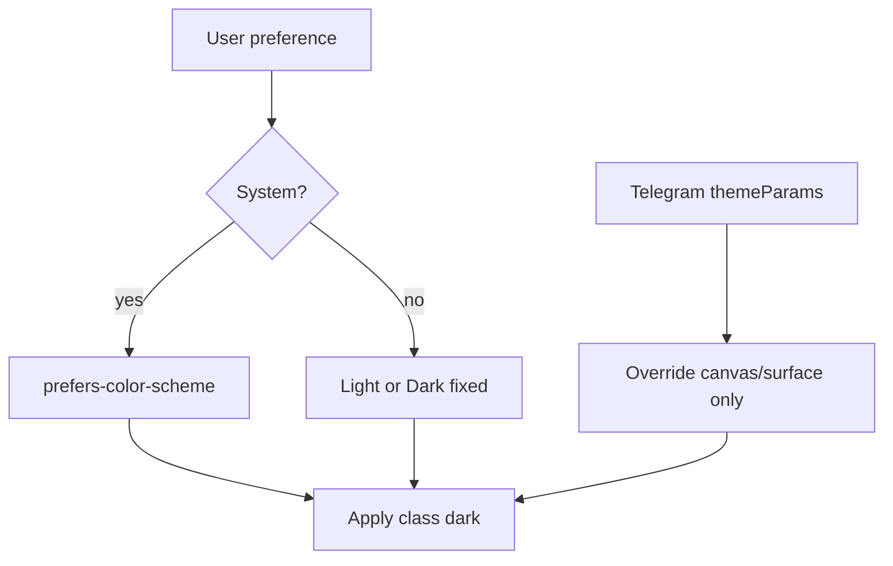

# PLANAM Design System 2026

**Дата:** 2026-06-03  
**Статус:** единая дизайн-система для реализации экранов PLANAM 2026  
**Режим:** только документация — код, API и БД не изменялись.

**Источники:** [`PLANAM_UX_UI_2026_MASTER_SPEC.md`](PLANAM_UX_UI_2026_MASTER_SPEC.md) · [`PLANAM_2026_PRODUCT_BLUEPRINT.md`](PLANAM_2026_PRODUCT_BLUEPRINT.md) · [`UI_SYSTEM_AUDIT.md`](UI_SYSTEM_AUDIT.md) · [`UX_FLOW_MAP.md`](UX_FLOW_MAP.md)

**Связь с кодом (справочно, не менять в этом документе):** [`apps/web/tailwind.config.ts`](../apps/web/tailwind.config.ts) · [`apps/web/app/globals.css`](../apps/web/app/globals.css) · [`apps/web/components/ui/Sheet.tsx`](../apps/web/components/ui/Sheet.tsx)

---

## 0. Концепция и мандат

### 0.1 Как PLANAM должен ощущаться

PLANAM **не** выглядит как учётная система, CRM, таблица, калькулятор калорий или список функций.

PLANAM воспринимается как **персональный помощник по питанию и покупкам**. При открытии пользователь чувствует: **«За меня уже подумали»**.

| Ощущение | Визуальный сигнал |
|----------|-------------------|
| Забота | Тёплый cream-фон, мягкие тени, спокойный sage |
| Ясность | Один primary action, крупная типографика |
| Премиум | Большие фото блюд, воздух, минимум chrome |
| Доверие | Консистентность, без визуального шума |

### 0.2 Визуальные референсы (ограничители, не копипаст)

**Apple Food** + **Apple Health** + **Premium Wellness** + ограничения **Telegram Mini App** (touch 44px, слабый GPU, без тяжёлой графики).

### 0.3 Границы документа

| Разрешено | Запрещено |
|-----------|-----------|
| Токены, компоненты, паттерны для **существующих** экранов 2026 | Новые продуктовые функции |
| Маппинг на cream / sage / graphite | Вторая параллельная палитра (`emerald-*`, `stone-*` в новых экранах) |
| Light / Dark / System | Изменение API, БД, бизнес-логики |
| 4 типа карточек, 4 типа кнопок | Локальные варианты кнопок и карточек |

### 0.4 Продуктовый якорь (из Master Spec)

Каждый экран проверяется вопросом: **«Что мне нужно сделать сегодня?»**

---

## 1. Цветовая система

### 1.1 Базовая палитра (единственная)

Используются **только** brand-нейтрали и зелень проекта:

| Family | Hex (референс) | Роль в DS |
|--------|----------------|-----------|
| **Cream** | `#FBF7EF` (DEFAULT), `#FFFDF8` (surface), `#F3EEE2` (deep), `#ECE4D6` (border) | Фон, поверхности |
| **Sage** | `#5E8B57` (500) … шкала 50–700 | Primary, Success, brand |
| **Graphite** | `#2E2C28` (900) … 300 | Текст, dark canvas |
| **Olive** | `#B9C49A`, `#8E9B6C` | Secondary badges (дозированно) |
| **Warm** | `#D98E5A`, `#E8B87E` | Accent urgent, Warning |

**Запрет:** в новых и переработанных экранах PLANAM 2026 — классы `emerald-*`, `stone-*`, ad-hoc серые Tailwind default. Legacy допустим только до Strangler-миграции ([`UI_SYSTEM_AUDIT.md`](UI_SYSTEM_AUDIT.md) Phase A–D).

### 1.2 Семантические роли

| Role | Назначение | Light | Dark |
|------|------------|-------|------|
| **Primary** | Главный CTA, активный tab, ключевой прогресс | `sage-500` `#5E8B57` | `sage-400` `#7DA870` |
| **Secondary** | Вторичные CTA, chips, иконки inactive | `sage-700` on `sage-50` | `sage-300` on `sage-700/30` |
| **Accent** | Срочность (expiry, trial ending) — **редко** | `warm` `#D98E5A` | `warm.soft` `#E8B87E` |
| **Success** | Куплено, выполнено, чекин | `sage-600` `#4C7347` | `sage-400` |
| **Warning** | Истекает скоро, мало Амов | `warm` + cream surface | `warm.soft` |
| **Error** | Ошибка сети, destructive confirm | `#B85C5C` (muted terracotta)* | `#D47878` |
| **Background** | Canvas приложения | `cream` `#FBF7EF` | `#1A1917` |
| **Surface** | Карточки, sheets | `cream.surface` `#FFFDF8` | `#252320` |
| **Surface elevated** | Sheet panel, modals | `#FFFFFF` | `#2E2C28` |
| **Text Primary** | Заголовки, основной текст | `graphite-900` `#2E2C28` | `cream.surface` `#FFFDF8` |
| **Text Secondary** | Meta, подписи | `graphite-500` `#726C61` | `graphite-300` `#C9C3B8` |
| **Border** | Разделители | `cream.border` `#ECE4D6` | `graphite-700` `#3C5B39` → use `#3A3834`† |

\* Error — единственный non-brand hue для accessibility; не расширять палитру красными оттенками.  
† Dark border: `#3A3834` (warm graphite border, не sage).

### 1.3 CSS-переменные (целевая схема для реализации)

```css
/* :root — Light */
--pa-bg-canvas: #fbf7ef;
--pa-bg-surface: #fffdf8;
--pa-bg-elevated: #ffffff;
--pa-text-primary: #2e2c28;
--pa-text-secondary: #726c61;
--pa-brand-primary: #5e8b57;
--pa-brand-secondary: #4c7347;
--pa-accent: #d98e5a;
--pa-success: #4c7347;
--pa-warning: #d98e5a;
--pa-error: #b85c5c;
--pa-border: #ece4d6;

/* .dark — Dark */
--pa-bg-canvas: #1a1917;
--pa-bg-surface: #252320;
--pa-bg-elevated: #2e2c28;
--pa-text-primary: #fffdf8;
--pa-text-secondary: #c9c3b8;
--pa-brand-primary: #7da870;
--pa-brand-secondary: #9cbe90;
--pa-accent: #e8b87e;
--pa-border: #3a3834;
```

### 1.4 Режимы темы

| Mode | Поведение |
|------|-----------|
| **Light** | Default для новых пользователей |
| **Dark** | `class="dark"` на `html` |
| **System** | `prefers-color-scheme` + fallback Light |

**Telegram Mini App:** `Telegram.WebApp.themeParams` может переопределять **только** `--pa-bg-canvas` и `--pa-bg-surface`; **Primary (sage)** не меняется.

**Выбор темы:** Account → Оформление → Light / Dark / System ([`PLANAM_UX_UI_2026_MASTER_SPEC.md`](PLANAM_UX_UI_2026_MASTER_SPEC.md) §14).

### 1.5 Контраст и доступность

- Текст Primary на Background: ≥ **4.5:1** (AA).
- Primary button (white on sage-500): проверено ≥ 4.5:1.
- Secondary text не использовать для единственного CTA.

---

## 2. Типографика

**Шрифт:** Manrope (`font-sans` в Tailwind) — единственный UI-шрифт.

**Запрещено:** произвольные `text-lg`, `text-xl` без токена; inline `font-size` в px.

### 2.1 Шкала (единственная)

| Token | Size / Line-height | Weight | Letter-spacing | Использование |
|-------|-------------------|--------|----------------|---------------|
| **Hero** | 28px / 34px (1.21) | 600 (semibold) | -0.02em | Home greeting, WOW reveal title |
| **Page Title** | 22px / 28px (1.27) | 600 | -0.01em | Заголовок экрана (Plan today, Shopping) |
| **Section Title** | 17px / 24px (1.41) | 600 | 0 | Секции на scroll-экранах («Сегодня», «Покупки») |
| **Card Title** | 17px / 22px (1.29) | 500 (medium) | 0 | Название блюда, позиция списка |
| **Body** | 15px / 22px (1.47) | 400 | 0 | Основной текст, описания |
| **Caption** | 13px / 18px (1.38) | 400 | 0 | KBJU, время, meta под карточкой |
| **Micro** | 11px / 14px (1.27) | 500 | 0.02em | Badges, tab labels, legal footnotes |

### 2.2 Tailwind mapping (для реализации)

| Token | Class (предложение) |
|-------|---------------------|
| Hero | `text-[28px] leading-[34px] font-semibold` |
| Page Title | `text-[22px] leading-[28px] font-semibold` |
| Section Title | `text-[17px] leading-[24px] font-semibold` |
| Card Title | `text-[17px] leading-[22px] font-medium` |
| Body | `text-[15px] leading-[22px] font-normal` |
| Caption | `text-[13px] leading-[18px] font-normal` |
| Micro | `text-[11px] leading-[14px] font-medium` |

### 2.3 Правила набора

| Правило | Detail |
|---------|--------|
| Max lines Card Title | 2, then ellipsis |
| Max lines Body в карточке | 3 |
| Числа (КБЖУ) | Caption, tabular nums если доступно |
| ALL CAPS | Только Micro для badges, не для заголовков |
| Ссылки | Body + `text-sage-700` / dark `sage-300`, underline off |

---

## 3. Сетка, отступы, радиусы

### 3.1 Spacing scale (base 4px)

**4 · 8 · 12 · 16 · 24 · 32 · 48** — единственные отступы между блоками.

| Context | Value |
|---------|-------|
| Screen horizontal padding | **16px** (`px-4`) |
| Between sections | **24px** |
| Inside card padding | **16px** |
| Card gap in list | **12px** |
| Rail gap (Today dishes) | **12px** |

### 3.2 Layout

| Token | Value |
|-------|-------|
| Max content width | `max-w-lg` (512px) centered |
| Bottom nav safe area | `env(safe-area-inset-bottom)` |
| Sheet max height | 92vh |
| Touch target min | **44×44px** |

### 3.3 Radius (из проекта)

| Token | px | Use |
|-------|-----|-----|
| `rounded-control` | 14 | Buttons, inputs, chips |
| `rounded-card` | 20 | Cards, sheet top |
| `rounded-pill` | full | Badges, scope chip |
| Photo inner | 16 | Inset photo in Hero Card |

### 3.4 Elevation

| Level | Light | Dark |
|-------|-------|------|
| Card | `shadow-soft` | border `1px` `--pa-border` |
| Sheet | `shadow-lift` | border top + elevated surface |
| Floating FAB | `shadow-card` | border + elevated |

---

## 4. Карточки (только 4 типа)

**Запрещено:** `HubTile`-стиль как равные плитки на Home; stone/emerald cards; седьмой «универсальный» card.

### 4.1 Hero Card

**Назначение:** блюдо дня, главное действие дня, WOW-момент (первый план).

| Property | Spec |
|----------|------|
| Min width (rail) | 72% viewport, max 320px |
| Photo | **Обязательно**; ratio **4:3** (Home rail) или **16:9** (Plan today, WOW) |
| Structure | Photo top → Card Title → Caption (time · kcal) → optional Primary button |
| Padding | 0 photo bleed; text block 16px |
| Radius | `rounded-card` |
| States | default · pressed (scale 0.98) · skeleton (shimmer photo rect) |

**Light:** surface + soft shadow. **Dark:** elevated surface + border, **без** затемнения фото.

**Использование:** Home Today rail, Plan `/plan/today` meal blocks, Onboarding reveal.

---

### 4.2 Action Card

**Назначение:** покупки, остатки, переход в меню, здоровье (компактные действия).

| Property | Spec |
|----------|------|
| Layout | Horizontal: leading icon **или** mini thumb 48px · title + caption · trailing chevron |
| Min height | 64px |
| Padding | 16px horizontal, 12px vertical |
| Radius | `rounded-card` |
| Interaction | Full row tap; active bg `sage-50` / dark `white/5` |

**Variants:**

| Variant | Leading | Caption example |
|---------|---------|-----------------|
| Shopping | checklist icon | «5 из 12 куплено» |
| Pantry | jar icon | «Молоко · 2 дня» |
| Plan link | dish icon | «3 блюда на сегодня» |
| Wellness | droplet icon | «Вода 60%» |

**Mobile:** single column, full width; **не** grid на Home (только strips).

---

### 4.3 Insight Card

**Назначение:** совет ПланАм, AI-рекомендация (одна в день), напоминание.

| Property | Spec |
|----------|------|
| Layout | Icon/emoji left (см. §10) · Body text · optional text link |
| Background | `sage-50` / dark `sage-700/20` |
| Border | none light; 1px sage-200 dark |
| Padding | 16px |
| Max lines | Body 3; disclaimer Micro below |
| Emoji | **Допустим** 1 emoji в начале совета |

**Disclaimer (Micro):** «Рекомендация, не медицинское назначение» — для health-tinted insights.

**Запрещено:** второй Insight Card на Home (дубль menu + nutritionist advice).

---

### 4.4 Metric Card

**Назначение:** КБЖУ, вода, прогресс, статистика.

| Property | Spec |
|----------|------|
| Layout | Label Caption + value Card Title / Hero number |
| Size | Min width 96px in row; или full width progress bar |
| Visual | Ring (вода), bar (прогресс), row of 4 macros |
| Colors | Values `text-primary`; labels `text-secondary`; progress fill `primary` |

**PRO locked:** Metric Card с blur overlay + Micro «В PRO» — не отдельный paywall screen.

---

### 4.5 Сводка: что на какой экран

| Экран | Допустимые карточки |
|-------|---------------------|
| Home | Hero (rail), Action strips, Insight chip, Metric mini |
| Plan today | Hero × meals |
| Recipes grid | Hero thumbnail 1:1 в grid cell |
| Shopping | Action rows (checklist), не Metric |
| Wellness | Metric (вода), Insight |
| Subscription | Metric (результат месяца), не Hero |

---

## 5. PLANAM Food Photography Guide

### 5.1 Принцип

Фотографии — **часть бренда**. Смешение стилов (сток, AI, пользовательские) **запрещено** в одном каталоге без нормализации.

### 5.2 Единый стиль съёмки

| Parameter | Standard |
|-----------|----------|
| **Угол** | 45° сверху (three-quarter), лёгкая перспектива |
| **Свет** | Мягкий дневной, рассеянный; без жёстких теней |
| **Фон** | Нейтральный тёплый: cream `#F3EEE2` или светлое дерево |
| **Стиль** | Premium wellness, «домашняя премиум-кухня», не фастфуд |
| **Реквизит** | Одна тарелка/боул; максимум 1–2 props |
| **Текст на фото** | **Запрещён** |
| **Люди / лица** | Вне кадра (только руки допустимы редко) |

### 5.3 Типы кадров в продукте

| Type | Aspect ratio | Display width (logical) | Use |
|------|--------------|-------------------------|-----|
| **Hero Photo** | 16:9 | 100% screen width, max 1200px source | Plan today, recipe detail top |
| **Recipe Photo** | 1:1 | Grid 50% − gap | Catalog `/plan/recipes` |
| **Thumbnail Photo** | 4:3 | Rail card ~72% vw | Home Today rail |

**CDN sizes (существующая логика URL):** thumb 400w · card 800w · hero 1200w ([`PLANAM_UX_UI_2026_MASTER_SPEC.md`](PLANAM_UX_UI_2026_MASTER_SPEC.md) §12).

### 5.4 Обработка в UI

| Rule | Detail |
|------|--------|
| Crop | `object-cover`, center on dish |
| Radius | Внешний `rounded-card`; фото Hero full-bleed top |
| Dark mode | **Без** overlay dim на фото |
| Loading | Skeleton same aspect ratio |
| Fallback L1 | Иллюстрация тарелки по `meal_type`, не серый box |

### 5.5 Запрещённые источники визуала

- Разные углы (top-down flat lay **и** 45° в одной ленте)
- Неон, насыщенные фильтры, сток «улыбающиеся люди за столом»
- AI-артефакты (лишние пальцы, текст на блюде)

---

## 6. Кнопки (только 4 типа)

**Запрещено:** `pa-btn` без variant, emerald buttons, inline `bg-sage` дубли, HubTile-as-button, text-only primary.

### 6.1 Primary

| Property | Light | Dark |
|----------|-------|------|
| Background | `sage-500` | `sage-500` / `sage-400` |
| Text | white | white |
| Min height | 44px | 44px |
| Padding horizontal | 16px | 16px |
| Radius | 14px (`rounded-control`) | same |
| Shadow | `shadow-soft` | none |
| States | hover `sage-600` · active scale 0.99 · disabled 40% opacity | same |
| Usage | 1 per screen/sheet | Hero CTA, «Сохранить план» |

**Маппинг legacy:** `.pa-btn-primary`

---

### 6.2 Secondary

| Property | Spec |
|----------|------|
| Background | `cream.surface` / dark `elevated` |
| Border | 1px `sage-200` / dark `border` |
| Text | `sage-700` / dark `sage-300` |
| Min height | 44px |
| Usage | Второе действие: «Заменить», «Позже» |

**Новый класс (целевой):** `.pa-btn-secondary` — при реализации обернуть ghost border pattern.

---

### 6.3 Ghost

| Property | Spec |
|----------|------|
| Background | transparent |
| Text | `sage-700` / dark `sage-300` |
| Border | none |
| Min height | 44px (или 36px только в **toolbar**, max 1 row) |
| Usage | Tertiary: «Не сейчас», отмена в sheet |

**Маппинг legacy:** `.pa-btn-ghost`

---

### 6.4 Danger

| Property | Spec |
|----------|------|
| Background | transparent или `error/10` |
| Text | `error` |
| Border | 1px `error` optional |
| Usage | Удалить позицию, отключить семью, отмена подписки |

**Не использовать** для обычного «Назад».

---

### 6.5 Размеры (одинаковая высота, разная ширина)

| Size | Height | Padding X | Typography |
|------|--------|-----------|------------|
| Default | 44px | 16px | Body semibold |
| Wide | 44px | 24px | full-width in sheet footer |
| Compact | 36px | 12px | Caption — **только** toolbars |

---

## 7. Bottom Sheets

**Основной паттерн** взаимодействия в PLANAM 2026 ([`UI_SYSTEM_AUDIT.md`](UI_SYSTEM_AUDIT.md): канонический `Sheet.tsx`).

**Запрещено:** отдельный full-screen route, если сценарий ≤ 2 решения + 1 список.

### 7.1 Анатомия шаблона

```
┌──────────────────────────────────────┐
│  ────  drag handle (36×4, centered)   │
│  Page Title                    [×]    │  optional close
│  Body (scroll max 60vh)               │
│  ───────────────────────────────────  │
│  [ Ghost ]              [ Primary ]   │  sticky footer, safe-area
└──────────────────────────────────────┘
```

| Element | Spec |
|---------|------|
| Backdrop | `graphite-900/40` light · `black/60` dark |
| Panel bg | `surface elevated` |
| Top radius | 20px |
| Animation | slide up 300ms ease-out |
| Focus trap | first focusable in sheet |

### 7.2 Когда Sheet, когда Screen

| Scenario | Pattern |
|----------|---------|
| Замена блюда | Sheet + photo preview |
| Выбор рецепта из 3–5 вариантов | Sheet list |
| Paywall / Амы | `PaywallSheet` |
| Meal Outcome | Sheet 3 кнопки |
| Быстрые действия меню | Sheet |
| Добавить позицию покупок | Sheet form |
| Nutrition mini (3 поля) | Sheet |
| Recipe detail | **Screen** (steps scroll) |
| Plan generate wizard | **Full-screen flow** (multi-step) |
| Shopping list | **Screen** |

### 7.3 Типы sheets (именование для кода)

| ID | Title | Footer |
|----|-------|--------|
| `sheet-meal-outcome` | «Как прошёл приём пищи?» | 3 equal buttons |
| `sheet-replace-dish` | «Заменить блюдо» | Primary «Подобрать» |
| `sheet-paywall` | Контекст действия | Primary + Ghost |
| `sheet-shopping-item` | Add/Edit | Primary «Сохранить» |
| `sheet-filters` | «Фильтры» | Primary «Показать» |

---

## 8. Empty States

**Запрещено:** «Нет данных», пустой список без CTA.

### 8.1 Шаблон

| Block | Spec |
|-------|------|
| Illustration | L1 plate **или** simple line icon 64px (не emoji) |
| Title | Section Title |
| Body | Body, 1–2 строки **пользы** |
| CTA | Primary **один** |

### 8.2 Каталог copy

| Context | Title | Body | CTA |
|---------|-------|------|-----|
| Нет меню | «План на неделю за минуту» | «Подберём блюда с учётом ваших предпочтений» | Составить меню |
| Нет покупок | «Список появится с планом» | «Или добавьте вручную то, что нужно сегодня» | Добавить продукт |
| Пустой pantry | «Знаем, что у вас дома» | «Сфотографируйте чек или добавьте вручную» | Добавить продукт |
| Нет избранного | «Сохраняйте любимые блюда» | «Нажмите ♥ в рецепте» | Открыть каталог |
| Профиль не заполнен | «Так план точнее» | «Цель и аллергии — 30 секунд» | Настроить питание |
| Wellness пусто | «Начните с воды» | «Отметьте стакан — подскажем ритм» | Добавить воду |
| Ошибка сети | «Не удалось загрузить» | «Проверьте связь» | Обновить |

---

## 9. Loading States

**Основной паттерн:** Skeleton. **Запрещено:** full-screen spinner как default.

| Exception | Когда |
|-----------|-------|
| Inline spinner | Внутри Primary button при submit (replace, save) |
| Full spinner | Только auth bootstrap < 2s |

### 9.1 Skeleton Home

| Element | Skeleton |
|---------|----------|
| Hero strip | 1 bar 56px h + rounded |
| Today rail | 3× card: 4:3 rect + 2 text lines |
| Action strip | 1 row 64px |
| Wellness chip | 44px h bar |

Shimmer: `cream.deep` → `cream.border` / dark `surface` → `border`.

### 9.2 Skeleton Recipe (grid)

- Square 1:1 image area
- Title 80% width
- Caption 50% width

### 9.3 Skeleton Shopping

- 6 rows: circle 24px + line 70%

### 9.4 Skeleton Health (Wellness)

- Ring 80px circle stroke
- 2 metric bars
- Insight card block

### 9.5 Generate menu

Progress: Body «Готовим ваш план…» + skeleton Hero cards stagger — **не** spinner.

---

## 10. Анимации (Telegram Mini App)

### 10.1 Разрешено

| Type | Duration | Easing | Use |
|------|----------|--------|-----|
| Fade | 150–200ms | ease-out | Photo load, content swap |
| Slide | 250–300ms | ease-out | Sheet open/close |
| Scale press | instant → 99% | — | Button active |
| Stagger | 60–80ms/item | — | WOW reveal cards (max 5 items) |

### 10.2 Запрещено

- Lottie full-screen
- Parallax scroll на recipe detail
- Blur backdrop > 12px на слабых Android WebView
- Бесконечные pulse на CTA

### 10.3 `prefers-reduced-motion`

- Sheet → fade only
- Stagger → none

---

## 11. Иконки

### 11.1 Система

| Rule | Detail |
|------|--------|
| Library | **Lucide** (или единый SVG sprite) 24×24 stroke 1.75 |
| Sizes | 24 nav · 20 inline · 16 meta |
| Color | `text-secondary` inactive · `primary` active |

### 11.2 Emoji

| Допустимо | Запрещено |
|-----------|-----------|
| Insight Card (1 в начале) | Bottom nav |
| Push / marketing copy | Кнопки, Action Card leading |
| Советы в notifications | Список покупок, табы |

### 11.3 Bottom navigation (3 + overflow)

| Tab | Icon (lucide name) |
|-----|-------------------|
| План | `utensils` или `chef-hat` |
| Дом | `home` |
| Забота | `heart` |
| Overflow | `more-horizontal` |

**Центр:** Дом — pill elevated, `primary` fill, не emoji ✨.

---

## 12. Home Design Rules

### 12.1 Миссия экрана

Home отвечает: **«Что мне делать сегодня?»**

**Home не является:** списком функций, дашбордом ради графиков, страницей настроек.

### 12.2 Структура (фиксированная иерархия)

| Zone | Order | Component types |
|------|-------|-----------------|
| **Header** | 1 | Greeting Hero typography + Scope chip (Micro/Body) |
| **Hero CTA** | 2 | Одна Primary wide **или** Hero Card с action (rule engine P0–P5) |
| **Today** | 3 | Section Title + horizontal **Hero Cards** (photo mandatory) |
| **Strip** | 4 | **One** Action Card row: Shopping **xor** Pantry (приоритет API) |
| **Insight** | 5 | **One** Insight Card OR Wellness Metric chip — не оба длинные |
| **Capture** | 6 | Ghost row: Чек · Голос → bot (не дублировать OCR UI) |

**Above the fold:** Header + Hero CTA + ≥1 Hero Card thumb.

### 12.3 Hero rule engine (визуал)

| Priority | Hero CTA style |
|----------|----------------|
| P0 nutrition | Secondary + warm dot «30 сек» |
| P1 no menu | Primary «Составить план» |
| P2 shopping | Primary + Caption count |
| P3 expiry | Accent border-left 3px warm |
| P4 meal outcome | Secondary «Отметить» |
| P5 default | Primary «Что готовим сегодня» |

### 12.4 Запреты на Home

- Grid из 4+ HubTiles
- Второй Primary CTA
- Полный AI chat embed
- Metric dashboard > 2 чисел
- Subscription banner (только Micro trial hint day 10+)

### 12.5 Persona tweaks (только content, не layout)

| Persona | Изменение |
|---------|-----------|
| Solo | Scope chip «Личный» |
| Family | Avatars max 4 в header |
| Athlete | Caption «белок» на Hero Card |
| Diet | Badge на Hero Card photo corner |

---

## 13. Dark Mode

### 13.1 Обязательность

Каждый компонент §3–§12 имеет **Light и Dark** спецификацию. Макеты в Figma — парами.

### 13.2 Правила по компонентам

| Component | Light | Dark |
|-----------|-------|------|
| Canvas | cream | `#1A1917` |
| Hero Card photo | no filter | no filter |
| Action Card press | sage-50 | white/5 |
| Insight Card | sage-50 | sage-700/20 |
| Primary button | sage-500 | sage-500 |
| Sheet | white elevated | `#2E2C28` |
| Bottom nav | cream.surface + shadow | elevated + border-top |
| Skeleton | cream.deep | surface lighten |

### 13.3 System theme flow



---

## 14. Компонентный реестр (маппинг на экраны 2026)

| DS component | Master Spec screen | Card/Button/Sheet |
|--------------|-------------------|-------------------|
| `HomeHero` | `/` | Primary + Accent |
| `TodayDishRail` | `/` | Hero Card × N |
| `ShoppingStrip` | `/` | Action Card |
| `WellnessChip` | `/` | Metric mini |
| `DayHeroStack` | `/plan/today` | Hero Card 16:9 |
| `RecipeGridCell` | `/plan/recipes` | Hero 1:1 |
| `RecipeDetail` | `/plan/recipes/[id]` | Hero 16:9 + Body |
| `ShoppingRow` | `/home/shopping` | Action variant checklist |
| `PaywallSheet` | contextual | Sheet + Primary/Ghost |
| `MealOutcomeSheet` | global | Sheet |
| `EmptyState` | all lists | §8 template |
| `Skeleton*` | all | §9 |

---

## 15. Governance (PR checklist)

Перед merge UI PR:

- [ ] Только semantic colors §1 (нет emerald/stone)
- [ ] Typography из §2 (нет arbitrary text-*)
- [ ] Карточка — один из 4 типов §4
- [ ] Кнопка — один из 4 типов §6
- [ ] Overlay — Sheet §7
- [ ] Empty — §8 copy pattern
- [ ] Loading — Skeleton §9
- [ ] Dark variant проверен
- [ ] Фото — ratio из §5
- [ ] Home — §12 checklist
- [ ] Emoji не в nav/кнопках

---

## 16. Миграция с as-is ([`UI_SYSTEM_AUDIT.md`](UI_SYSTEM_AUDIT.md))

| Phase | Design System action |
|-------|---------------------|
| A | Ввести CSS variables §1.3 + dark class |
| B | Primitives: Button 4 variants, EmptyState, Skeleton |
| C | Все overlays → Sheet §7 |
| D | Home + Bottom nav §11–§12 |
| E | Forms → Secondary inputs (same radius 14px) |
| F | PaywallSheet §7 |
| H | Lucide nav §11 |

**Definition of Done:** 0 новых emerald/stone; 100% sheets через шаблон; Home соответствует §12.

---

## Appendix A — Quick token cheat sheet

| Need | Light token | Dark token |
|------|-------------|------------|
| Page bg | `--pa-bg-canvas` | same var |
| Card bg | `--pa-bg-surface` | same var |
| Primary CTA | `--pa-brand-primary` | same |
| Urgent | `--pa-accent` | same |
| Main text | `--pa-text-primary` | same |
| Muted text | `--pa-text-secondary` | same |

---

## Appendix B — Связь документов

| Вопрос | Документ |
|--------|----------|
| Куда ведут экраны | [`PLANAM_UX_UI_2026_MASTER_SPEC.md`](PLANAM_UX_UI_2026_MASTER_SPEC.md) |
| Продукт и монетизация | [`PLANAM_2026_PRODUCT_BLUEPRINT.md`](PLANAM_2026_PRODUCT_BLUEPRINT.md) |
| Текущий долг UI | [`UI_SYSTEM_AUDIT.md`](UI_SYSTEM_AUDIT.md) |
| Трения UX | [`UX_FLOW_MAP.md`](UX_FLOW_MAP.md) |

---

*Дизайн-система PLANAM 2026 — единый источник правды для визуальной реализации. Код и БД не изменялись.*
