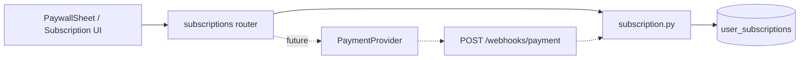

# PLANAM Payment Architecture 2026 (CR5)

**Дата:** 2026-06-03  
**Статус:** архитектура — **без реализации платежей** в Sprint 0–8.

---

## 1. Цель

Подготовить границы для checkout без блокировки UX-спринтов. Сейчас: `POST /subscriptions/select-plan` меняет план в БД **без оплаты**.

---

## 2. Слои



---

## 3. Текущие endpoints (reuse)

| Method | Path | Role |
|--------|------|------|
| GET | `/subscriptions/me` | Overview wallet + plan |
| POST | `/subscriptions/select-plan` | **Staging only** until checkout |

---

## 4. Целевые endpoints (Phase B)

| Method | Path | Role |
|--------|------|------|
| POST | `/subscriptions/checkout-session` | Create payment session |
| POST | `/webhooks/payment/{provider}` | Confirm payment |
| GET | `/subscriptions/ama-packs` | List AMS packs |

---

## 5. PaymentProvider interface (Python)

```python
class PaymentProvider(Protocol):
    def create_checkout(
        self,
        *,
        user_id: int,
        plan_code: str,
        amount_rub: int,
        return_url: str,
    ) -> CheckoutSession: ...

    def verify_webhook(self, headers: dict, body: bytes) -> PaymentEvent: ...
```

Реализации: `YooKassaProvider`, `TelegramStarsProvider` (TBD).

---

## 6. Идемпотентность

| Key | Store |
|-----|-------|
| `payment_id` | `ama_transactions.metadata` / new `payment_events` table (future migration) |
| Webhook retry | Same `payment_id` → no double grant |

---

## 7. AMS packs (без платежей в UI sprint)

| Pack | AMS | UI |
|------|-----|-----|
| S | 50 | Ghost CTA «Скоро» или staging |
| M | 150 | |
| L | 500 | |

Server: `add_ams` уже есть.

---

## 8. PRO gating

| Rule |
|------|
| Sprint 8: audit checklist P2-1 |
| UI: `PaywallSheet` reason=`pro` |
| Server: `user_has_pro` / feature flags в seeds |

---

## 9. Окружения

| Env | `select-plan` | Checkout |
|-----|---------------|----------|
| development | allowed | mock |
| staging | allowed + banner «тест» | test keys |
| production | **disabled** или invite-only until webhook | live keys |

---

## 10. Связь с trial (CR1)

Новый пользователь: trial 3d / 50 AMS → outcome sheet D3 → checkout CTA → `checkout-session` (Phase B).

---

*CR5 закрыт документацией. Код checkout — отдельный epic после Sprint 8.*
