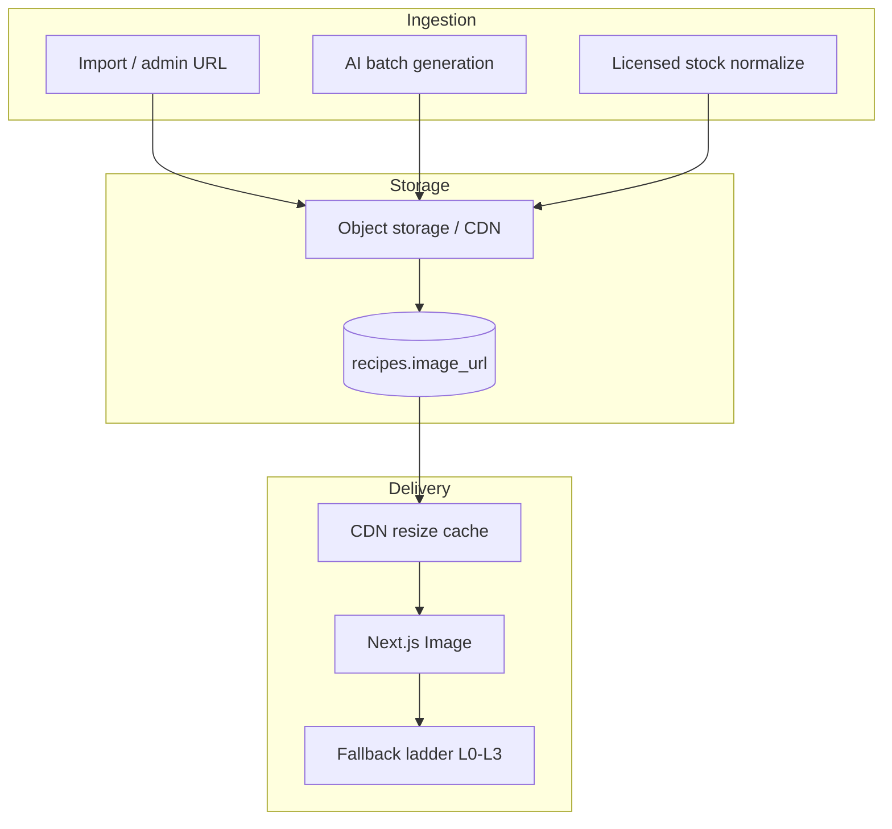

# PLANAM Recipe Media Architecture 2026

**Дата:** 2026-06-03  
**Режим:** продуктовая и визуальная архитектура — код, API контракты и БД **не менялись**.

**Основа:** [`PLANAM_DESIGN_SYSTEM_2026.md`](PLANAM_DESIGN_SYSTEM_2026.md) §5 · [`PLANAM_UX_UI_2026_MASTER_SPEC.md`](PLANAM_UX_UI_2026_MASTER_SPEC.md) §12 · [`PLANAM_2026_PRODUCT_BLUEPRINT.md`](PLANAM_2026_PRODUCT_BLUEPRINT.md) §12

**As-is data:** `recipes.image_url` (`String(512)`, nullable) — [`apps/api/app/models/recipe.py`](../apps/api/app/models/recipe.py)

---

## 1. Мандат

Фотографии блюд — **часть бренда PLANAM**, не декорация. Пользователь должен узнавать продукт по одному стилю кадра.

**Стиль:**

**Apple Food** + **Premium Wellness** + **PLANAM** (тёплый cream-контекст, sage UI, 45° natural light).

**Запрещено:** смешивать в одной ленте разные стили (фастфуд сток, top-down flat lay, AI-артефакты, текст на фото).

---

## 2. Типы медиа в продукте

| Type | Aspect ratio | Source width | Primary use |
|------|--------------|--------------|-------------|
| **Hero Photo** | **16:9** | 1200px | `/plan/today`, recipe detail top, push rich preview |
| **Recipe Photo** | **1:1** | 800px | Catalog grid `/plan/recipes` |
| **Thumbnail Photo** | **4:3** | 400px | Home Today rail, week day chips |



---

## 3. Хранение

### 3.1 Модель данных (существующая)

| Field | Role |
|-------|------|
| `recipes.image_url` | Canonical HTTPS URL to **hero/master** asset |
| Derived sizes | CDN query or path convention — **не** отдельные колонки на v1 |

### 3.2 URL convention (целевая)

```
https://cdn.planam.ru/recipes/{recipe_id}/hero.jpg
https://cdn.planam.ru/recipes/{recipe_id}/card_800.webp
https://cdn.planam.ru/recipes/{recipe_id}/thumb_400.webp
```

| Param | Example |
|-------|---------|
| `w` | 400 \| 800 \| 1200 |
| `fm` | webp |
| `q` | 80 |

*Внедрение CDN — evolutionary ([`PLANAM_2026_PRODUCT_BLUEPRINT.md`](PLANAM_2026_PRODUCT_BLUEPRINT.md) H2); до CDN — прямой `image_url`.*

### 3.3 Форматы

| Format | Use |
|--------|-----|
| **WebP** | Primary |
| **JPEG** | Fallback Accept header / old WebView |
| **LQIP** | Optional blur hash in import metadata (future JSONB meta, не миграция в этом пакете) |

### 3.4 Версионирование стиля

| Version | Описание | Правило |
|---------|----------|---------|
| **v1 PLANAM** | 45°, warm cream bg, premium wellness | Все **active** catalog |
| **v0 legacy** | Mixed / missing | Только до backfill; не показывать в marketing |

**Style lock:** при смене стиля — новый `style_generation=2` в ops metadata (admin), batch re-render; **не** смешивать v0 и v1 в одном grid.

| Trigger | Action |
|---------|--------|
| New recipe approved | Generate v1 before `is_active=true` |
| User draft | No public image until promote |
| Quarterly audit | Sample 100 cards for style drift |

---

## 4. Отображение (клиент TMA)

### 4.1 Правила по контексту

| Context | Type | Crop | Radius | Dark mode |
|---------|------|------|--------|-----------|
| Home rail | Thumbnail 4:3 | `object-cover` center dish | card 20px | **no dim** |
| Plan today | Hero 16:9 | cover | top bleed 0, bottom 20px | no dim |
| Grid cell | Recipe 1:1 | cover | 20px | no dim |
| Detail | Hero 16:9 | cover, max-h 40vh | top bleed | no dim |
| Push | Thumbnail 4:3 | crop center | — | N/A |

### 4.2 Next.js Image (реализация позже)

| Prop | Value |
|------|-------|
| `sizes` | `(max-width: 512px) 80vw, 400px` |
| `priority` | First visible Hero on Home/Today |
| `loading` | lazy except above fold |

### 4.3 Prefetch

При `GET /menus/selected` — batch `recipe_ids` today → prefetch thumb_400 для rail.

---

## 5. Генерация

### 5.1 Источники (приоритет)

| Priority | Source | Quality bar |
|----------|--------|-------------|
| 1 | Professional / licensed stock (normalized) | PASS v1 style guide |
| 2 | AI generation (batch) | Human QA sample 10% |
| 3 | Import URL (partners) | Reprocess through normalize pipeline |
| 4 | — | User uploads **не** в catalog v1 |

### 5.2 AI generation brief (единый prompt envelope)

```
Subject: {recipe_title}, single plate, home-cooked premium wellness
Angle: 45 degree, soft natural daylight
Background: warm cream #F3EEE2 or light wood, minimal props
No text, no faces, no watermark
Style: Apple Food editorial, soft shadows
```

| Output | Size | Crop |
|--------|------|------|
| Master | 1200×675 (16:9) | source |
| Card | 800×800 center crop from master | 1:1 |
| Thumb | 400×300 (4:3) center crop | 4:3 |

### 5.3 Pipeline jobs (logical, без нового API)

| Job | Trigger | Result |
|-----|---------|--------|
| `backfill_missing_images` | `image_url IS NULL` AND `is_active` | Set URL after QA |
| `regenerate_style_v2` | Admin batch | Replace URL + bump version |
| `menu_generation_pick` | AI menu only picks recipes **with** L0 image or L1 fallback allowed |

---

## 6. Fallback ladder

| Level | Condition | UI | Brand impact |
|-------|-----------|-----|--------------|
| **L0** | Valid `image_url` loads | Photo per §4 | Full |
| **L1** | NULL or 404 | **Illustrated plate** by `meal_type` (breakfast/lunch/dinner/snack) | Degraded |
| **L2** | Loading | Skeleton shimmer same aspect | Neutral |
| **L3** | Retry failed | L1 + refresh icon | Degraded |

**Запрещено:** пустой серый `#E5E5E5` rectangle.

### L1 illustration spec

| meal_type | Motif | Palette |
|-----------|-------|---------|
| breakfast | bowl, steam | cream + sage |
| lunch | plate + salad | cream + olive |
| dinner | plate warm protein | cream + warm accent |
| snack | small bowl | cream |

---

## 7. Обновление изображений

| Event | Behavior |
|-------|----------|
| Recipe title change | Image **не** auto-regenerate |
| Ingredient major change | Flag for ops review |
| Admin upload new hero | Invalidate CDN cache key `{id}-v{n}` |
| Menu replace dish | New recipe_id → new image instant (prefetch) |
| Import dedup merge | Keep best quality v1 image |

### Cache invalidation

```
Cache-Key: recipe-{id}-hero-v{style_version}
```

Client: if `updated_at` recipe > cached → bust local SW cache (optional PWA later).

---

## 8. Качество и модерация

| Gate | Rule |
|------|------|
| Pre-publish | Human or automated: no text, no extra limbs (AI), resolution ≥ 800w |
| Catalog grid | Hide `is_active=false` |
| Security | HTTPS only; no user-controlled domain without allowlist ([`SECURITY_AUDIT.md`](SECURITY_AUDIT.md)) |

---

## 9. Связь с монетизацией и воронкой

| Touchpoint | Media role |
|------------|--------------|
| Onboarding WOW | Hero 16:9 × 3 — **must** L0 or L1 |
| Push «Что на ужин» | Thumbnail 4:3 in Telegram message |
| Trial conversion | Outcome screen uses **collage** of user's plan photos (generated client-side) |
| PRO | No exclusive photos — PRO = progress, not stock library |

---

## 10. Dark mode

| Rule | Detail |
|------|--------|
| Photo pixels | Unchanged |
| Letterbox | If aspect mismatch, use `bg.canvas` not black |
| Skeleton | `surface` shimmer, not white flash |

---

## 11. Метрики медиа

| Metric | Target 2026 |
|--------|-------------|
| Active catalog with L0 | ≥ 85% |
| Home today cards L0 | ≥ 90% of slots |
| L1 rate | < 10% |
| CDN p95 thumb | < 200ms |
| Broken image 404 | < 0.5% |

---

## 12. As-is gap (документация, не задача на код здесь)

| As-is | Target 2026 |
|-------|-------------|
| Single `image_url`, nullable | CDN derivatives + style version ops |
| Mixed catalog photos | v1 normalize backfill |
| Trial 14d / 200 AMS (backend) | Media independent; funnel doc uses product trial 3d/50 AMS |

---

*Архитектура медиа согласована с [`PLANAM_VISUAL_MOCKUPS_2026.md`](PLANAM_VISUAL_MOCKUPS_2026.md) и Design System §5.*
