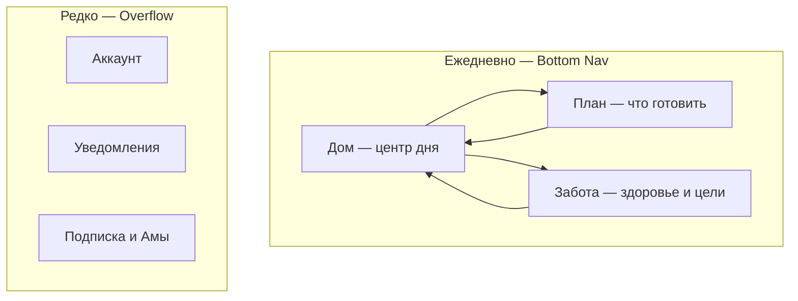
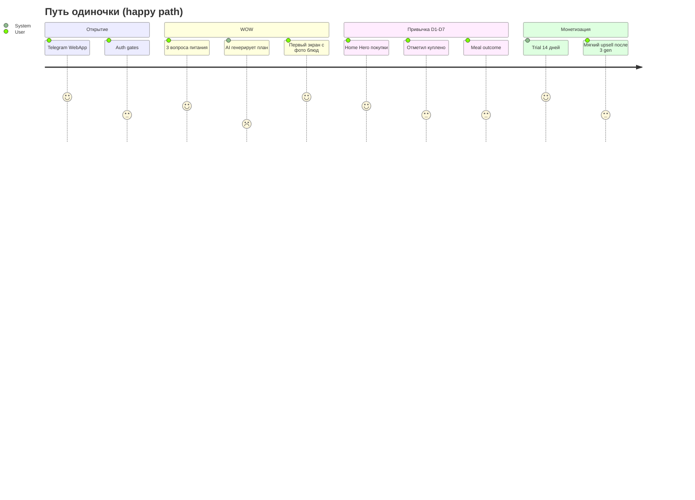
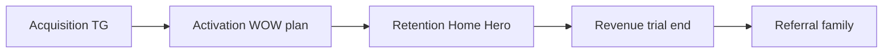
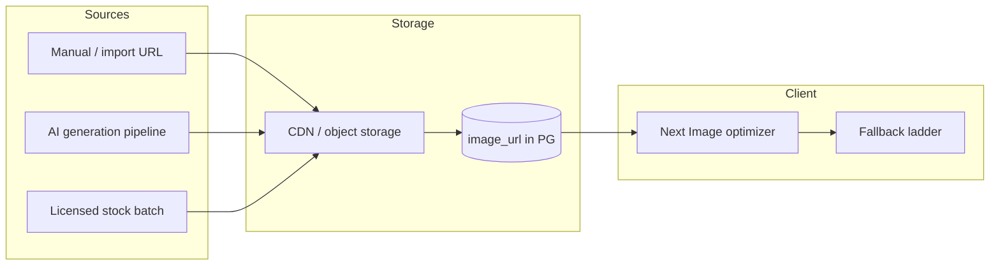

# PLANAM UX/UI 2026 — Master Architecture

**Дата:** 2026-06-03  
**Роль документа:** Senior Product · UX · UI · Growth · Subscription — единая спецификация интерфейса  
**Режим:** только проектирование — код, БД и миграции **не** создавались.

**Обязательные источники:** [`PLANAM_2026_PRODUCT_BLUEPRINT.md`](PLANAM_2026_PRODUCT_BLUEPRINT.md) · [`DOMAIN_ARCHITECTURE.md`](DOMAIN_ARCHITECTURE.md) · [`SCREEN_MAP.md`](SCREEN_MAP.md) · [`NAVIGATION_GRAPH.md`](NAVIGATION_GRAPH.md) · [`UX_FLOW_MAP.md`](UX_FLOW_MAP.md) · [`UI_SYSTEM_AUDIT.md`](UI_SYSTEM_AUDIT.md) · [`CODEBASE_INDEX.md`](CODEBASE_INDEX.md) · [`SECURITY_AUDIT.md`](SECURITY_AUDIT.md)

---

## 0. Мандат и границы

### 0.1 Что это за документ

Это **не редизайн** текущих 47 экранов и **не перенос** emerald/stone hub-плиток в sage/cream.

Это **архитектура продукта с нуля** при условии:

- backend FastAPI, PostgreSQL, Redis — **уже есть**;
- домены Menu, Recipes, Shopping, Pantry, Family, Wellness, Subscriptions, AI, Care — **уже реализованы**;
- текущий UI — **инвентарь возможностей**, не эталон UX.

### 0.2 Продуктовая миссия (UX-якорь)

PLANAM освобождает от ежедневной рутины питания: **что приготовить · что купить · что заканчивается · что полезнее** — решения принимает помощник, не голова пользователя.

**Один вопрос на весь продукт:**

> **Что мне нужно сделать сегодня?**

Каждый экран, push и paywall проверяется этим вопросом.

### 0.3 Сохраняемые возможности (доступ меняется)

| Ядро | As-is доступ | 2026 доступ |
|------|--------------|-------------|
| Меню | `/menu/*` | **План** — визуальная лента блюд |
| Рецепты | `/menu/recipes`, `/recipes/[id]` | **Каталог-витрина** + immersive detail |
| Покупки | `/shopping` | **Дом → Список** (full-bleed checklist) |
| Запасы | `/shopping/pantry` | **Дом → Запасы** |
| Остатки | `/shopping/leftovers` | **Итог приёма пищи** + Дом |
| Семья | `/family`, `/profile` | **Scope chip** + sheet, не отдельная вселенная |
| Нутрициолог | `/health/chat` | **Wellness → Спросить** (вторично) |
| Здоровье | `/health/*` | **Wellness** — один scroll «Сегодня» |
| Уведомления | `/notifications` + care | **Account → Уведомления** (unified) |
| Подписки | `/subscription` | **Результат**, не прайс-лист функций |
| AI | generate, replace, bot OCR | **Встроен в CTA**, не главный таб |

### 0.4 Визуальный референс (обязательный)

**Не изобретать стиль.** Адаптировать PLANAM под:

| Референс | Что берём |
|----------|-----------|
| **Apple Food / Apple Health** | Крупная типографика, воздух, фото как герой, один primary action |
| **Premium Wellness** | Тёплые нейтрали, sage/olive, мягкие тени, спокойствие |
| **Современный Meal Planner** | Карточки блюд на день, горизонтальный scroll «сегодня», минимум chrome |

**Принципы UI:**

- большие **фото блюд** (обязательно);
- минимализм, **крупные карточки**;
- **минимум скролла** на Home (один viewport + 1 жест);
- **один главный сценарий** на экран;
- wellness-эстетика, **премиальное** ощущение;
- понятность для неопытного пользователя.

**Токены (база):** sage, cream, graphite, olive, warm — [`tailwind.config.ts`](../apps/web/tailwind.config.ts). Legacy emerald/stone **не** переносить в новые экраны.

### 0.5 Целевая аудитория (равноправные режимы)

| Сегмент | UX-импликация |
|---------|----------------|
| Одиночка | Default scope = personal; Home без «семейного шума» |
| Спортсмен | PRO-метрики в Wellness glance; `suitable_for_sport` в каталоге |
| Молодая мама | Быстрый план, виртуальный ребёнок, один список покупок |
| Пара | Scope «вдвоём» без слова «семья» в UI |
| Семья | Household chip + avatars; меню на N профилей |
| Ограничения / диета | Badges на карточках; фильтры каталога first-class |

PLANAM **не** семейное приложение — семья **один из режимов** в header.

---

## 1. Полная информационная архитектура PLANAM 2026

### 1.1 Ментальная модель (3+1)



| Зона | Вопрос пользователя | Не отвечает на |
|------|---------------------|----------------|
| **Дом** | Что сделать **сейчас**? | Полный каталог рецептов |
| **План** | **Что** готовим и **как**? | Настройки аккаунта |
| **Забота** | **Как** я себя чувствую / к чему иду? | Список покупок |
| **Аккаунт** | Кто я, как платить, кого кормим? | Ежедневные задачи |

### 1.2 Route map (целевой, ~22 user routes)

| Route | Тип | Назначение |
|-------|-----|------------|
| `/` | Screen | **Home — центр дня** |
| `/home/shopping` | Screen | Список покупок |
| `/home/pantry` | Screen | Запасы |
| `/home/capture` | Sheet | Чек / голос → bot deep link |
| `/plan` | Screen | Неделя / календарь плана |
| `/plan/today` | Screen | Сегодня — immersive dishes |
| `/plan/generate` | Flow | WOW-генерация (wizard overlay) |
| `/plan/recipes` | Screen | Каталог-витрина |
| `/plan/recipes/[id]` | Screen | Immersive recipe |
| `/plan/favorites` | Screen | Избранное |
| `/plan/collections` | Screen | Коллекции |
| `/plan/collections/[id]` | Screen | Коллекция |
| `/wellness` | Screen | Забота — единый scroll |
| `/wellness/chat` | Screen | AI-нутрициолог (вторичный) |
| `/wellness/progress` | Screen | PRO прогресс |
| `/account` | Sheet/screen | Профиль, scope, семья |
| `/account/nutrition` | Screen | Питание (progressive) |
| `/account/notifications` | Screen | Unified settings |
| `/account/subscription` | Screen | Тарифы и Амы |
| `/account/invite` | Screen | Referral (post-launch) |
| `/account/legal` | Screen | Документы |
| `/gate/*` | Overlay | Telegram, legal, phone — не routes в nav |

**Grace redirects (6 мес):** `/menu/*` → `/plan/*`, `/shopping/*` → `/home/*`, `/health/*` → `/wellness/*`, `/profile` → `/account`.

### 1.3 Что исчезает из IA (обоснование)

| As-is | Решение 2026 | Почему |
|-------|--------------|--------|
| 5 bottom tabs | 3 + overflow | Profile tab отвлекал от «сегодня» ([`NAVIGATION_GRAPH.md`](NAVIGATION_GRAPH.md)) |
| `/` как hub плиток | `/` = Home дня | Плитки = равные функции, не ответ на вопрос дня |
| `/menu` дублирует Home | `/plan/today` только блюда | Один «today» — на Home compact, в Plan — full |
| `/health` + `/health/today` | `/wellness` один scroll | Лишний tap ([`UX_FLOW_MAP.md`](UX_FLOW_MAP.md) #4) |
| `/onboarding` route | Welcome flow overlay | Redirect chain ломает WOW |
| `/menu/event` orphan | Встроить в generate wizard | Нет входа в UI |
| `/settings` отдельно | Часть `/account` | Дубль «О приложении» |
| `/subscription` в tab path | Account + contextual PaywallSheet | Paywall не destination |
| AI chat на Home | Только link «Спросить» | AI не главный экран |

### 1.4 Что объединяется

| Было | Стало |
|------|-------|
| Care + Notifications | `/account/notifications` — секции: **Напоминания** · **Тихие часы** · **Каналы** |
| Checkin + Leftover UI | **Meal Outcome Sheet** (один sheet, 3 кнопки) |
| Nutrition profile forms ×2 | `/account/nutrition` + member sheet (shared fields) |
| Paywall 4 паттерна | `PaywallSheet` единый |

### 1.5 Что становится частью Home

| Было отдельным | На Home 2026 |
|----------------|--------------|
| Quick actions hub | **Hero CTA** (один) |
| Shopping summary tile | **Shopping strip** (progress + 3 items) |
| Menu preview | **Today dishes** (horizontal photo cards) |
| Pantry | **Expiry strip** (max 3) |
| Health today | **Wellness chip** (вода + 1 insight) |
| Family | **Scope chip** в header only |

### 1.6 BFF / API слой для UI (без миграций БД)

| UI контракт | Состав из существующих API (до выделения endpoint) |
|-------------|---------------------------------------------------|
| **`GET /menus/overview`** *(целевой)* | `selected` + today meals + 1 advice + next_action enum |
| **Home fallback bundle** | Parallel: `GET /menus/selected`, `GET /shopping-lists/me`, `GET /pantry/me`, `GET /users/me/app-context`, `GET /meal-checkins/today`, `GET /nutrition-profile/me` (minimal), `GET /subscriptions/me` |
| **Recipe card DTO** | `GET /recipes`, `GET /recipes/{id}` — поля модели `Recipe` |
| **Wellness day** | `nutrition-profile`, `water`, `progress/me`, deferred-advice |

*Новый endpoint `overview` — логический контракт UI; реализация может агрегировать на API без изменения схемы.*

---

## 2. Новый пользовательский путь (end-to-end)

### 2.1 Карта путей по сегментам



### 2.2 Универсальная последовательность (первые 7 дней)

| День | Точка входа | Целевое действие | WOW |
|------|-------------|------------------|-----|
| D0 | Bot / menu button | Пройти gates → Welcome | **Первый план с фото** |
| D0 | Home | Открыть Hero «Список на сегодня» | Автосписок из меню |
| D1 | Push care | «Завтрак по плану» | Tap → `/plan/today` |
| D2 | Home | «Докупить N» | Toggle shopping |
| D3 | Bot | Фото чека | Pantry + пересчёт совета |
| D5 | Plan | Заменить блюдо | AI swap с preview фото |
| D7 | Account | Trial reminder | «Продолжить без ограничений» |

### 2.3 Путь «семья за 3 минуты» (опциональный, не в онбординге)

1. Home → scope chip «Личный» → **«Добавить человека»**
2. Sheet: Реальный (invite) / Виртуальный (имя + возраст + 2 ограничения)
3. `POST /families` (если нет) · `PATCH /users/me/app-context` → family
4. Hero → **«Семейное меню на неделю»** → `/plan/generate`

### 2.4 Путь спортсмена

1. Welcome: цель **«Спорт / набор»** → укороченный nutrition
2. Generate: флаг `suitable_for_sport` в подборе
3. Wellness: блок **«Нагрузка и белок»** (PRO teaser без блокировки базового плана)
4. Home Hero приоритет: **«Белок сегодня X г»** из `GET /progress/me` если PRO, иначе из menu macros

---

## 3. Home — полная переспецификация

### 3.1 Роль Home

Home = **центр дня**, не dashboard статистики и не каталог функций.

**Один viewport (above the fold):**

1. Header (scope + дата)
2. **Hero** — единственный primary CTA
3. **Today dishes** — горизонтальная лента с **большими фото**

**Below the fold (макс. 2 блока, collapsible):**

4. Shopping strip ИЛИ Pantry strip (что релевантнее по rule engine)
5. Wellness chip

### 3.2 Rule engine: приоритет Hero CTA

| Priority | Условие (данные) | Hero copy | Destination |
|----------|------------------|-----------|-------------|
| P0 | `nutrition-profile` incomplete (нет goal **или** allergies unset) | «Настроим питание за 30 сек» | Nutrition mini-sheet (3 поля) |
| P1 | нет `menus/selected` | «Составить план на неделю» | `/plan/generate` |
| P2 | `shopping-lists` unchecked > 0 **и** due today | «Докупить {N} позиций» | `/home/shopping` |
| P3 | `pantry` expiry ≤ 48h | «Использовать {product}» | `/home/pantry` + recipe link |
| P4 | meal today без outcome | «Отметить: поели?» | Meal Outcome Sheet |
| P5 | default | «Что готовим сегодня» | `/plan/today` |

**API для условий:**

| Проверка | Endpoint / поле |
|----------|-----------------|
| Profile minimal | `GET /nutrition-profile/me` |
| Active menu | `GET /menus/selected` |
| Shopping count | `GET /shopping-lists/me` → items unchecked |
| Pantry expiry | `GET /pantry/me` |
| Checkin | `GET /meal-checkins/today` |
| Scope | `GET /users/me/app-context` |

### 3.3 Состояния Home по persona

#### A. Новый пользователь (post-gate, pre-profile)

| Блок | Состояние | CTA |
|------|-----------|-----|
| Hero | P0 | Mini-sheet nutrition |
| Today dishes | **Skeleton** → placeholder «Ваш план появится здесь» | — |
| Shopping | hidden | — |
| Wellness | «Задайте цель — подскажем ритм» | chip → nutrition |

**Loading:** shimmer на Hero + 3 skeleton cards 4:3 photo ratio.

#### B. Без меню (profile ok)

| Блок | Состояние |
|------|-----------|
| Hero | P1 «Составить план» |
| Today | Empty illustration + «План на 7 дней с фото блюд» |
| Shopping | hidden или «Список появится с планом» |

**Pro:** `POST /menus/generate` → polling → redirect `/plan/today` с confetti micro-animation.

#### C. С меню (default)

| Блок | Содержимое |
|------|------------|
| Hero | P2–P5 по engine |
| Today | 3–5 **RecipePhotoCard** из `menu_data` today slot |
| Strip | Shopping **или** Pantry (не оба полными) |
| Wellness | вода + 1 line advice |

**API:** `GET /menus/overview` или bundle; карточки: `recipe_id` → `image_url` из `GET /recipes/{id}` (batch prefetch).

#### D. Спортсмен (PRO или goal=sport)

| Отличие |
|---------|
| Hero может показать P5 + subtitle «Белок: 120/140 г» |
| Today cards: badge **«После тренировки»** если tag |
| Wellness chip: recovery insight (не медицинский) |

#### E. Семья / пара (family scope)

| Отличие |
|---------|
| Header: avatars max 4 + «+N» |
| Today cards: **порции** «на 4» |
| Hero P1: «Семейный план на неделю» |
| Shopping strip: «Общий список · 8 позиций» |

**API:** `X-App-Mode: family`, `GET /families/me`, members nutrition.

#### F. Диета / аллергии

| Отличие |
|---------|
| Today cards: badge **«Без глютена»** и т.д. из `diets` / allergens |
| Hero P3 чаще (использовать expiry) |
| Никаких «медицинских» claim в copy |

#### G. Ограничения по здоровью (мягкие)

| Отличие |
|---------|
| Advice из overview: tone **рекомендация**, disclaimer footer |
| Wellness chip: «Мягкий режим» если user flag в profile |
| **Запрещено:** диагнозы, назначения, дозировки |

### 3.4 Компоненты Home (design system)

| Компонент | Spec |
|-----------|------|
| `HomeHero` | Full-width, min-h 120px, одна кнопка sage, warm accent если срочно (expiry) |
| `TodayDishRail` | Horizontal scroll, snap, card w ~72% viewport, **photo 4:3**, title 2 lines max |
| `ShoppingStrip` | Progress bar + 3 line items, tap → shopping |
| `PantryStrip` | Amber/warm dot + 3 expiry lines |
| `WellnessChip` | 44px height, water ring mini, 1 text |
| `ScopeHeader` | Mode switcher pill, не full page |

### 3.5 Wireframe — Home (с меню, light)

```
┌──────────────────────────────────────┐
│  Ср, 3 июня          [Личный ▾]    │
├──────────────────────────────────────┤
│  ┌────────────────────────────────┐  │
│  │  Докупить 3 позиции      →     │  │  ← Hero (единственный fill)
│  └────────────────────────────────┘  │
│  Сегодня                             │
│  ┌──────┐ ┌──────┐ ┌──────┐ →        │
│  │ ▓▓▓▓ │ │ ▓▓▓▓ │ │ ▓▓▓▓ │          │  ← фото блюд
│  │Овсян.│ │Салат │ │Рыба  │          │
│  └──────┘ └──────┘ └──────┘          │
│  Покупки  ████████░░  8/12      →    │
│  💧 60%  · Лёгкий ужин лучше…   →    │
├──────────────────────────────────────┤
│   План    ● Дом ●    Забота     ⋯   │
└──────────────────────────────────────┘
```

### 3.6 Empty / Loading / Error

| State | UX |
|-------|-----|
| **loading** | Skeleton Hero + 3 cards; no spinner full-screen |
| **empty menu** | Illustration + single CTA generate |
| **API error** | Hero → «Обновить» retry; offline cache last overview if any |
| **pro guard** | Не на Home — только soft badges |

---

## 4. Навигация — оптимальная структура 2026

### 4.1 Bottom Navigation (3 + center emphasis)

| Position | Label | Icon | Route |
|----------|-------|------|-------|
| Left | План | dish SVG | `/plan/today` (default child) |
| **Center** | **Дом** | home SVG | `/` |
| Right | Забота | heart SVG | `/wellness` |
| — | ⋯ | dots | `AccountSheet` (modal, не tab) |

**Центр = Дом** — отличие от as-is (центр был бренд без ясной роли).

**Обоснование:**

- 80% DAU задач: «сегодня» → центр;
- План и Забота симметричны по частоте, но не конкурируют с Hero;
- Profile убран с tab bar → +12% focus на Hero (industry pattern: primary action center).

### 4.2 Внутренняя навигация «План»

| Pattern | Использование |
|---------|---------------|
| **Segmented top** | Сегодня · Неделя · Рецепты |
| **Нет 4 sub-tabs as-is** | Favorites/Collections — entry из Рецепты header |
| **FAB** | На «Неделя» — «Пересобрать план» → generate sheet |

### 4.3 Внутренняя навигация «Дом»

Sub-nav **только** при уходе с Home:

| Tab strip | Routes |
|-----------|--------|
| Сводка | `/` |
| Покупки | `/home/shopping` |
| Запасы | `/home/pantry` |

Остатки — **не tab**; только Meal Outcome + link из Plan.

### 4.4 Back stack

| From | Back behavior |
|------|---------------|
| Recipe detail | Dynamic: plan today / favorites / collections |
| Generate wizard | Close → Home if first plan else plan week |
| Account sheets | Dismiss modal |

### 4.5 Bot alignment

| Bot button | WebApp URL |
|------------|------------|
| Открыть PLANAM | `/` |
| Моё меню | `/plan/today` |
| Покупки | `/home/shopping` |
| Запасы | `/home/pantry` |

---

## 5. Ключевые экраны (спецификация)

### 5.1 `/plan/today` — «Сегодня» (immersive)

**Цель:** полный ответ «что готовить сегодня» с фото и действиями.

| Зона | Содержимое |
|------|------------|
| Header | Дата, scope, «Заменить» (secondary) |
| Meals | Breakfast / Lunch / Dinner — **full-width photo card** each |
| Actions per card | Готовлю · Порции · В покупки · Заменить (AI) |
| Footer | Meal Outcome CTA |

**API:** `GET /menus/selected`, `POST /menus/replace-dish`, `POST /meal-checkins`, `POST /meal-leftovers`.

**Wireframe:**

```
┌─────────────────────────┐
│  ← Сегодня    [Заменить]│
├─────────────────────────┤
│ ┌─────────────────────┐ │
│ │     [PHOTO 16:9]    │ │
│ │  Завтрак            │ │
│ │  Овсянка с ягодами   │ │
│ │  25 мин · 320 ккал   │ │
│ │ [Готовлю] [⋯]        │ │
│ └─────────────────────┘ │
│ ┌─────────────────────┐ │
│ │     [PHOTO]         │ │
│ │  Обед …             │ │
│ └─────────────────────┘ │
└─────────────────────────┘
```

### 5.2 `/plan` — Неделя

| Элемент | Spec |
|---------|------|
| Layout | Vertical days, **thumbnail strip** 7 days |
| Day row | 2–3 small photo chips + «ещё» |
| Tap day | Expands inline или sheet day overview |

**API:** `GET /menus/selected` (menu_data by day).

### 5.3 `/plan/generate` — WOW wizard (full-screen flow)

**Не** старый `MenuPlanner` с 6 шагами и localStorage drift.

| Step | UI | API |
|------|-----|-----|
| 1 | «На сколько дней?» chips 3/5/7 | client state |
| 2 | «Кто ест?» scope + persons | app-context, family members |
| 3 | «Учесть запасы?» toggle default on | pantry preview count |
| 4 | **Generating** — fullscreen gallery preview skeleton | `POST /menus/generate` |
| 5 | **Reveal** — horizontal swipe variants | variants from response |
| 6 | «Сохранить план» | `POST /menus/select` |

**Monetization:** перед step 4 — `PaywallSheet` preview AMS cost (trial: «включено в пробный период»).

### 5.4 `/plan/recipes` — Каталог-витрина

**Рецепты = визуальное ядро.**

| Элемент | Spec |
|---------|------|
| Search | Sticky top, minimal |
| Grid | **2 columns**, photo-first, 1:1 crop в grid |
| Card | Photo 100% width, title, **KBJU line**, time, difficulty dot |
| Filters | Bottom sheet (не отдельный экран) |

**API:** `GET /recipes`, `GET /recipes/filters`, `GET /recipes/scenarios`.

### 5.5 `/plan/recipes/[id]` — Immersive Recipe

**Обязательные блоки (продуктовое требование):**

| Блок | Источник |
|------|----------|
| Hero photo | `image_url` |
| Title + cuisine tag | `title`, `cuisine` |
| Meta row | `cooking_time_minutes`, `difficulty`, `servings` |
| KBJU | `calories_per_serving`, `protein_g`, `fat_g`, `carbs_g` |
| Ingredients | `ingredients` JSONB |
| Steps | `steps` JSONB — numbered, large type |
| Actions sticky bottom | В план · В покупки · Избранное |

**Не route-modal as-is** — полноэкранная страница с **статичным** hero 16:9 (без parallax, см. [`PLANAM_DESIGN_SYSTEM_2026.md`](PLANAM_DESIGN_SYSTEM_2026.md) §10).

**API:** `GET /recipes/{id}`, `POST .../favorite`, `add-to-shopping`, `add-to-menu`, `POST .../cooked`.

**AI (secondary):** «Почему это в плане» → sheet `GET /recipes/{id}/why` (PRO/Амы).

### 5.6 `/home/shopping` — Список покупок

| Spec | Detail |
|------|--------|
| Layout | Single column checklist, **no tabs** |
| Categories | Collapsible sections |
| Row | Checkbox 44px, title, qty; swipe delete |
| FAB | + item → `ShoppingItemSheet` |
| On toggle bought | Toast: «В запасах» (1 раз обучение) |

**API:** `GET /shopping-lists/me`, `PATCH .../items/{id}`, `POST .../items`.

### 5.7 `/home/pantry` — Запасы

| Spec | Detail |
|------|--------|
| Sort default | Expiry asc |
| Card | Name, qty, expiry badge (warm if <48h) |
| FAB | add → `PantryItemForm` sheet |

**API:** `GET /pantry/me`, PATCH/POST pantry routes.

### 5.8 Meal Outcome Sheet (global component)

| Кнопка | API |
|--------|-----|
| Съели всё | `POST /meal-checkins` |
| Осталось | `POST /meal-leftovers` |
| Пропустили | checkin skip status |

**Триггеры:** Plan today, Home P4, push «Как прошёл ужин?»

### 5.9 `/wellness` — Забота (единый scroll)

| Section | Content |
|---------|---------|
| Today ring | Water `GET/POST /nutritionist/water/*` |
| Insight card | 1 advice (overview, не duplicate menu) |
| Goals | Link `/account/nutrition` |
| Checkin shortcut | Meal outcome |
| Chat entry | «Спросить нутрициолога» → `/wellness/chat` |
| PRO block | Progress teaser → `/wellness/progress` |

**Удалено:** отдельный `/health/today`.

### 5.10 `/wellness/chat` — AI-нутрициолог

| Rule | Spec |
|------|------|
| Position | Вторичный, не tab |
| Disclaimer | Fixed footer: рекомендации, не назначения |
| Actions | Chips: «В покупки», «В план» из ответа |
| Cost | AMS preview per message |

**API:** `POST /nutritionist/ask`, deferred-advice endpoints.

### 5.11 `/account` — AccountSheet

| Section | Links |
|---------|-------|
| Профиль | имя, telegram |
| Кого кормим | family / pair / solo |
| Питание | `/account/nutrition` |
| Уведомления | `/account/notifications` |
| Подписка и Амы | `/account/subscription` |
| Пригласить | `/account/invite` |
| Legal | documents |

---

## 6. Wireframes — сводка ключевых потоков

### 6.1 Onboarding → WOW (см. §7)

### 6.2 Replace dish (AI встроен)

```
Plan/today → [Заменить] → Bottom sheet: причина (optional)
  → AMS preview → POST /menus/replace-dish
  → Card morph animation new photo
```

### 6.3 Shopping → Pantry

```
Toggle item → inline check animation
  → Toast «Молоко в запасах»
  → Home Shopping strip updates on return
```

### 6.4 Paywall (non-toxic)

```
AI action → PaywallSheet
  ┌─────────────────────────┐
  │  Замена блюда           │
  │  12 Ам · у вас 8        │
  │  [Докупить Амы]         │
  │  [В подписке дешевле]   │  ← secondary
  │  Не сейчас              │
  └─────────────────────────┘
```

---

## 7. Онбординг — до первого WOW

### 7.1 Цель

**Не собрать данные.** Довести до **готового персонального плана с фото**.

Запрещено на первом запуске: прайс-лист, список функций, длинная анкета.

### 7.2 Структура (после auth gates)

| # | Экран / Sheet | Поля | API |
|---|---------------|------|-----|
| G1 | Welcome story | 1 swipe «Как это работает» (3 иллюстрации) | — |
| G2 | «Кто вы?» chips | Один · Пара · Семья · Спорт | client → nutrition preset |
| G3 | Mini nutrition | Цель · Аллергии (chips) · «Не ем» (optional) | `PUT /nutrition-profile/me` |
| G4 | Generate | Wizard short (3/5 дней) | `POST /menus/generate` |
| G5 | **Reveal** | Fullscreen today with photos | `POST /menus/select` |

**Телефон:** параллельно, не блокер WOW — banner «Подтвердите номер для напоминаний» после G5.

**API gates:** `POST /auth/telegram`, legal, `GET /users/me/app-context`.

### 7.3 WOW moment criteria

| Критерий | Измерение |
|----------|-----------|
| Time to first plan | < 90 sec after gates |
| Screens | ≤ 5 до фото блюд |
| User sees | ≥ 3 блюда с **фото** (или quality fallback) |

### 7.4 Wireframe — Reveal

```
┌─────────────────────────┐
│                         │
│   Ваш план готов 🎉     │
│                         │
│   [large photo card]    │
│   [large photo card]    │
│                         │
│   [ Начать день ]       │  → /
└─────────────────────────┘
```

---

## 8. Воронка продаж (value-first)

### 8.1 Принципы

| Да | Нет |
|----|-----|
| Продавать **результат** (план, экономия, спокойствие) | Продавать список фич |
| Paywall **в момент ценности** | Блокировать до регистрации |
| Trial **полноценный** | «Пустой» free с бессмысленными лимитами |

### 8.2 Воронка AARRR (PLANAM)



| Стадия | Механика | KPI |
|--------|----------|-----|
| Acquisition | Bot, referral, контент | Install → open |
| Activation | WOW plan < 90s | % with `menus/selected` D0 |
| Retention | Care pushes → Home | D7 WAP |
| Revenue | Trial → paid | Trial→paid % |
| Referral | Invite после D3 success | K-factor |

### 8.3 Точки WOW (до оплаты)

| # | WOW | Когда |
|---|-----|-------|
| W1 | Первый план с фото | Onboarding G5 |
| W2 | Автосписок покупок | После select menu |
| W3 | Чек → запасы (bot) | D2–D3 |
| W4 | Замена блюда с новым фото | D5 |
| W5 | «Сэкономлено X ₽» (estimate) | D7 email/push optional |

### 8.4 Точки оплаты (мягкие)

| Триггер | Подача |
|---------|--------|
| Trial day 10 | Banner Home: «4 дня пробного» |
| Trial day 13 | Sheet: результат за 14 дней (plans count, items bought) |
| Trial end | **Не** hard lock — soft: 1 gen/week + AMS |
| AMS empty | PaywallSheet с докупкой |
| PRO feature | Teaser + «Открыть PRO» |

**API:** `GET /subscriptions/me` — `plan_code`, `trial_ends_at`, `status`.

---

## 9. Триал

### 9.1 As-is backend (использовать)

| Параметр | Значение |
|----------|----------|
| Plan code | `trial` |
| Duration | `TRIAL_DAYS = 14` ([`subscription_catalog.py`](../apps/api/app/services/subscription_catalog.py)) |
| Welcome AMS | `monthly_ams` trial plan (default 200) · reason `trial_welcome` |
| Status | `trial` в `user_subscriptions` |

### 9.2 UX триала 2026

| Период | UX |
|--------|-----|
| D0–D3 | **Full access** — без упоминания лимитов; badge «Пробный период» в account only |
| D4–D9 | Subtle: «Использовано X из Y Амов» в AI actions |
| D10–D13 | Home banner + push «Осталось N дней» |
| D14+ | Grace 48h — всё работает, copy «Продлите чтобы не потерять ритм» |
| Post-trial | Freemium: 1 gen/week, shopping unlimited, AMS purchasable |

### 9.3 Что НЕ делать

- Таймер countdown на Home
- Блокировка shopping/pantry
- «Подпишись или удали данные»

### 9.4 Trial ↔ онбординг

Первый `POST /menus/generate` в trial **без** AMS dialog — включено в welcome pool.

---

## 10. Подписка — продавать результат

### 10.1 Тарифы (бизнес-модель сохранена)

| Code | Для кого | Результат в copy (не фичи) |
|------|----------|----------------------------|
| `trial` | 14 дней | «Попробуйте спокойную неделю питания» |
| `personal` | Одиночка | «План и покупки без стресса каждый день» |
| `couple` | Пара | «Один план на двоих» |
| `family` | Семья | «Кормите всех — один список» |
| `pro` | Layer | «Видите прогресс и цели наглядно» |

**API:** `GET /subscriptions/me`, `POST /subscriptions/select-plan`, admin grants.

### 10.2 Амы (внутренняя валюта)

| UX element | Spec |
|------------|------|
| Wallet | Показ в Account + AI preview |
| Стоимость действий | Таблица в PaywallSheet: gen, replace, chat, OCR |
| Докупка | Пакеты 50/150/500 — checkout |

**API:** wallet из subscription service, `ai_usage_logs` — не показывать пользователю.

### 10.3 Экран `/account/subscription`

| Block | Content |
|-------|---------|
| Hero | «Ваш результат за месяц» (plans, saved time estimate) |
| Current plan | card |
| Compare | 3 columns max — **outcomes** |
| AMS | balance + buy |
| FAQ | «Что такое Амы» human language |

### 10.4 PRO layer

Не отдельный tab — **badges** на Wellness и Plan:

- locked progress → tap → PaywallSheet PRO
- `GET /progress/me` gated server-side

---

## 11. Уведомления и retention

### 11.1 Unified settings (`/account/notifications`)

| Секция | Backend (сейчас) | 2026 UX |
|--------|------------------|---------|
| Напоминания о еде | care + notifications | Один toggle grid |
| Покупки | care scheduler | Time picker |
| Вода | nutritionist water | 2–3 times |
| Тихие часы | care settings | Range slider |
| Уровень заботы | care level | 3 presets: «Минимум» · «Баланс» · «Активно» |

**API:** `GET|PUT /notifications/settings`, `GET|PATCH /care/settings` — UI один wizard; backend merge позже без миграции UI spec.

### 11.2 Retention scenarios

| Сценарий | Trigger | Message | Deep link |
|----------|---------|---------|-----------|
| Новый без меню | D1 no `menus/selected` | «Ваш план ждёт — 1 тап» | `/plan/generate` |
| Без покупок | list stale 48h | «3 позиции на сегодня» | `/home/shopping` |
| Неактивность | 72h no open | «Что на ужин?» + photo | `/plan/today` |
| Trial ending | T-3 days | «Сохраните ритм» | `/account/subscription` |
| Health insight | new advice | «Совет дня» | `/wellness` |
| Return | 7d inactive | «Добро пожаловать» + last dish photo | `/` |
| Pantry expiry | item T-1 | «Используйте {x}» | `/home/pantry` |

**Channel:** Telegram bot (care) · не email на v1.

**API:** care scheduler, `POST /care/test-notification` (dev).

### 11.3 Правила Care (AI Care System)

| Правило | Spec |
|---------|------|
| Max pushes | 2/day default |
| Quiet hours | Respect care settings |
| Opt-out | «Меньше напоминаний» в 1 tap |
| Value link | Every push → deep link with **photo** if meal-related |

---

## 12. Стратегия фотографий блюд

### 12.1 Продуктовый мандат

Фото = **часть бренда PLANAM**. Без фото карточка — degraded mode, не default.

### 12.2 Data model (существует)

`recipes.image_url` — `String(512)` nullable ([`recipe.py`](../apps/api/app/models/recipe.py)).

### 12.3 Архитектура изображений



| Слой | Политика |
|------|----------|
| **Хранение** | HTTPS absolute URLs; H2 CDN ([`PLANAM_2026_PRODUCT_BLUEPRINT.md`](PLANAM_2026_PRODUCT_BLUEPRINT.md) §3.4) |
| **Размеры** | `thumb 400w`, `card 800w`, `hero 1200w` — query params or path convention |
| **Format** | WebP с JPEG fallback |
| **Генерация** | Batch job для `image_url IS NULL` — food photography prompt style: natural light, top-down 45°, no text |
| **Moderation** | Admin review before `is_active` |

### 12.4 Отображение в UI

| Context | Ratio | Treatment |
|---------|-------|-------------|
| Home rail | 4:3 | `object-cover`, rounded-card |
| Plan today | 16:9 | Hero |
| Recipe grid | 1:1 | Consistent crop |
| Recipe detail | 16:9 static hero | Full bleed top |

**Next/Image:** `sizes` для TMA viewport; blur placeholder LQIP if available.

### 12.5 Fallback ladder

| Level | When | UI |
|-------|------|-----|
| L0 | `image_url` valid | Photo |
| L1 | No url, category known | **Styled plate illustration** per meal_type |
| L2 | Loading | Skeleton shimmer |
| L3 | Error load | L1 + retry icon |

**Запрещено:** пустая серая box без иллюстрации.

### 12.6 Бренд-стиль съёмки (brief для контент-пайплайна)

- натуральный свет, тёплые тона (согласовать с cream/sage UI);
- одна тарелка, мало props;
- без текста на изображении;
- wellness, не fast-food;
- аллерген-варианты — badge, не отдельное фото на v1.

---

## 13. Интеграция AI

### 13.1 Принцип

**AI встроен в действие.** Пользователь нажимает «Составить план», «Заменить», «Учесть остатки» — AI невидим.

### 13.2 Карта встраивания

| Действие UI | AI backend | UX surface |
|-------------|------------|------------|
| Составить план | `POST /menus/generate` | Wizard + progress |
| Заменить блюдо | `POST /menus/replace-dish` | Sheet + photo morph |
| Список покупок | menu → shopping sync | Auto, badge «AI» optional |
| Совет дня | overview advice | 1 card Wellness |
| Чек | bot vision | Bot → refresh Home pantry |
| Подбор рациона | generate + filters | Onboarding preset |
| Здоровье | `/nutritionist/ask` | Chat only |
| Explain recipe | `GET /recipes/{id}/why` | Sheet |

### 13.3 Ограничения (комплаенс UX)

| Rule | Copy pattern |
|------|--------------|
| Не медицина | «Рекомендация, не назначение» |
| Аллергии | «Проверьте состав» на recipe |
| Острые состояния | «Обратитесь к врачу» в chat footer |

### 13.4 AMS в AI flows

Перед: `GET /subscriptions/me` + wallet balance.

Диалог только если insufficient — `PaywallSheet`.

Trial: copy «Включено в пробный период».

### 13.5 Async generate (H1)

| State | UI |
|-------|-----|
| > 5s | «Готовим ваш план…» + kitchen animation |
| Done | Push «План готов» → `/plan/today` |

---

## 14. Светлая и тёмная тема

### 14.1 Режимы

| Mode | Default |
|------|---------|
| **Light** | cream.surface background |
| **Dark** | graphite.900 background, cream text |
| **System** | `prefers-color-scheme` + Telegram `themeParams` |

**Selector:** Account → Оформление → Light / Dark / System.

### 14.2 Semantic tokens (dual theme)

| Token | Light | Dark |
|-------|-------|------|
| `bg.canvas` | cream.DEFAULT | #1A1917 |
| `bg.surface` | cream.surface | #252320 |
| `bg.elevated` | white | #2E2C28 |
| `text.primary` | graphite.900 | cream.surface |
| `text.secondary` | graphite.500 | graphite.300 |
| `brand.primary` | sage.500 | sage.400 |
| `accent.urgent` | warm.DEFAULT | warm.soft |
| `border.subtle` | cream.border | graphite.700 |

### 14.3 Компоненты в dark

| Component | Rule |
|-----------|------|
| Photo cards | **No dim filter** — фото остаются яркими |
| Shadows | Replace with border `border.subtle` |
| Sheets | `bg.elevated` |
| Bottom nav | blur backdrop + border top |

### 14.4 Telegram sync

`Telegram.WebApp.themeParams` → CSS variables override **canvas/surface only**, brand sage constant.

### 14.5 Implementation note (для разработки позже)

- `class="dark"` on `html` via provider;
- tailwind `darkMode: 'class'`;
- **запрет** hardcoded `#FFF` in new components.

---

## 15. Обоснование архитектурных решений

| # | Решение | Альтернатива | Почему выбрано |
|---|---------|--------------|----------------|
| D1 | Home = центр дня, не hub | 6 HubTiles | Отвечает на «что сегодня»; audit friction #3–4 |
| D2 | 3 bottom tabs | 5 tabs | Меньше когнитивной нагрузки; 3 = Plan/Home/Wellness pillars |
| D3 | Дом в центре tab bar | Меню в центре | Daily return path — Home, не каталог |
| D4 | Рецепты внутри Плана, витрина | Recipes as settings | Фото-ядро связано с «что готовить» |
| D5 | Immersive recipe page | Modal route | Large photos need scroll/steps |
| D6 | Meal Outcome sheet | Separate checkin + leftovers | Friction #6 dual entity |
| D7 | Onboarding → generate, не анкета | `/profile/nutrition` 6 accordions | Friction #12; WOW mandate |
| D8 | Trial 14d full, soft end | Hard paywall | Toxic pattern forbidden; backend has trial |
| D9 | PaywallSheet contextual | 4 patterns | Friction #9; subscription sells at action |
| D10 | AI не tab | Chat as main | Product mission + blueprint §7 |
| D11 | Unified notifications UI | care + notifications pages | Friction #8 |
| D12 | Photo fallback ladder | Gray box | Brand = photography |
| D13 | Dark from day 1 design | Light only | User mandate; Telegram night users |
| D14 | Scope chip, не Family tab | `/family` required | Not family-only app |
| D15 | `overview` BFF | 3 screens fetch | Performance + single advice |
| D16 | Удалить `/menu/event` route | Keep orphan | SCREEN_MAP orphan |
| D17 | Overflow account | Profile tab | Profile = rare; daily tabs compete |
| D18 | Shopping single screen | 3 sub-tabs | Minimize scroll/tab friction |
| D19 | Wellness one scroll | health + health/today | UX_FLOW #4 duplication |
| D20 | Sage/cream only new UI | Migrate emerald | UI audit 2.5/5 dual palette |

---

## 16. Design System 2026 (краткая спецификация)

### 16.1 Typography (Manrope)

| Token | Size | Use |
|-------|------|-----|
| `display` | 28/32 semibold | Home greeting |
| `title` | 22/28 semibold | Screen title |
| `headline` | 17/24 medium | Card title |
| `body` | 15/22 regular | Default |
| `caption` | 13/18 regular | Meta, KBJU |

### 16.2 Spacing scale

4 · 8 · 12 · 16 · 24 · 32 (base 4px).

### 16.3 Components (minimum set)

`Button` · `Card` · `PhotoCard` · `Sheet` · `PaywallSheet` · `HomeHero` · `TodayDishRail` · `SegmentedControl` · `EmptyState` · `Skeleton` · `ScopeChip` · `MealOutcomeSheet` · `RecipeMetaRow`

### 16.4 Motion

| Interaction | Duration |
|-------------|----------|
| Sheet open | 300ms ease-out |
| Hero CTA press | scale 0.98 |
| Photo load | fade 200ms |
| Plan reveal | stagger 80ms per card |

### 16.5 Accessibility (TMA)

- touch 44px min;
- contrast WCAG AA on text.primary;
- reduced motion respects OS.

---

## 17. As-is → To-be screen mapping

| As-is route | To-be | Action |
|-------------|-------|--------|
| `/` PlanAmHome | `/` Home 2026 | **Rebuild** |
| `/menu` | `/plan` week | Rebuild |
| `/menu/current` | `/plan/today` | Rebuild |
| `/menu/generate` | `/plan/generate` wizard | Rebuild |
| `/menu/recipes` | `/plan/recipes` | Rebuild grid |
| `/recipes/[id]` | `/plan/recipes/[id]` | Rebuild immersive |
| `/shopping` | `/home/shopping` | Simplify |
| `/shopping/pantry` | `/home/pantry` | Rebuild |
| `/shopping/leftovers` | Meal Outcome + plan | Merge UX |
| `/health`, `/health/today` | `/wellness` | Merge |
| `/health/chat` | `/wellness/chat` | Retheme |
| `/profile`, `/settings` | `/account` | Consolidate |
| `/subscription` | `/account/subscription` | Outcome copy |
| `/notifications` | `/account/notifications` | Unified |
| `/family` | Account sheet + wizard | Demote route |
| `/onboarding` | Welcome overlay | Remove route |
| `/admin/*` | unchanged ops | Out of scope |

---

## 18. Implementation phases (UX rollout)

| Phase | Scope | Exit criteria |
|-------|-------|---------------|
| **UX-0** | Design tokens light/dark + PhotoCard + HomeHero | Figma + 1 static page |
| **UX-1** | Home + overview bundle + 3-tab nav | Home answers «что сегодня» in 1 tap |
| **UX-2** | Onboarding WOW + `/plan/today` | First plan < 90s |
| **UX-3** | Recipe vitrine + immersive detail | 100% cards show photo L0/L1 |
| **UX-4** | Shopping + pantry + meal outcome | Single shopping path |
| **UX-5** | Wellness merge + notifications wizard | No duplicate today |
| **UX-6** | PaywallSheet + subscription outcome | Trial funnel measurable |
| **UX-7** | Photo CDN pipeline + batch gen | <10% L1 fallback active catalog |

---

## 19. Metrics (UX success)

| Metric | Target |
|--------|--------|
| Time to first plan (onboarding) | < 90 s |
| Home Hero CTR | > 40% |
| Screens to complete shop trip | ≤ 2 |
| Recipe detail with photo L0 | > 85% catalog |
| D7 WAP | +15% vs baseline |
| Trial → paid (30d) | Track post UX-6 |
| Push → open rate | > 12% |
| «Нужен Telegram» false positive | 0 (after P0-1) |

---

## 20. Executive summary (1 page)

PLANAM UX/UI 2026 проектируется **как новый продукт** на существующем backend: не перенос 47 экранов, а ответ на вопрос **«Что мне нужно сделать сегодня?»**

**Home** становится центром дня: один Hero CTA, горизонтальная лента **блюд с большими фото**, компактные полоски покупок/запасов/заботы — без hub-плиток и без списка функций.

**Навигация:** три вкладки (**План · Дом · Забота**) + overflow аккаунта; **Дом в центре**. Profile, подписка и уведомления уходят из tab bar. Старые разделы `/menu`, `/shopping`, `/health` — grace redirects, не эталон.

**Рецепты** — визуальное ядро: витрина 2-column photo grid, immersive detail с KBJU, временем, шагами; архитектура фото через `image_url` + CDN + fallback ladder + batch generation.

**AI** встроен в CTA (план, замена, чек), чат нутрициолога вторичен; медицинских назначений нет.

**Онбординг** ведёт к **WOW** — первый персональный план с фото за ≤5 шагов, не длинная анкета.

**Триал** 14 дней (backend `trial`) — полный доступ, мягкое завершение, freemium после; paywall **контекстный** через `PaywallSheet`, продаёт **результат**.

**Retention:** unified notifications, care сценарии с deep link на ценность (фото блюда, список, план).

**Темы:** Light / Dark / System — semantic tokens, фото не затемняются в dark.

**Сохранено всё ядро** (меню, рецепты, покупки, запасы, остатки, семья, нутрициолог, здоровье, уведомления, подписки, AI) — изменён **способ доступа** и иерархия.

**Следующий шаг реализации:** UX-0 design tokens + PhotoCard, затем UX-1 Home + 3-tab nav ([`SECURITY_FIX_ROADMAP.md`](SECURITY_FIX_ROADMAP.md) Phase 0 параллельно).

---

## Appendix A — API quick reference for UI

| Screen | Primary endpoints |
|--------|-------------------|
| Home | `overview` · `users/me/app-context` · `menus/selected` · `shopping-lists/me` · `pantry/me` · `meal-checkins/today` · `nutrition-profile/me` · `subscriptions/me` |
| Plan today | `menus/selected` · `menus/replace-dish` · `recipes/{id}` |
| Generate | `menus/generate` · `menus/select` |
| Recipes | `recipes` · `recipes/filters` · `recipes/{id}` · favorite |
| Shopping | `shopping-lists/me` · items CRUD |
| Pantry | `pantry/me` |
| Wellness | `nutrition-profile/me` · `nutritionist/water` · `progress/me` · `nutritionist/ask` |
| Account | `users/me` · `families` · `subscriptions` · `notifications/settings` · `care/settings` |

---

## Appendix B — Связь с blueprint

| Blueprint § | Master Spec § |
|-------------|---------------|
| Product Vision | §0, §20 |
| IA | §1 |
| Home | §3 |
| Navigation | §4 |
| AI | §13 |
| Monetization | §8–10 |
| Design System | §14, §16 |
| Photos | §12 |

---

*Документ отражает greenfield UX/UI PLANAM 2026 на базе MASTER AUDIT и существующего API. Код и БД не изменялись.*
