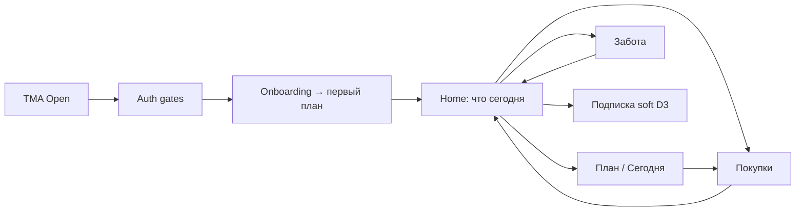

# PLANAM Visual Product Package 2026 — Executive Summary

**Дата:** 2026-06-03  
**Пакет документов:**

| # | Документ | Назначение |
|---|----------|------------|
| 1 | [`PLANAM_VISUAL_MOCKUPS_2026.md`](PLANAM_VISUAL_MOCKUPS_2026.md) | Wireframes и спецификация экранов TMA |
| 2 | [`PLANAM_RECIPE_MEDIA_ARCHITECTURE.md`](PLANAM_RECIPE_MEDIA_ARCHITECTURE.md) | Фото блюд: хранение, CDN, fallback, стиль |
| 3 | [`PLANAM_CONVERSION_FUNNEL_2026.md`](PLANAM_CONVERSION_FUNNEL_2026.md) | D0–D3, триал 3 дня / 50 Амов, WOW и оплата |
| 4 | [`PLANAM_NOTIFICATION_SYSTEM_2026.md`](PLANAM_NOTIFICATION_SYSTEM_2026.md) | Push/care сценарии и deep links |

**Основа:** [`PLANAM_UX_UI_2026_MASTER_SPEC.md`](PLANAM_UX_UI_2026_MASTER_SPEC.md) · [`PLANAM_DESIGN_SYSTEM_2026.md`](PLANAM_DESIGN_SYSTEM_2026.md) · [`PLANAM_2026_PRODUCT_BLUEPRINT.md`](PLANAM_2026_PRODUCT_BLUEPRINT.md)

**Код · API · БД · миграции:** не изменялись.

---

## Как выглядит продукт

PLANAM 2026 — **премиальный wellness meal companion** в Telegram: тёплый cream/sage, **большие фото блюд**, один главный CTA на экране. Ощущение: **«За меня уже подумали»** — не CRM и не калькулятор.

- **Light / Dark / System** на всех компонентах ([`PLANAM_DESIGN_SYSTEM_2026.md`](PLANAM_DESIGN_SYSTEM_2026.md))
- **4 типа карточек**, **4 типа кнопок**, **Bottom Sheets** как основной паттерн
- Фото: Hero 16:9 · Recipe 1:1 · Thumb 4:3 — единый стиль Apple Food + PLANAM

---

## Как пользователь двигается

**Главный вопрос:** *Что мне нужно сделать сегодня?*  
**Навигация:** **План · Дом (центр) · Забота** + `⋯` Аккаунт.

---

## Что удаляется (из пользовательского UX)

| As-is | Причина |
|-------|---------|
| 5 bottom tabs (Меню, Покупки, ПланАм, Здоровье, Профиль) | Заменены 3 + overflow |
| Home как **HubTile** / список функций | Не отвечает на «сегодня» |
| `/health` + `/health/today` | Дубль «сегодня» |
| `/onboarding` → длинный nutrition | Ломает WOW |
| `/menu/event` orphan | Нет входа |
| `/menu/settings` + generate localStorage drift | Единый wizard |
| Care **и** Notifications как два мира | Unified `/account/notifications` |
| Отдельные legacy routes как UX (`/nutritionist`, `/pantry` tab islands) | Grace redirect only |
| Emerald/stone визуал в product | Вторая палитра запрещена |
| AI-чат как главный вход | AI в действиях |
| «Нет данных» empty | Заменены action empty |
| Spinner-first loading | Skeleton-first |
| Агрессивный / feature-list paywall | Outcome + PaywallSheet |

*Backend routes могут оставаться с redirect — UX считает их удалёнными.*

---

## Что объединяется

| Было | Стало |
|------|-------|
| health + health/today | `/wellness` один scroll |
| checkin + leftovers UI | **Meal Outcome Sheet** |
| profile + settings | `/account` |
| care + notification settings | `/account/notifications` |
| menu home + `/` today | Home compact + `/plan/today` full |
| paywall 4 паттерна | **PaywallSheet** |
| nutrition forms (user + virtual) | Shared fields, progressive |

---

## Что переносится (grace / логика сохранена)

| Capability | As-is API/domain | 2026 surface |
|------------|------------------|--------------|
| Меню, generate, replace | `/menus/*` | `/plan/*` |
| Рецепты, favorites, collections | `/recipes/*` | `/plan/recipes/*` |
| Покупки | `/shopping-lists/*` | `/home/shopping` |
| Запасы | `/pantry/*` | `/home/pantry` |
| Семья, scope | `/families`, app-context | Scope chip + account |
| Нутрициолог | `/nutritionist/*` | `/wellness/chat` |
| Прогресс PRO | `/progress/*` | `/wellness/progress` |
| Подписки, Амы | `/subscriptions/*` | `/account/subscription` |
| AI OCR/voice | Bot | Bot + Home capture row |
| Admin | `/admin/*` | Без изменений UX пакета |

**Редиректы ~6 мес:** `/menu/*` → `/plan/*`, `/shopping/*` → `/home/*`, `/health/*` → `/wellness/*`, `/profile` → `/account`.

---

## Ключевые экраны (primary)

| Экран | Route | Роль |
|-------|-------|------|
| **Home** | `/` | Центр дня, Hero, today rail |
| **Plan Today** | `/plan/today` | Готовка с фото |
| **Generate** | `/plan/generate` flow | WOW, AI menu |
| **Recipe catalog** | `/plan/recipes` | Визуальное ядро |
| **Recipe detail** | `/plan/recipes/[id]` | Immersive cooking |
| **Shopping** | `/home/shopping` | Закрыть список |
| **Onboarding reveal** | overlay | Первый план |

Эти экраны получают **первый приоритет** Figma и разработки (UX-0…UX-2).

---

## Второстепенные сценарии (secondary)

| Сценарий | Route / pattern | Доступ |
|----------|-----------------|--------|
| Запасы | `/home/pantry` | Home strip, push expiry |
| Забота | `/wellness` | Tab, не дубль Home advice |
| AI-чат | `/wellness/chat` | Из Заботы |
| Неделя плана | `/plan` | Tab План |
| Избранное / коллекции | `/plan/favorites`, collections | Из каталога |
| Питание (полное) | `/account/nutrition` | Progressive, не онбординг-блокер |
| Уведомления | `/account/notifications` | Account |
| Подписка | `/account/subscription` | Account, D3, PaywallSheet |
| Invite / legal | `/account/invite`, legal | Account |
| PRO progress | `/wellness/progress` | Teaser + PRO |
| Meal outcome | global sheet | Plan, Home, push |
| Фильтры рецептов | sheet | Catalog |

---

## Данные на главных экранах

| Экран | Данные (существующие API) |
|-------|---------------------------|
| Home | app-context, menus/selected или overview, shopping-lists, pantry, checkins, nutrition minimal |
| Today | menu_data + recipes image_url, replace, checkins |
| Catalog | recipes + filters |
| Shopping | shopping-lists items |
| Wellness | water, progress, one advice |

---

## Воронка и триал (целевой продукт 2026)

| | |
|--|--|
| **D0** | WOW: план + фото + список |
| **D1** | Home → today / shopping |
| **D2** | Pantry, replace, чек |
| **D3** | Outcome sheet → подписка (мягко) |
| **Триал** | **3 дня**, **50 Амов**, полный цикл |
| **Оплата** | После ценности; freemium после trial без hard lock |

*Backend сегодня: trial 14d / 200 AMS — см. gap в [`PLANAM_CONVERSION_FUNNEL_2026.md`](PLANAM_CONVERSION_FUNNEL_2026.md).*

---

## Уведомления

7 обязательных сценариев + операционные (meal, expiry, AMS). Каждый: условие · текст · CTA · цель → [`PLANAM_NOTIFICATION_SYSTEM_2026.md`](PLANAM_NOTIFICATION_SYSTEM_2026.md).

---

## Фото и dark mode

- **Медиа:** [`PLANAM_RECIPE_MEDIA_ARCHITECTURE.md`](PLANAM_RECIPE_MEDIA_ARCHITECTURE.md) — CDN, v1 style, fallback L0–L3
- **Dark:** все компоненты в паре Light/Dark; фото без затемнения

---

## Бизнес- и продуктовая цель

| | |
|--|--|
| **Продукт** | Освободить от рутины питания и покупок |
| **Бизнес** | Полезность → подписка → удержание годами в экосистеме PLANAM |
| **UX средство** | Один следующий шаг, фото, забота, честный trial |

---

## Следующий шаг для команды

1. Figma: Home + Plan Today + Recipe grid (Light/Dark)  
2. Контент: backfill `image_url` v1 style  
3. Реализация: Design System tokens → UX-1 Home + 3 tabs  
4. Продукт: согласовать trial **3d / 50 AMS** с `subscription_catalog` (отдельная задача, не в этом пакете)

---

*Пакет завершён. Код не изменялся.*
