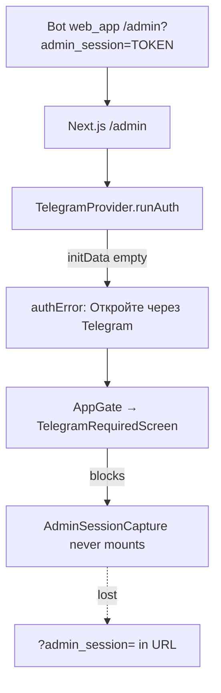

# Security Audit — ПланАм (MASTER AUDIT)

**Дата:** 2026-06-03  
**Репозиторий:** `ai-food-family`  
**Режим:** только аудит и документация — **код, БД и миграции не менялись**.

**Связанные документы:** [`ADMIN_PANEL_INCIDENT_AUDIT.md`](ADMIN_PANEL_INCIDENT_AUDIT.md), [`CODEBASE_INDEX.md`](CODEBASE_INDEX.md).

---

## Executive Summary

ПланАм строит безопасность вокруг **Telegram Mini App `initData`** (HMAC на API) и **scope** (`personal` / `family` через `X-App-Mode` + membership). Отдельный слой — **admin PIN + `admin_sessions`** + заголовок `X-Admin-Session`.

**Сильные стороны:** корректная серверная валидация `initData` (hash, `auth_date`, 24h TTL, `compare_digest`); большинство бизнес-роутов за `get_verified_user` / `get_app_scope`; family routes с проверкой `membership.family_id`; paywall меню на сервере (`assert_menu_generation_allowed`); admin API за `require_admin_user`; PIN lockout (5 попыток / 15 мин).

**Критичные / высокие зоны:**

| # | Тема | Severity |
|---|------|----------|
| 1 | **Open issue:** `/admin` → `TelegramRequiredScreen` при пустом `initData` до захвата `admin_session` | High (ops) |
| 2 | Telegram webhook без секрета → подделка updates | High |
| 3 | Любой verified user может **создавать/редактировать глобальный каталог** рецептов | High |
| 4 | `ADMIN_PIN` не пробрасывается в `docker-compose.prod.yml` | High (ops) |
| 5 | Утечка `initData` через XSS = полный account takeover (нет server session cookie) | Medium–High |

**Инфраструктура (prod):** наружу только 80/443; Postgres/Redis не публикуются. Dev compose открывает 5432/6379.

---

## Open Issue: Admin Panel + AppGate

**Симптом:** после `/admin` + PIN кнопка «📊 Открыть админ-панель» ведёт на `/admin`, но UI показывает **«Нужен Telegram»** (`TelegramRequiredScreen`).

**Цепочка (доказательства):**



| Шаг | Файл | Поведение |
|-----|------|-----------|
| Глобальный gate | `apps/web/components/auth/AppGate.tsx` | Блок при `authError` и отсутствии `user` |
| Загрузка SDK | `apps/web/lib/telegram-webapp.ts` | Poll + inject script; может вернуть WebApp с **пустым** `initData` |
| Auth | `apps/web/components/TelegramProvider.tsx` | `initData` пустой → `authError`, `user=null` |
| Admin session | `apps/web/components/admin/AdminSessionCapture.tsx` | Только внутри `AdminShell` |
| Admin API check | `apps/web/components/admin/AdminShell.tsx` | `pingAdmin(initData)` — без `initData` сразу «Нет доступа» |

**Кнопка бота (уже WebApp, не `url`):** `apps/api/app/services/admin_bot.py` → `web_app.url` = `admin_auth.admin_webapp_url()` → `https://planam.ru/admin?admin_session=…` (fallback base в `admin_auth.py`).

**Вероятные причины (для Phase 0):**

1. Открытие **вне** Mini App (external browser) — нет `initData`.
2. **Race:** `AppGate` рендерит `TelegramRequiredScreen` до появления `initData` (см. §2).
3. **`admin_session` не сохранён:** `AdminSessionCapture` не выполняется, пока `AppGate` блокирует.
4. Неверный `TELEGRAM_WEBAPP_URL` / домен в BotFather (менее вероятно при абсолютном URL).

**Рекомендация (needs code change: yes):** захват `admin_session` на уровне **выше** `AppGate` (layout/root) или ослабить gate для `/admin` только при наличии query token + последующая проверка `pingAdmin`; отдельно — диагностика `initData` в Mini App.

---

## 1. Telegram Auth

### 1.1 Реализация

| Аспект | Evidence | Оценка |
|--------|----------|--------|
| HMAC validation | `apps/api/app/telegram/validate.py` — `validate_init_data()` | OK |
| `hash` | Required; `hmac.compare_digest` | OK |
| `auth_date` | Required; max age **86400s** (24h) | OK |
| Replay | Stolen `initData` valid до 24h; **нет nonce / one-time use** | Medium |
| Bot token | `settings.telegram_bot_token` — never sent to client | OK |
| Header | `X-Telegram-Init-Data` on protected routes — `apps/api/app/deps.py` `get_current_user` | OK |
| Bootstrap | `POST /auth/telegram` body `init_data` — `apps/api/app/routers/auth.py` | OK |

### 1.2 Session / cookie strategy

| Механизм | Evidence | Risk |
|----------|----------|------|
| **Нет** HttpOnly session cookie для Telegram | Каждый запрос несёт сырой `initData` (`apps/web/lib/api-client.ts`) | XSS → полный доступ API от имени пользователя |
| Admin session | `sessionStorage` key `planam_admin_session` — `apps/web/lib/admin/session.ts` | XSS → admin API до TTL 12h |
| Dev token | `planam-dev-local-v1` — `dev_auth.py` / `dev-auth.ts`; API только если `ENVIRONMENT=development` | Low в prod |

### 1.3 Findings — Telegram Auth

| ID | Severity | Area | Evidence | Risk | Recommended fix | Code change |
|----|----------|------|----------|------|-----------------|-------------|
| T-01 | **medium** | Replay | `validate.py` — 24h window, no revocation | Перехваченный `initData` работает сутки | Короткий TTL + server-side session после `/auth/telegram`; optional refresh | yes |
| T-02 | **medium** | XSS / transport | `api-client.ts`, all API calls | Кража заголовка = impersonation | CSP, sanitize UI; HttpOnly session binding telegram_id | yes |
| T-03 | **low** | Tests | No tests for `validate_init_data` in `apps/api/tests` | Регрессии HMAC | Unit tests: valid/invalid/expired/tampered | yes |
| T-04 | **low** (dev) | Dev bypass | `dev_auth.py`, `POST /auth/dev-login` | Known static token in dev | Ensure prod `ENVIRONMENT=production`; never expose dev-login publicly | no (ops) |

---

## 2. AppGate / Frontend Auth

### 2.1 Определение Telegram environment

| Сигнал | Источник |
|--------|----------|
| `initData.length > 0` | `TelegramProvider.runAuth` после `loadTelegramWebApp()` |
| `isTelegram` flag | Set true only after successful `authenticateWithTelegram` |
| `isClientDevMode()` | `NODE_ENV===development` + localhost → skip Telegram UI |

### 2.2 Когда показывается `TelegramRequiredScreen`

**Файл:** `apps/web/components/auth/AppGate.tsx`

Условие:

```text
!isClientDevMode() && !isDevMode && !user && !isAuthenticating && authError
```

**Сообщение по умолчанию:** `TelegramProvider` → `"Откройте приложение через Telegram"` (`TelegramProvider.tsx` ~L170).

**Влияние на `/admin`:** **да** — `/admin` внутри того же `AppProviders` → `AppGate` оборачивает **все** страницы, включая admin layout. Legal/phone gates также требуют `isTelegram && initData && user`.

### 2.3 Race conditions (`telegram-web-app.js`)

| ID | Severity | Area | Evidence | Risk | Fix | Code |
|----|----------|------|----------|------|-----|------|
| F-01 | **high** | Admin + AppGate | § Open Issue; `AppGate` + `AdminSessionCapture` order | Потеря `admin_session`, ложный «Нужен Telegram» | Capture query param before gate; loading state until auth settles | yes |
| F-02 | **medium** | Pre-hydration flash | `TelegramProvider`: before `mounted`, `defaultContext` has `isAuthenticating:false`, `authError:null` | Краткий рендер children без user | Don't render children until `mounted` or treat as authenticating | yes |
| F-03 | **medium** | SDK timing | `telegram-webapp.ts` — FAST_POLL + script inject 4s | `initData` late on slow clients | Extend wait / retry `runAuth` on WebApp `viewportChanged` | yes |
| F-04 | **low** | Security boundary | UI gate ≠ security | Обход UI не даёт API без valid `initData` | Document; fix UX only | partial |

**Provider tree:** `AppProviders.tsx` — `TelegramProvider` → `AppGate` → … → `AppShell`.

---

## 3. Admin Security

### 3.1 Модель доступа

| Слой | Механизм | Evidence |
|------|----------|----------|
| Allowlist | `ADMIN_TELEGRAM_IDS` → `settings.admin_telegram_id_set()` | `config.py`, `admin_auth.is_admin_telegram_id` |
| PIN | `ADMIN_PIN` → `secrets.compare_digest` | `admin_auth.verify_pin` |
| Lockout | 5 fails / 15 min | `admin_login_attempts` |
| Session | Token 32 bytes url-safe, TTL **12h** | `admin_sessions` — `create_admin_session` |
| API | `require_admin_user` | `deps.py` — `get_current_user` + `X-Admin-Session` + `require_valid_session` |
| Audit | `admin_actions` | `admin_audit.log_admin_action` |
| Errors | `admin_error_logs` + middleware | `main.py` `AdminErrorLoggingMiddleware`, `admin_errors.py` |
| Flag | `ADMIN_PANEL_ENABLED` | `config.py` |

**Важно:** `require_admin_user` использует **`get_current_user`**, не `get_verified_user` — admin API **не требует** phone/legal на сервере (by design).

### 3.2 Admin routes (frontend)

| Route | Guard |
|-------|-------|
| `/admin/*` | `AppGate` (Telegram) + `AdminShell` (`pingAdmin` + `X-Admin-Session`) |

### 3.3 Admin API

**Router:** `apps/api/app/routers/admin.py` — все handlers `Depends(require_admin_user)`.

**Capabilities (by design — platform admin):** block/delete users, grant subscriptions/AMS, family ops, backups, OpenAI stats, error logs.

### 3.4 Findings — Admin

| ID | Severity | Area | Evidence | Risk | Fix | Code |
|----|----------|------|----------|------|-----|------|
| A-01 | **high** | UX / session capture | Open Issue § | Admin unusable; token lost | Phase 0 AppGate/admin_session | yes |
| A-02 | **high** | Ops / PIN | `docker-compose.prod.yml` — no `ADMIN_PIN` | PIN always empty → `verify_pin` false | Pass `ADMIN_PIN` in prod compose / secrets manager | no (ops) |
| A-03 | **medium** | Session storage | `sessionStorage` | XSS → admin until expiry | httpOnly cookie or shorten TTL + bind IP | yes |
| A-04 | **medium** | PIN strength | Single env string, no rotation API | Brute force mitigated by lockout only | Strong PIN, alerting on lockouts | partial |
| A-05 | **low** | Bypass phone/legal | `require_admin_user` vs `get_verified_user` | Admin Telegram ID without phone can manage platform | Accept or require verified for admin | yes |
| A-06 | **low** | Bot button | `admin_bot.py` already `web_app` | Misconfiguration if URL wrong domain | Verify BotFather Web App URL = `TELEGRAM_WEBAPP_URL` | no (ops) |

---

## 4. API Authorization

### 4.1 Dependency ladder

```text
get_current_user (initData)
  → get_verified_user (+ legal, phone, blocked)
    → get_app_scope (+ X-App-Mode, family membership)
require_admin_user (initData + admin session + allowlist)
```

### 4.2 Публичные / слабые endpoints

| Endpoint | Auth | Evidence | Risk |
|----------|------|----------|------|
| `GET /health`, `GET /health/live` | None | `main.py` | OK |
| `POST /auth/telegram` | Body initData | `auth.py` | OK (bootstrap) |
| `POST /auth/dev-login` | Dev only | `auth.py` | OK if prod env |
| `GET /legal/documents` | None | `legal.py` | OK (public text) |
| `POST /telegram/webhook`, `POST /bot/webhook` | Optional secret | `telegram_bot.py` | **High** if secret empty |
| `GET /telegram/webhook/info`, `GET /telegram/webhook/url` | **None** | `telegram_bot.py` | Info disclosure |

### 4.3 Домены (кратко)

| Domain | Router | Auth pattern | Isolation notes |
|--------|--------|--------------|-----------------|
| users | `users.py` | `get_verified_user` | Only `/me/app-context` |
| families | `families.py` | verified + service checks `family_id` | 404 on wrong family |
| recipes | `recipes.py` | verified / scope | **Global write** issue |
| menu | `menus.py` | `get_app_scope` | Generation paywalled server-side |
| shopping | `shopping_lists.py` | scope queries | Item IDs scoped |
| pantry | `pantry.py` | scope | OK |
| nutritionist | `nutritionist.py` | verified + scope | deferred_advice by user_id |
| subscriptions | `subscriptions.py` | verified; plan change needs family admin | Server `user_has_pro` |
| admin | `admin.py` | `require_admin_user` | Intentional cross-tenant |

### 4.4 Findings — API Authorization

| ID | Severity | Area | Evidence | Risk | Fix | Code |
|----|----------|------|----------|------|-----|------|
| API-01 | **high** | Recipes IDOR / integrity | `POST /recipes`, `PATCH /recipes/{id}` — `authoring.create_recipe` / `update_recipe`; `_ = user` | Любой user пишет в глобальный каталог | Restrict to admin or `source_type=user` + owner | yes |
| API-02 | **high** | Webhook | `telegram_bot._validate_webhook_secret` — skip if empty | Fake updates, spam, admin PIN flow abuse | Require `TELEGRAM_WEBHOOK_SECRET` in prod | no (ops) + yes (fail closed) |
| API-03 | **medium** | Webhook debug | `GET /telegram/webhook/info`, `/webhook/url` | Leak webhook URL, env hints | Remove or protect with admin auth | yes |
| API-04 | **medium** | meal-checkins | `POST /meal-checkins` uses `resolve_scope(db, user)` **without** `X-App-Mode` | Wrong scope vs other endpoints | Use `get_app_scope` | yes |
| API-05 | **medium** | meal-checkins IDOR | `upsert_meal_checkin` — no `family_member_id ∈ family` check | Write checkins for alien `family_member_id` | Validate member like `recipes.py` rate endpoint | yes |
| API-06 | **low** | event-plans | `GET /event-plans/{id}` — `user_id` only | No cross-family read (may be OK) | Document or add family share rules | yes |
| API-07 | **low** | CORS | `main.py` — `allow_methods/headers=["*"]` | Misconfigured origins widen attack | Strict origins in prod | no (ops) |

**Положительный пример (member check):** `POST /recipes/{id}/rate` — `member.family_id != scope.family_id` → 404 (`recipes.py` ~L440).

---

## 5. Family Data Isolation

### 5.1 Механизмы

| Mechanism | Evidence |
|-----------|----------|
| Single membership | `family.get_user_membership(db, user)` |
| Path `/{family_id}/` | `membership.family_id != family_id` → 404 |
| AppScope | `app_scope.resolve_scope` — personal vs family |
| Queries | pantry, shopping, menu_selection filter by `scope.family_id` or `user_id` |

### 5.2 Findings

| ID | Severity | Area | Evidence | Risk | Fix | Code |
|----|----------|------|----------|------|-----|------|
| FI-01 | **medium** | meal-checkins | § API-05 | Cross-member write in family mode | Member validation | yes |
| FI-02 | **low** | Scope header drift | meal-checkins vs rest | Inconsistent family/personal data | Unify `get_app_scope` | yes |
| FI-03 | **low** | Invites | `accept_invite` via bot callback | Out of HTTP scope; token in deep link | Audit invite token entropy / expiry | review |

---

## 6. Subscription / Paywall Security

### 6.1 Server-side enforcement

| Feature | Evidence |
|---------|----------|
| Menu generation | `subscription.assert_menu_generation_allowed` — `menu.py` |
| HTTP 402 | `subscription.py` — structured `detail` with `code`, `ams_cost` |
| PRO checks | `progress.user_has_pro`, `care._user_has_pro` |
| Family billing | `is_family_admin` on `select-plan` |
| Admin grant | `admin.py` / `admin_manage.py` — metadata `admin_grant: True` |

### 6.2 Findings

| ID | Severity | Area | Evidence | Risk | Fix | Code |
|----|----------|------|----------|------|-----|------|
| SUB-01 | **medium** | Client trust | UI may hide PRO features | Bypass UI still needs API checks | Audit all PRO endpoints use `require_pro` / `assert_*` | yes |
| SUB-02 | **low** | Admin grant | `admin_manage` grant subscription | Insider abuse | Audit log review (`admin_actions`) | no (process) |
| SUB-03 | **low** | `user_has_pro` | `except Exception: return False` in `progress.py` | Fail-closed to free (OK) | Log errors | yes |

---

## 7. Secrets / Environment

### 7.1 Inventory

| Secret | Env var | In repo examples | In prod compose `api` |
|--------|---------|------------------|------------------------|
| Telegram bot | `TELEGRAM_BOT_TOKEN` | `.env.example` | yes |
| OpenAI | `OPENAI_API_KEY` | yes | yes |
| Admin PIN | `ADMIN_PIN` | yes | **no** |
| DB | `DATABASE_URL`, `POSTGRES_PASSWORD` | yes | yes |
| Redis | `REDIS_URL` | yes | yes (no password) |
| Webhook secret | `TELEGRAM_WEBHOOK_SECRET` | **not in examples** | **no** |

### 7.2 `.gitignore`

**Файл:** `.gitignore` — ignores `.env`, `.env.production`, `apps/api/.env`, `backups/`, `logs/`, `deploy/certbot/`, `*.sql`.

**Risk:** broad `*.sql` may hide intentional SQL assets; backup dumps must never be committed.

### 7.3 Findings

| ID | Severity | Area | Evidence | Risk | Fix | Code |
|----|----------|------|----------|------|-----|------|
| SEC-01 | **high** | Prod deploy | `docker-compose.prod.yml` missing `ADMIN_PIN` | Admin PIN broken / empty | Add to compose + secret store | no (ops) |
| SEC-02 | **high** | Webhook | `TELEGRAM_WEBHOOK_SECRET` undocumented | Prod webhooks open | Set secret; document in `.env.production.example` | no (ops) |
| SEC-03 | **medium** | Backups | `backup.py`, `scripts/backup.sh` copy `.env` | Full secrets on disk | Encrypt backups; restrict permissions | yes |
| SEC-04 | **low** | Dev token | Hardcoded `planam-dev-local-v1` in repo | Known dev credential | OK if prod blocks | no |
| SEC-05 | **low** | Logs | Webhook logs message text | PII in logs | Redact / truncate | yes |

**Repository scan:** no committed `.env` files expected; operators must verify history separately (`git log --all -- .env`).

---

## 8. Docker / Infrastructure

### 8.1 Exposure

| Environment | Ports published | Evidence |
|-------------|-----------------|----------|
| Dev | 3000, 8000, **5432**, **6379** | `docker-compose.yml` |
| Prod | **80, 443** only | `docker-compose.prod.yml` |

### 8.2 Nginx / HTTPS / headers

| Item | Evidence |
|------|----------|
| TLS | `app-ssl.conf.template` — TLS 1.2/1.3, redirect HTTP→HTTPS |
| Headers | `X-Frame-Options`, `X-Content-Type-Options` only |
| Missing | HSTS, CSP, Referrer-Policy |
| Next.js | `next.config.mjs` — no security headers |

### 8.3 CORS / rate limits / backups

| Item | Status |
|------|--------|
| CORS | `CORSMiddleware` — origins from env; methods/headers `*` |
| Rate limits | **Global: none**; admin PIN lockout only |
| Backups | `scripts/backup.sh`, admin API `/admin/backups/*` |

### 8.4 Findings

| ID | Severity | Area | Evidence | Risk | Fix | Code |
|----|----------|------|----------|------|-----|------|
| INF-01 | **medium** (dev) | Postgres/Redis | Dev compose host ports | LAN exposure on shared machine | Firewall; don't deploy dev compose publicly | no |
| INF-02 | **medium** | Redis | No `requirepass` | Lateral movement if Redis reached | Redis AUTH in prod | yes |
| INF-03 | **medium** | Headers | No HSTS/CSP | MITM/downgrade; XSS impact | Add nginx + Next headers | yes |
| INF-04 | **medium** | Rate limit | No API throttling | DoS, PIN brute at scale | nginx `limit_req` or middleware | yes |
| INF-05 | **low** | Backups | `backups/` gitignored | Disk theft | Off-site encrypted backup | no (ops) |

---

## 9. AI Security

### 9.1 Architecture

| Component | Evidence |
|-----------|----------|
| Prompt build | `ai_context.build_ai_user_context` — profile, pantry, menu, catalog slice |
| Menu AI | `ai.py` — user context embedded in prompt; `chat_json` |
| Client | `ai_client.py` — OpenAI; errors logged |
| Paywall | Menu generation gated before AI call |

### 9.2 Recipe pipeline

| Aspect | Evidence |
|--------|----------|
| User-created recipes | `authoring.create_recipe` — immediate DB insert |
| Import jobs | `recipe_import_jobs` — `status` default `pending` / pipeline in migrations |
| Admin promote | Documented in `RECIPE_ENGINE_V1.md` — admin-only promote-to-system |

### 9.3 Findings

| ID | Severity | Area | Evidence | Risk | Fix | Code |
|----|----------|------|----------|------|-----|------|
| AI-01 | **medium** | Prompt injection | User profile, pantry, free text in `prompt_text` | Model ignores policies; bad menu/nutrition advice | Sanitize/limit fields; system prompt hardening | yes |
| AI-02 | **medium** | Output validation | `menu_ai_parsing`, JSON from model | Invalid or unsafe recipe IDs | Strict schema validation; allowlist recipe_ids | yes |
| AI-03 | **medium** | Catalog pollution | API-01 — any user creates recipes | AI may pick malicious entries | Separate user drafts vs `is_active` catalog | yes |
| AI-04 | **low** | Vision / receipt | `vision_json`, receipt OCR | Image-based injection | Size limits; content policy | yes |
| AI-05 | **low** | Cost abuse | OpenAI calls behind verified user | AMS/quota partially limits | Per-user rate limits on AI endpoints | yes |

---

## 10. Future Referral / Partner Risks

**Текущее состояние:** в коде **нет** referral/partner/payout модулей (поиск: `referral`, `partner` — только admin `promo_note`, recipe `promote-to-system`).

Планируемые риски (design-time):

| ID | Severity | Risk | Mitigation (future) |
|----|----------|------|---------------------|
| REF-01 | **high** | Self-referral (multi Telegram → one payout) | 1 account = 1 telegram_id; device fingerprint; cooldown |
| REF-02 | **high** | Fake accounts / bot farms | Telegram auth + phone verified + min activity before bonus |
| REF-03 | **medium** | Referral loops (A↔B) | Graph detection; max depth |
| REF-04 | **medium** | Bonus / promo abuse | Server-side ledger; idempotent grants; admin audit |
| REF-05 | **high** | Partner / payout fraud | KYC for partners; manual approval; clawback |

**needs code change:** yes (when feature ships).

---

## Summary Table (by severity)

| Severity | Count (documented) | Examples |
|----------|-------------------|----------|
| **critical** | 0 | — |
| **high** | 6 | A-01, A-02, API-01, API-02, F-01, SEC-01/02 |
| **medium** | 18 | T-01/02, F-02/03, API-03–05, FI-01, SUB-01, SEC-03, INF-02–04, AI-01–03 |
| **low** | 15+ | T-03, A-05/06, API-06/07, … |

---

## Verification Checklist (post-fix)

- [ ] `/admin` from bot WebApp: `initData` present, `admin_session` in `sessionStorage`, `GET /admin/ping` → 200
- [ ] Webhook without secret → 403 in prod
- [ ] Non-admin cannot `PATCH /recipes/{id}` on system recipes
- [ ] `POST /meal-checkins` with alien `family_member_id` → 404
- [ ] `TELEGRAM_WEBHOOK_SECRET` and `ADMIN_PIN` set in prod deployment
- [ ] Security headers present on HTTPS responses

---

*Аудит выполнен по состоянию репозитория на 2026-06-03. Для деталей админ-инцидента см. [`ADMIN_PANEL_INCIDENT_AUDIT.md`](ADMIN_PANEL_INCIDENT_AUDIT.md).*
