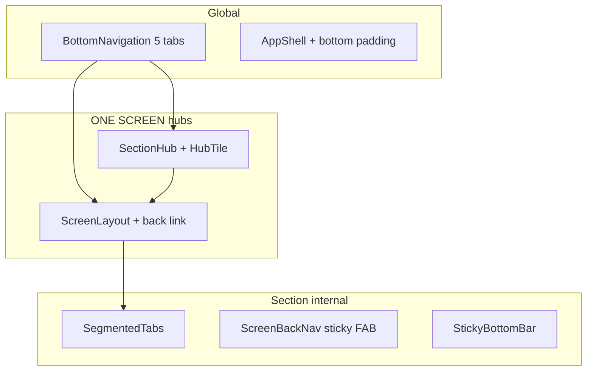
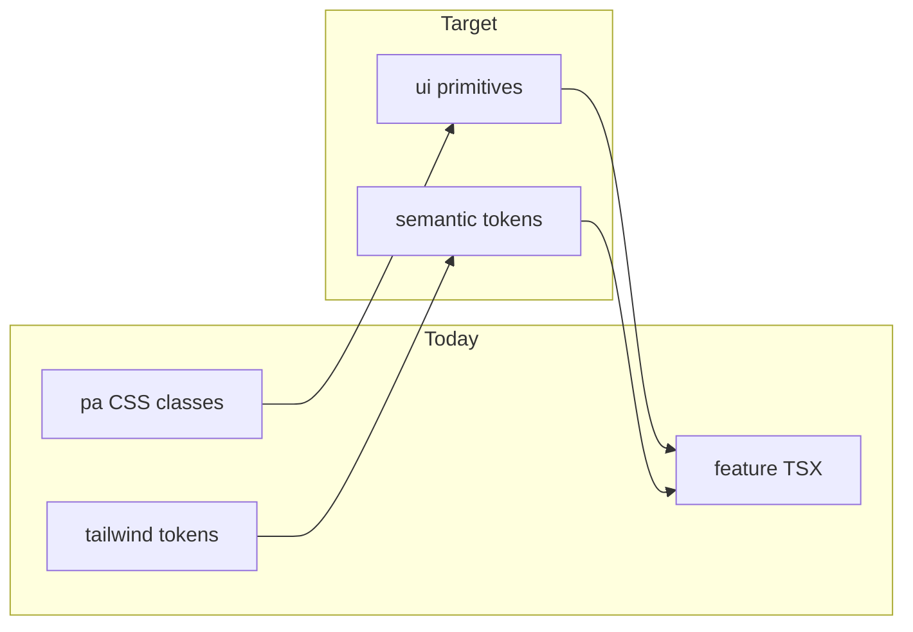

# UI System Audit — ПланАм (MASTER AUDIT)

**Дата:** 2026-06-03  
**Область:** `apps/web` (Next.js 14 Mini App)  
**Режим:** только документация — код не изменялся.

**Связанные документы:** [`SCREEN_MAP.md`](SCREEN_MAP.md), [`UX_FLOW_MAP.md`](UX_FLOW_MAP.md), [`UX_PROBLEMS.md`](UX_PROBLEMS.md), [`DOMAIN_ARCHITECTURE.md`](DOMAIN_ARCHITECTURE.md).

---

## Executive Summary

В репозитории **нет отдельного пакета дизайн-системы** (`@planam/ui`). UI собран из:

1. **Токенов Фазы 1** — `tailwind.config.ts` (cream / sage / graphite / warm) + `globals.css` (`.pa-*`).
2. **~6 файлов в `components/ui/`** — минимальный kit.
3. **~120 feature-компонентов** — доменная вёрстка с локальными Tailwind-классами.

**Состояние:** идёт **частичная миграция** на тёплую палитру (sage/graphite/cream). Параллельно живёт **legacy-палитра** emerald/stone (~39 TSX-файлов с `stone-*`, навигация и home на emerald). Админка почти полностью **stone/amber**, без `.pa-*`.

**Главные долги:** дубли overlay (Sheet vs 7+ кастомных модалок), три семейства кнопок, два визуальных языка на одном экране (home stone + menu sage), emoji вместо иконочной системы, paywall размазан по 4 паттернам.

---

## 1. Design Tokens & Foundation

### 1.1 Colors

| Слой | Источник | Статус |
|------|----------|--------|
| **Новые семантические** | `tailwind.config.ts` — `cream`, `sage`, `olive`, `graphite`, `warm` | Задокументированы, частично в UI |
| **CSS variables** | `globals.css` `:root` — `--pa-cream`, `--pa-sage`, … | 5 переменных, мало используются напрямую |
| **Legacy Tailwind** | `emerald-*`, `stone-*` (дефолт Tailwind) | Активны в nav, home, auth, admin, onboarding |
| **Ad-hoc** | `amber-*` (`FromPantrySection`), `red-*` (errors) | Точечно |

**Оценка файлов (TSX в `app/` + `components/`):**

| Палитра | Файлов (прибл.) | Зоны |
|---------|-----------------|------|
| `stone-*` / `emerald-*` | **~39** | `BottomNavigation`, `home/*`, auth gates, admin, onboarding, settings, `PageLoading` |
| `sage-*` / `cream-*` / `graphite-*` / `.pa-*` | **~79** | menu, shopping, pantry, family, recipes, health, subscription (частично) |

### 1.2 Typography

| Аспект | Реализация |
|--------|------------|
| Шрифт | **Manrope** — `app/layout.tsx`, `fontFamily.sans` в Tailwind |
| Заголовки экранов | `ScreenLayout`: `text-2xl font-bold`; `SectionHub`: `text-[1.7rem]`; admin: `text-lg` |
| Body | `text-sm` доминирует; `text-xs` для meta |
| Utility | `.pa-title`, `.pa-subtle` в `globals.css` — **редко** в JSX |

**Несогласованность:** нет шкалы `text-h1/h2/body/caption` в токенах — размеры заданы inline в каждом layout.

### 1.3 Spacing

| Паттерн | Значение |
|---------|----------|
| Контейнер | `max-w-lg mx-auto px-4` / `px-5` |
| Межкарточный gap | `space-y-3`, `gap-3` (hub), `gap-1.5` (chips) |
| Safe area | `env(safe-area-inset-bottom)` в Sheet, BottomNav, StickyBottomBar |
| Nav offset | `BOTTOM_NAV_OFFSET` — `lib/layout/constants.ts` |

Нет единой spacing scale (4/8/12/16) в токенах — только Tailwind defaults.

### 1.4 Radius

| Token | CSS | Использование |
|-------|-----|---------------|
| `rounded-control` | 14px | кнопки, inputs, HubTile icon box |
| `rounded-card` | 20px | карточки, Sheet panel top |
| `rounded-pill` | full | chips, tabs, badges |
| **Legacy** | `rounded-xl`, `rounded-2xl`, `rounded-[24px]` | auth screens, admin, home, onboarding (~30+ файлов) |

### 1.5 Shadows

| Token | В Tailwind | Использование |
|-------|------------|---------------|
| `shadow-soft` | да | `.pa-card`, HubTile, SkeletonCard |
| `shadow-card` | да | редко |
| `shadow-lift` | да | Sheet, ScreenBackNav FAB |
| **Legacy** | `shadow-sm`, `shadow-emerald-200` | BottomNavigation center tab |

### 1.6 Icons

| Тип | Где |
|-----|-----|
| **Emoji** | Bottom nav (`🍽🛒✨❤️👤`), HubTile, advice cards, empty states |
| **SVG icon library** | **отсутствует** (нет lucide/heroicons/radix) |
| **Текст** | `›`, `←`, `✓` как UI chrome |

**Долг:** нет единого размера/stroke; emoji рендерятся по-разному на iOS/Android/Desktop Telegram.

### 1.7 Themes

| Тема | Поддержка |
|------|-----------|
| Light only | `body` bg-cream; Telegram `themeParams` только CSS var `--tg-theme-bg-color` в `TelegramProvider` |
| Dark mode | **нет** |
| Telegram theme sync | частично (фон), без полной дизайн-системы |

---

## 2. Component Inventory

### 2.1 Buttons

| Вариант | Реализация | Где используется | Кол-во стилей |
|---------|------------|------------------|---------------|
| **A. `.pa-btn-primary`** | `globals.css` | menu, family, recipes, progress, care, shopping sheets (~35 файлов) | 1 |
| **B. `.pa-btn-ghost`** | `globals.css` | то же + secondary actions | 1 |
| **C. `.pa-btn`** | base (редко) | — | 1 |
| **D. Raw primary** | `bg-sage-500 text-white rounded-control…` | `SegmentedTabs`, `FilterChip`, `ModeSwitcher`, `MenuPlanner` chips | ~10+ inline |
| **E. Legacy emerald** | `bg-emerald-600…` | `BottomNavigation` center, onboarding steps, home CTAs | ~15 файлов |
| **F. Legacy stone** | `border-stone-200 bg-white…` | admin actions, settings | admin + settings |
| **G. HubTile** | component | `/`, `/health`, hub screens | 2 tones |
| **H. Link-as-button** | `font-semibold text-sage-800` | back links, menu hub | pervasive |
| **I. Admin ConfirmButton** | inline in `AdminDashboard.tsx` | admin destructive/confirm | 1 local |

**Дублирование:** одна и та же «primary CTA» описана **4 способами** (pa-btn-primary, sage inline, emerald inline, HubTile primary).

**Touch target:** `.pa-btn*` и HubTile задают `min-h-[44px]` / `min-h-[68px]` — хорошо для TMA.

---

### 2.2 Cards

| Компонент / паттерн | Файл | Токены | Использование |
|---------------------|------|--------|---------------|
| **`.pa-card`** | utility | cream/sage shadow | 50+ секций в feature components |
| **`RecipeCard`** | `recipes/RecipeCard.tsx` | pa-card | catalog, favorites, collections |
| **`MemberCard`** | `family/MemberCard.tsx` | pa-card + badges | `/family` |
| **`PantryItemCard`** | `pantry/PantryItemCard.tsx` | pa-card | pantry list |
| **`MenuVariantCard`** | `menu/MenuVariantCard.tsx` | pa-card + custom | generate choose phase |
| **`HubTile`** | `ui/HubTile.tsx` | rounded-card, not pa-card | home, health hub |
| **Home cards** | `home/HomeTodayCard.tsx` etc. | **stone/emerald**, `rounded-2xl` | `/` only |
| **`CareTelegramLinkCard`** | care | sage | notifications flow |
| **Admin stat cards** | `AdminDashboard.tsx` | stone borders | `/admin` |

**Вариантов карточки:** **≥6** визуальных семейств.

---

### 2.3 Forms

| Подсистема | Компоненты | Поля / паттерны |
|------------|------------|-----------------|
| **Nutrition profile** | `NutritionProfileForm`, `NutritionSection`, `NumberInput`, `ToggleRow`, `NutritionGoalDetailsFields` | accordions, chips, option cards |
| **Family** | `MemberForm`, `VirtualMemberNutritionForm` | дублирует ~70% nutrition form |
| **Onboarding (legacy)** | `ChipSelect`, `OptionCards`, `TextAreaField`, `ChipSelectWithCustom`, `StepNavigation` | используются **внутри** nutrition form; wizard **не смонтирован** |
| **Shopping** | `ShoppingItemSheet`, `CategoryPicker` | text + category dropdown |
| **Pantry** | `PantryItemForm` | name, qty, unit, expiry |
| **Notifications** | `NotificationSettingsForm` | toggles + time inputs |
| **Care** | `CareSettingsPanel` | toggles, quiet hours, level selector |
| **Progress** | inline in `ProgressDashboard` | weight/training expand |
| **Settings** | inline in `app/settings/*` | stone styled inputs |
| **Admin** | inline inputs | stone, dense tables |

**Общий UI kit для input:** **отсутствует** — нет `<Input>`, `<Select>`, `<Checkbox>` в `components/ui/`.

**Дубли:** `ChipSelect` / `OptionCards` shared onboarding ↔ nutrition; два полных мегаформ (profile vs virtual member).

---

### 2.4 Modals & overlays

| Тип | Реализация | Count usages |
|-----|------------|--------------|
| **Canonical bottom sheet** | `components/ui/Sheet.tsx` | **8** imports |
| **Duplicate bottom sheets** | Custom `fixed inset-0 z-50` | **7+** |
| **Fullscreen overlay** | `MenuPlanner` preview, `RecipeDetailModal` page shell | 2 |
| **Dialog (center/bottom)** | `AmaConfirmDialog`, `AdminConfirmDialog` | 2 |
| **Progress modals** | inline in `ProgressDashboard.tsx` | 2 |

#### Sheet (`ui/Sheet.tsx`) — используется в:

| Consumer | Назначение |
|----------|------------|
| `ShoppingItemSheet` | add/edit item |
| `ShoppingCategorySheet` | new category |
| `PantryItemForm` | add/edit pantry |
| `RecipeFiltersSheet` | filters |
| `MenuQuickActionsSheet` | menu quick actions |
| `MenuDayOverview` | meal detail |
| `RecipeDetailModal` | «Ещё» panel |
| `ScenarioChips` | more scenarios |

#### Custom overlays (дублируют Sheet):

| File | Отличия от Sheet |
|------|------------------|
| `AddPersonSheet.tsx` | свой backdrop `graphite-900/40`, без drag handle |
| `InviteSheet.tsx` | `p-4`, centered on sm |
| `FamilyManageSheet.tsx` | `items-end`, no Sheet import |
| `ReplaceDishModal.tsx` | `sm:items-center`, form modal |
| `RecipeDetailModal.tsx` | полноэкранная страница `/recipes/[id]` + внутренний Sheet |
| `AmaConfirmDialog.tsx` | marketing + AMS paywall |
| `AdminConfirmDialog.tsx` | stone palette |
| `ProgressDashboard.tsx` | `bg-black/40` ×2 |

**Вариантов overlay shell:** **≥5** (Sheet + 4 семейства кастомных).

---

### 2.5 Bottom sheets

В проекте **все** «sheets» — bottom-aligned overlays. Единственный стандартизированный — `Sheet.tsx` (handle, title, close, max-h 85vh).

**Не используют Sheet:** family sheets (3), replace dish, ama confirm, admin confirm, progress — **технический долг #1**.

---

### 2.6 Tabs

| Паттерн | Компонент | Маршруты |
|---------|-----------|----------|
| **Bottom navigation** | `BottomNavigation.tsx` | 5 tabs: menu, shopping, home, health, profile |
| **Segmented sub-tabs** | `SegmentedTabs.tsx` | wrapped by `MenuSubTabs`, `ShoppingSubTabs` |
| **Mode switch** | `ModeSwitcher.tsx` | personal/family in profile |
| **Admin top nav** | `AdminShell.tsx` | horizontal scroll links |
| **Filter chips** | `FilterChip.tsx` | recipe catalog (not route tabs) |
| **Day chips** | `MenuDayPicker.tsx` | menu current |
| **Care level** | `CareSettingsPanel.tsx` | soft/med/high chips |

**Дубли:** `SegmentedTabs` vs `FilterChip` — одинаковая визуальная логика (sage active), разные компоненты.

**Несогласованность:** bottom nav — **emerald**; sub-tabs — **sage**.

---

### 2.7 Navigation patterns

| Pattern | File | Notes |
|---------|------|-------|
| App shell | `AppShell.tsx` | Toast + DevBanner + BottomNav |
| Section hub | `SectionHub.tsx` | PlanAm home, health hub |
| Screen + header | `ScreenLayout.tsx` | most sub-pages |
| Back nav | `ScreenBackNav.tsx` | optional sticky FAB |
| `returnTo` query | `lib/navigation/return-to.ts` | profile/progress loops |
| Hidden nav | `HIDDEN_NAV_PREFIXES` | `/admin`, `/onboarding` |
| Config SSOT | `lib/navigation/nav-config.ts` | tabs + subtabs |

---

### 2.8 Loaders

| Тип | Реализация | Где |
|-----|------------|-----|
| **Spinner page** | `PageLoading.tsx` | admin detail, meal leftovers, AdminShell |
| **Skeleton cards** | `Skeleton.tsx` — Box, Card, List | menu, shopping, pantry, progress route |
| **Route loading** | `app/menu/loading.tsx`, `shopping/`, `pantry/` | Next.js suspense |
| **Inline pulse** | `animate-pulse` ad-hoc | `FavoritesView`, `FromPantrySection` |
| **`RecipeListSkeleton`** | dedicated | recipes catalog |
| **Button pending** | `Составляем…`, `Сохранение…` | forms |
| **Protected fallback** | `ProtectedScreenFallback.tsx` | health screens |

**Дубли:** skeleton **не везде** — часть экранов использует `PageLoading` spinner (визуальный разрыв).

**Несогласованность:** `PageLoading` spinner — **emerald/stone**; skeleton — **cream-border**.

---

### 2.9 Skeletons

| Export | Назначение |
|--------|------------|
| `SkeletonBox` | primitive |
| `SkeletonLine` | text lines |
| `SkeletonCard` | card block + optional CTA |
| `SkeletonList` | N × SkeletonCard |

**Используют:** `MenuHub`, `MenuCurrentView`, `PantryDashboard`, `app/menu/loading.tsx`, `app/progress/page.tsx`.

**Нет skeleton для:** recipe detail, family sheets, subscription (uses spinner via provider).

---

### 2.10 Empty states

| Экран / компонент | Copy pattern | CTA |
|-------------------|--------------|-----|
| `MenuHub` | `loadState === "empty"` | «Составить меню» |
| `MenuCurrentView` | «Активного плана пока нет» | link to generate |
| `HomeTodayCard` | «Плана пока нет» | stone styling |
| `PantryDashboard` | «Запасов пока нет» | add CTA |
| `CollectionsView` | «Коллекций пока нет» | create |
| `MealLeftoversPage` | «Пока нет остатков» | form below |
| `FavoritesView` | empty list after load | link to catalog |
| `CollectionDetailView` | empty collection | hint |

**Дубли:** нет shared `<EmptyState title icon action />` — **8+ inline implementations**.

---

### 2.11 Paywalls & monetization UI

| Паттерн | Файл | Триггер |
|---------|------|---------|
| **PRO locked panel** | `ProgressProLocked.tsx` | free user on `/progress` |
| **AMA confirm dialog** | `AmaConfirmDialog.tsx` | paid AI actions (dynamic import ×4) |
| **Subscription page** | `SubscriptionDashboard.tsx` | `/subscription`, plan cards |
| **Inline 402 link** | `MenuHub`, `MenuPlanner`, `NutritionistChat` | API errors |
| **PRO badge** | `CareSettingsPanel.tsx` | coach level |
| **Disabled CTA** | «Купить Амы» disabled | subscription page |

**Дубли:** paywall UX **не унифицирован** — dialog vs page vs inline link vs locked section.

**Consumers of `AmaConfirmDialog`:** `MenuHub`, `MenuCurrentView`, `NutritionistChat`, `RecipeDetailModal`, `HomeQuickActions`.

---

## 3. `components/ui/` — минимальный kit

| File | Role | Adoption |
|------|------|----------|
| `Sheet.tsx` | bottom sheet | medium (8) |
| `Skeleton.tsx` | loading placeholders | medium |
| `HubTile.tsx` | hub navigation tile | low (home, health) |
| `PageLoading.tsx` | spinner loader | low, **legacy colors** |
| `ToastProvider.tsx` | toasts | global via AppShell |
| `MultiSelectField.tsx` | multi select | onboarding/nutrition only, **stone** |

**Отсутствуют:** Button, Input, Card, Dialog, Tabs, EmptyState, Badge, Icon — всё в feature folders или `.pa-*` CSS.

---

## 4. Layout components

| Component | Purpose |
|-----------|---------|
| `AppShell` | bottom nav + toast wrapper |
| `BottomNavigation` | **legacy emerald** 5-tab |
| `SectionHub` | one-screen hub layout |
| `ScreenLayout` | titled sub-page |
| `ScreenBackNav` | back + optional FAB |
| `SegmentedTabs` | **sage** sub-tabs |
| `MenuSubTabs` / `ShoppingSubTabs` | wrappers |
| `ShoppingSectionLayout` / `MenuSectionLayout` | section chrome |
| `StickyBottomBar` | CTA above nav |
| `BottomBackButton` | legacy back |

---

## 5. Cross-cutting inconsistencies

### 5.1 Dual brand palette on one session

Пользователь видит:

- **Home (`/`)** — stone/emerald cards (`HomeTodayCard`, `HomeShoppingCard`).
- Tap **Меню** — sage/cream (`MenuHub`).

→ Ощущение «два разных приложения».

### 5.2 Admin island

`/admin/*` — stone, amber alerts, без Manrope-токенов, без HubTile/Sheet. Отдельный визуальный продукт.

### 5.3 Auth gates

`LegalConsentScreen`, `PhoneRequiredScreen`, `TelegramRequiredScreen` — `rounded-[24px]`, stone, не `.pa-card`.

### 5.4 Orphan / legacy components

| Component | Статус | Evidence |
|-----------|--------|----------|
| `TelegramAuthPanel.tsx` | **устарел** | заменён `TelegramRequiredScreen`; не в дереве providers |
| `OnboardingWizard.tsx` | **не в роуте** | `/onboarding` → redirect `/profile/nutrition` |
| `HealthStatus.tsx` | **dev-only diagnostic** | только `settings/account` — API health, не продуктовый UI |
| `OpenMiniAppButton.tsx` | niche | bot hints |
| `BotQuickInputHint.tsx` | niche | |

### 5.5 Визуально выбивающиеся

| UI | Почему |
|----|--------|
| `FromPantrySection` | `bg-amber-100` skeleton — не cream/sage |
| `BottomNavigation` | emerald FAB в sage app |
| `PageLoading` | emerald ring spinner |
| `menu/event/page.tsx` | смесь 44 sage + local inline styles |
| `MultiSelectField` | stone/emerald, не обновлён |

---

## 6. Design Debt

Полный реестр UI-долгов (приоритет для redesign).

| ID | Долг | Impact | Effort |
|----|------|--------|--------|
| DD-01 | **Два цветовых языка** (sage vs emerald/stone) | High | M |
| DD-02 | **7+ кастомных overlay** вместо `Sheet` | High | M |
| DD-03 | **Нет primitives** Input/Button/Card в ui/ | High | L |
| DD-04 | **6+ типов карточек** | Medium | M |
| DD-05 | **4+ типа primary button** | High | S–M |
| DD-06 | **Emoji-only iconography** | Medium | L |
| DD-07 | **Empty states не компонент** | Medium | S |
| DD-08 | **Paywall 4 паттерна** | High | M |
| DD-09 | **Spinner vs skeleton split** | Medium | S |
| DD-10 | **Admin UI не в DS** | Medium | L |
| DD-11 | **Дубль форм nutrition** (profile/virtual) | High | M |
| DD-12 | **Onboarding kit без маршрута** | Low | S |
| DD-13 | **Radius chaos** (control/card/xl/24px) | Medium | S |
| DD-14 | **Typography scale не токенизирована** | Medium | M |
| DD-15 | **No dark / TG theme pack** | Low | L |
| DD-16 | **Home hub не на HubTile-only** (mixed cards) | Medium | M |
| DD-17 | **FilterChip = SegmentedTabs duplicate** | Low | S |
| DD-18 | **Recipe detail = full page** not sheet | Medium | M |
| DD-19 | **Settings stone pages** | Medium | S |
| DD-20 | **CSS variables underused** | Low | S |

---

## 7. 2026 Redesign Readiness

Оценка готовности к переходу на единую дизайн-систему (см. [`DOMAIN_ARCHITECTURE.md`](DOMAIN_ARCHITECTURE.md) §9, [`UX_FLOW_MAP.md`](UX_FLOW_MAP.md) Recommended 2026).

| Критерий | Оценка 0–5 | Комментарий |
|----------|------------|-------------|
| **Токены заданы** | 4 | cream/sage/graphite в Tailwind; не полная semantic map |
| **Токены применены** | 2 | ~50% экранов на legacy palette |
| **Компонентный kit** | 1 | 6 ui files, нет Button/Input |
| **Навигация SSOT** | 4 | `nav-config.ts` готов к IA смене |
| **Hub pattern** | 4 | SectionHub + HubTile = правильный вектор ONE SCREEN |
| **Overlay unify** | 1 | Sheet есть, не принят |
| **Формы** | 2 | работают, но дубли и тяжёлые |
| **Документация UX** | 4 | SCREEN_MAP, UX_FLOW готовы |
| **Тестовая инфраструктура UI** | 0 | нет visual regression / Storybook |

### **Общая готовность: 2.5 / 5** — «foundation laid, migration incomplete»

**Можно начинать Redesign без полного rewrite**, если:

1. Заморозить новые emerald/stone экраны.
2. Расширить `.pa-*` / ui kit, не трогая бизнес-логику.
3. Мигрировать слоями: **tokens → primitives → overlays → home/nav → admin**.

**Блокеры redesign:**

- Dual palette на hot path (home ↔ menu).
- Family/nutrition forms duplication (UX debt DD-11).
- Paywall inconsistency (product risk при смене UI).

---

## 8. Design System Migration Plan

Цель: **новая дизайн-система без переписывания продукта** — Strangler Fig на UI-слое.

### Phase A — Token contract (1–2 недели, low risk)

| Шаг | Действие | Файлы |
|-----|----------|-------|
| A1 | Зафиксировать semantic tokens в `tailwind.config.ts`: `bg.surface`, `text.primary`, `border.default`, `action.primary` → map to sage/cream | `tailwind.config.ts` |
| A2 | Alias **emerald → sage** в Tailwind (`emerald.600` → `sage.500` plugin) для совместимости | `tailwind.config.ts` |
| A3 | Alias **stone text → graphite** для совместимости | plugin |
| A4 | Документ `docs/DESIGN_TOKENS.md` (одна страница) | docs |
| A5 | ESLint/style rule: запрет **новых** `emerald-*` / `stone-*` в `components/` | ci optional |

**Критерий:** новые PR только semantic tokens.

### Phase B — Primitives in `components/ui/` (2–3 недели)

Добавить тонкие обёртки (без headless UI library на первом шаге):

| Primitive | Заменяет |
|-----------|----------|
| `Button` variant: primary, ghost, danger, link | pa-btn*, emerald inline |
| `Card` variant: default, muted, PRO | pa-card, home cards |
| `Input`, `Textarea`, `Select` | raw inputs in forms |
| `EmptyState` | 8+ inline |
| `Spinner` | PageLoading (единый sage) |
| `Dialog` → uses `Sheet` internally | all overlays |

**Миграция:** codemod `className="pa-btn-primary"` → `<Button variant="primary">` (можно оставить pa-classes внутри Button).

### Phase C — Overlay unification (1–2 недели)

| Шаг | Действие |
|-----|----------|
| C1 | Расширить `Sheet` props: `size`, `footer`, `danger` |
| C2 | Перевести `InviteSheet`, `AddPersonSheet`, `FamilyManageSheet`, `ReplaceDishModal`, `AmaConfirmDialog` на `Sheet` или `Dialog` |
| C3 | `RecipeDetailModal` → route stays, shell uses `ScreenLayout` + bottom Sheet pattern |

**Критерий:** один `fixed inset-0 z-50` implementation.

### Phase D — Navigation & home (1 неделя)

| Шаг | Действие |
|-----|----------|
| D1 | `BottomNavigation` → sage/cream tokens |
| D2 | Refactor `home/*` to `HubTile` + `SectionHub` only (remove stone cards) |
| D3 | Align `PageLoading` + `ProtectedScreenFallback` |

**Критерий:** первый экран и nav в одной палитре.

### Phase E — Forms consolidation (2–4 недели, parallel)

| Шаг | Действие |
|-----|----------|
| E1 | Shared `ProfileFields` chunk: goal, allergies, diets |
| E2 | `NutritionProfileForm` + `VirtualMemberNutritionForm` consume shared |
| E3 | Deprecate unused `OnboardingWizard` route components or wire 3-step welcome |

### Phase F — Paywall & PRO (1 неделя)

| Шаг | Действие |
|-----|----------|
| F1 | `PaywallSheet` component (402, AMS, PRO) |
| F2 | Replace scattered links with unified CTA + `returnTo` |

### Phase G — Admin (optional, 2 недели)

| Шаг | Действие |
|-----|----------|
| G1 | Admin consumes same Button/Card/Input |
| G2 | Keep dense tables; only token swap |

### Phase H — Icons & polish (ongoing)

| Шаг | Действие |
|-----|----------|
| H1 | Introduce 24px SVG set (lucide-react tree-shake) |
| H2 | Replace emoji in **nav** first; content emoji later |
| H3 | Storybook or Ladle for ui/ primitives |

---

### Migration diagram

### Risk controls

| Риск | Mitigation |
|------|------------|
| Visual regressions in TMA | screenshot tests 5 critical routes |
| Large PRs | one phase = one primitive |
| Designer dev drift | Figma tokens = `tailwind.config` export |
| Break Telegram WebView | test iOS + Android after nav/home |

### Definition of Done (migration)

- [ ] 0 новых `stone-*` / `emerald-*` в product components
- [ ] 100% overlays через `Sheet`/`Dialog`
- [ ] `Button`/`Card`/`EmptyState` покрывают 80% UI
- [ ] Bottom nav + home + menu визуально одна система
- [ ] Paywall единый компонент
- [ ] Storybook для ui/ kit

---

## 9. Quick reference — file map

| Category | Canonical path | Legacy / duplicate |
|----------|----------------|------------------|
| Tokens | `apps/web/tailwind.config.ts`, `app/globals.css` | inline emerald/stone |
| Sheet | `components/ui/Sheet.tsx` | `*Sheet.tsx` custom, `*Modal.tsx` |
| Skeleton | `components/ui/Skeleton.tsx` | inline pulse |
| Hub | `SectionHub`, `HubTile` | `home/*` cards |
| Tabs | `SegmentedTabs`, `nav-config` | `FilterChip`, emerald bottom nav |
| Layout | `ScreenLayout`, `AppShell` | — |
| Paywall | `AmaConfirmDialog`, `ProgressProLocked` | inline 402 links |

---

*Аудит по состоянию репозитория 2026-06-03. При добавлении ui primitives обновлять §2 и §8.*
