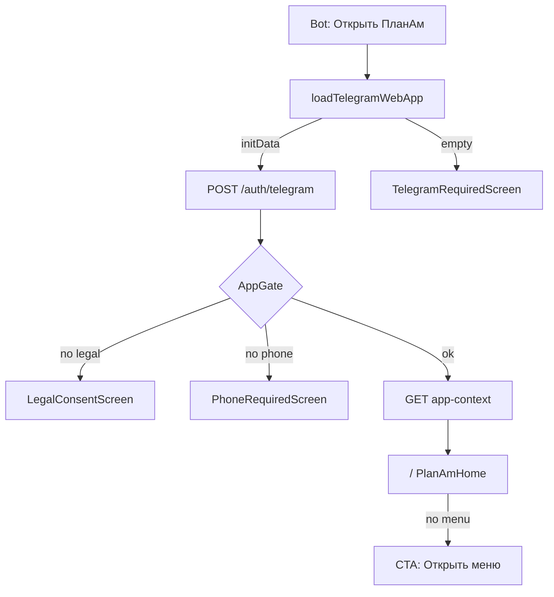
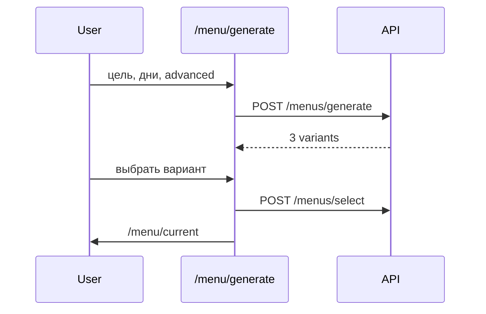
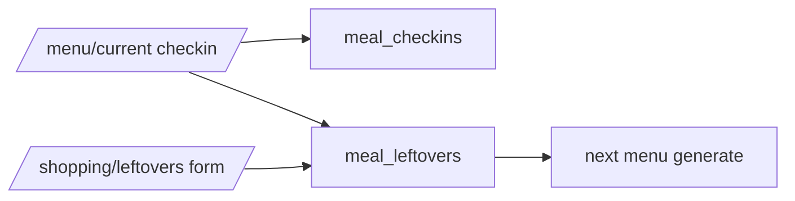
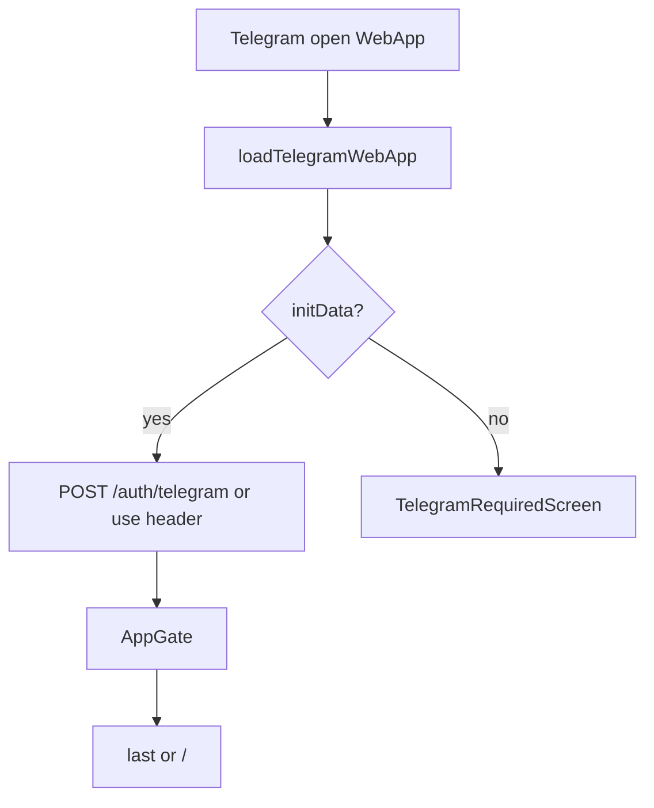
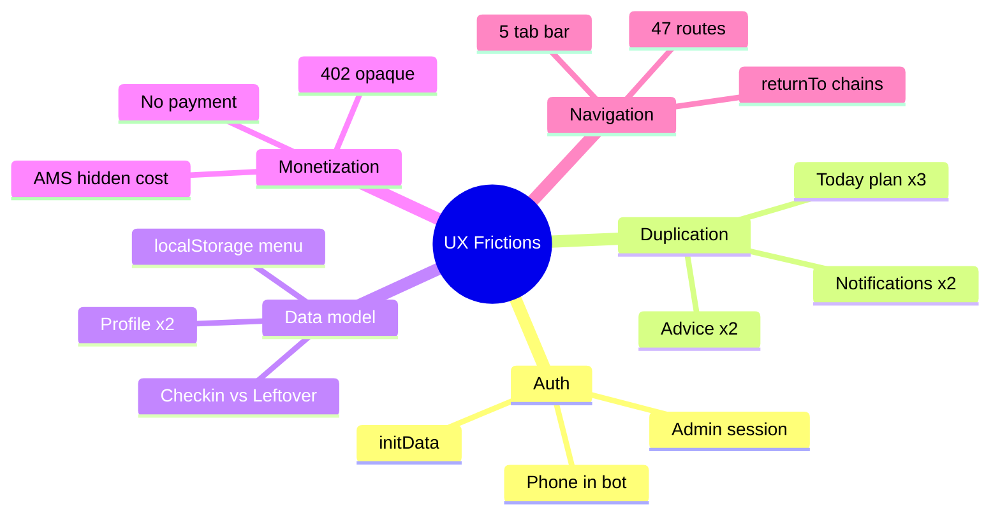

# UX Flow Map — ПланАм (MASTER AUDIT)

**Дата:** 2026-06-03  
**Режим:** только документация — код и БД не изменялись.

**Источники:** `apps/web/app/**`, `apps/web/components/**`, `apps/api/app/routers/**`, [`SCREEN_MAP.md`](SCREEN_MAP.md), [`USER_FLOWS.md`](USER_FLOWS.md), [`UX_PROBLEMS.md`](UX_PROBLEMS.md), [`DOMAIN_ARCHITECTURE.md`](DOMAIN_ARCHITECTURE.md).

---

## Условные обозначения

| Поле | Значение |
|------|----------|
| **Трение** | Лишний шаг, путаница, ошибка, ожидание, дубль данных |
| **Лишнее действие** | Повтор того же смысла на другом экране или без эффекта |
| **Gate** | `AppGate` блокирует маршрут до auth/legal/phone |

---

## 1. Первый запуск

**Цель пользователя:** открыть ПланАм из Telegram и понять, что делать дальше (план / покупки).

| | |
|--|--|
| **Входная точка** | Кнопка «Открыть ПланАм» (menu button / inline в боте) · deep link `t.me/...` |
| **Шаги** | 1) WebView загружается → 2) `TelegramProvider` ждёт `initData` → 3) `POST /auth/telegram` → 4) `AppGate`: legal → phone → 5) `AppModeProvider`: `GET /users/me/app-context` → 6) `/` `PlanAmHome` |
| **Экраны** | *(gate)* `TelegramRequiredScreen` · `LegalConsentScreen` · `PhoneRequiredScreen` → `/` |
| **API** | `POST /auth/telegram` · `GET /legal/documents` · `POST /legal/accept` · `POST /legal/skip-phone` · `GET /users/me/app-context` · `GET /menus/selected` · `GET /shopping-lists/me` |
| **Точки трения** | Пустой `initData` → «Нужен Telegram»; телефон только через бот (4 шага в `PhoneRequiredScreen`); нет принудительного онбординга профиля на `/` |
| **Лишние действия** | Повтор `/start` в боте после уже открытого TMA; legal в боте **и** в TMA для части пользователей |

### Current Flow

### Problems

- `/onboarding` редиректит на `/profile/nutrition`, но **прямого редиректа с `/` на настройку профиля нет** — новый пользователь видит пустой план без явного «Сначала настройте питание».
- Race `initData` / `AppGate` (см. [`ADMIN_PANEL_INCIDENT_AUDIT.md`](ADMIN_PANEL_INCIDENT_AUDIT.md)).
- Дубль регистрации: бот (contact + legal) vs Mini App gates.

### Recommended 2026 Flow

1. После auth — **один** «Welcome» sheet: цель + аллергии (3 поля) → сразу «Составить первое меню».
2. Телефон: один deep link «Открыть бот для номера» с auto-return в TMA.
3. Home показывает **один** next step, не три равноправных hub-tile без контекста.

---

## 2. Создание семьи

**Цель:** завести семью и стать админом для совместного меню и покупок.

| | |
|--|--|
| **Входная точка** | `/profile` → «Семья» · `/family` (пустое состояние) |
| **Шаги** | 1) Ввести название 2) Чекбокс подтверждения *(UI only)* 3) «Создать семью» 4) `refreshContext` 5) Список участников |
| **Экраны** | `/profile` → `/family` · `AddPersonSheet` · `InviteSheet` |
| **API** | `POST /families` · `GET /families/me` · `PATCH /users/me/app-context` (режим family) |
| **Трения** | Чекбокс не пишется в БД; после создания не предлагается включить family mode автоматически |
| **Лишнее** | `/profile` → `/family` при пустой семье (можно CTA с главной) |

### Current Flow

`/profile` → `/family` (empty) → name + confirm → `POST /families` → members list → optional `AddPersonSheet`.

### Problems

- Нет onboarding «зачем семья» на одном экране.
- Приглашение — отдельный сценарий (шаг +1).

### Recommended 2026 Flow

«Дом» wizard: название → добавить 1 человека (реальный / виртуальный) → переключить режим family → CTA «Составить семейное меню».

---

## 3. Настройка предпочтений

**Цель:** задать цели, аллергии, ограничения для меню и AI.

| | |
|--|--|
| **Входная точка** | `/profile/nutrition` · `/family` (nutrition участника) · ссылки из `/menu/generate` checklist · `/health` → «Цели» |
| **Шаги** | 1) Открыть форму 2) Аккордеоны (цель, диета, аллергии, …) 3) «Сохранить» 4) `returnTo` или `/profile` |
| **Экраны** | `/profile/nutrition` · inline `VirtualMemberNutritionForm` на `/family` · *(legacy)* `/onboarding` → redirect |
| **API** | `GET|PUT /nutrition-profile/me` · `PUT /families/{id}/members/{id}/nutrition` |
| **Трения** | Длинная форма (~6 аккордеонов); два UI для «свой» vs «член семьи»; `favoriteFoods` из старого wizard нигде не редактируются |
| **Лишнее** | Повтор цели в MenuPlanner, если профиль уже заполнен; `/onboarding` redirect без wizard |

### Current Flow

Множественные входы → одна большая `NutritionProfileForm` ИЛИ `VirtualMemberNutritionForm` → save → optional banner на `/menu` «Цель изменилась».

### Problems

- Дубль данных: `user_profiles` vs `family_members.nutrition_profile` ([`UX_PROBLEMS.md`](UX_PROBLEMS.md) §3.4–3.5).
- Нет прогресса «профиль 60% заполнен».

### Recommended 2026 Flow

**Progressive profiling:** 3 обязательных поля при первом меню → остальное «улучшить план» inline. Один компонент формы для user + member.

---

## 4. Генерация меню

**Цель:** получить 3 варианта плана и выбрать один.

| | |
|--|--|
| **Входная точка** | `/` → «Открыть меню» · `/menu` → «Составить меню» · `/family` CTA |
| **Шаги** | 1) `/menu/generate` load profile/pantry/selected 2) Цель + дни + «Настроить подробнее» (персоны, бюджет, режим) 3) Чеклист «ПланАм учтёт» 4) «Сгенерировать» 5) Фаза `choose` — 3 варианта 6) «Выбрать вариант» |
| **Экраны** | `/menu` → `/menu/generate` → (preview fullscreen) → `/menu/current?saved=1` |
| **API** | `GET /nutrition-profile/me` · `GET /menus/selected` · `GET /pantry/me` · `POST /menus/generate` · `POST /menus/select` |
| **Трения** | 402 лимит / Амы — ссылка на тариф только в тексте ошибки; `personsCount` / `planMode` в `localStorage` расходятся с сервером; долгое ожидание AI без queue UI |
| **Лишнее** | Переходы в профиль/запасы из checklist и обратно; дубль «план сегодня» на `/` и `/menu` |

### Current Flow

### Problems

- Нет явной стоимости в Амах до generate (если extra).
- После смены профиля wizard state не инвалидируется.

### Recommended 2026 Flow

«План» tab: **1 экран** «На этой неделе» → кнопка «Обновить план» → bottom sheet (дни + 1 advanced) → generate → inline pick variant без отдельной фазы на новом URL.

---

## 5. Замена блюда

**Цель:** поменять одно блюдо в активном плане.

| | |
|--|--|
| **Входная точка** | `/menu/current` → «Заменить блюдо» · `/menu` quick-action `replace_dish` → `/menu/current?replace=1` |
| **Шаги** | 1) `ReplaceDishModal` 2) Подсказка (hint) 3) «Заменить» 4) `POST /menus/replace-dish` 5) `POST /menus/select` 6) UI refresh |
| **Экраны** | `/menu/current` · `ReplaceDishModal` · `AmaConfirmDialog` |
| **API** | `POST /menus/replace-dish` · `POST /menus/select` · `GET /subscriptions/me` (Амы) |
| **Трения** | Стоимость (~3 Ама) не видна до confirm; три входа (карточка, quick-action, query) |
| **Лишнее** | Quick-action редирект без объяснения; повторный `select` после replace |

### Current Flow

Modal → AI replace → auto save menu → close modal.

### Problems

- 402 после чата/замены — нет return URL ([`UX_PROBLEMS.md`](UX_PROBLEMS.md) §6.5).
- Quick-action дублирует кнопку на карточке.

### Recommended 2026 Flow

Замена **inline** в карточке дня: hint chips + цена Амов в кнопке; один entry point.

---

## 6. Просмотр рецепта

**Цель:** увидеть рецепт, оценить, добавить в покупки/меню/избранное.

| | |
|--|--|
| **Входная точка** | `/menu/recipes` · `/recipes/[id]` · карточка из меню (`MenuDayOverview` Sheet) · `/health/today` |
| **Шаги** | 1) Список/поиск 2) Tap карточки 3) `RecipeDetailModal` 4) Действия: favorite, shopping, menu, cooked, rate, AI evaluate |
| **Экраны** | `/menu/recipes` (→ redirect `/recipes`) · `/recipes/[id]` |
| **API** | `GET /recipes`, `GET /recipes/{id}` · `POST .../favorite` · `add-to-shopping` · `add-to-menu` · `GET evaluate/improve/why` · `POST rate` |
| **Трения** | URL redirect `/recipes` → `/menu/recipes`; AI-кнопки пустые при нет Амов; после `add-to-menu` нет перехода к плану |
| **Лишнее** | Параллельные AI fetch (evaluate + improve + family-compat) при открытии |

### Current Flow

Catalog → detail modal page → actions.

### Problems

- Redirect flash в WebView.
- Нет «где это блюдо в плане».

### Recommended 2026 Flow

Recipe = **bottom sheet** поверх плана/каталога; primary CTA «В план на [день]» с выбором слота.

---

## 7. Добавление в покупки

**Цель:** добавить товар или ингредиенты рецепта в список покупок.

| | |
|--|--|
| **Входные точки** | `/shopping` + · рецепт «В покупки» · совет нутрициолога `?add=` · бот voice/text pending · OCR чека |
| **Шаги (ручной)** | 1) `ShoppingItemSheet` 2) Имя, кол-во, категория 3) `POST /shopping-lists/items` |
| **Шаги (рецепт)** | `POST /recipes/{id}/add-to-shopping` |
| **Экраны** | `/shopping` · `RecipeDetailModal` · бот pending confirm |
| **API** | `GET /shopping-lists/me` · `POST /shopping-lists/items` · `GET|POST /shopping-categories` · `POST /recipes/{id}/add-to-shopping` |
| **Трения** | 5 путей добавления с разной нормализацией категорий; поллинг списка 4 с |
| **Лишнее** | Категория: client suggest vs server normalize |

### Current Flow

Пять параллельных pipelines → один JSONB `family_shopping_lists.items`.

### Problems

- Пользователь не видит, что «куплено» уедет в запасы (связанный сценарий 9).

### Recommended 2026 Flow

Единый **«Добавить в дом»** sheet: покупки | запасы; один normalize на сервере.

---

## 8. Работа с остатками

**Цель:** учесть остатки готовых блюд для следующего меню.

| | |
|--|--|
| **Входная точка** | `/shopping/leftovers` · `/menu/current` · чекин «сохранить как остаток» · бот FSM `quick:leftover` |
| **Шаги (UI)** | 1) Форма: название, порции 2) `POST /meal-leftovers` 3) Статус: active/frozen/spoiled 4) `PATCH` / `DELETE` |
| **Шаги (чекин)** | `POST /meal-checkins` с `saved_as_leftover` → также `create_leftover` |
| **Экраны** | `/shopping/leftovers` · `MealCheckinPanel` на `/menu/current` |
| **API** | `GET|POST|PATCH|DELETE /meal-leftovers` · `POST /meal-checkins` |
| **Трения** | Два типа сущностей: `meal_leftovers` vs чекин; 4 ссылки «остатки» в UI; цикл `/menu` ↔ leftovers ↔ current |
| **Лишнее** | Дубль создания остатка из чекина и из формы leftovers |

### Current Flow

### Problems

- Пользователь не понимает разницу «поел вне дома» vs «остаток блюда» (UX §2.7).

### Recommended 2026 Flow

Один тип **«Остаток / факт приёма пищи»** с enum; остатки — подраздел «Дом», не отдельная вкладка меню.

---

## 9. Покупка продуктов

**Цель:** отметить купленное и пополнить запасы.

| | |
|--|--|
| **Входная точка** | `/shopping` · `/` «Что купить» |
| **Шаги** | 1) Список по категориям 2) Toggle чекбокс 3) Сервер: pantry merge 4) Опционально «Синхронизировать с меню» |
| **Экраны** | `/shopping` |
| **API** | `GET /shopping-lists/me` · `PATCH /shopping-lists/items/{id}/toggle` · `POST /shopping-lists/sync` |
| **Трения** | Неочевидно, что toggle → запасы; дубли имён → два pantry item; sync не всегда нужен вручную |
| **Лишнее** | Ручной sync если меню уже selected; sub-tab pantry дублирует `/pantry` |

### Current Flow

Toggle item → server `add_or_merge_from_shopping` → optional manual sync.

### Problems

- Дубль запасов manual + from shopping (UX §2.6).

### Recommended 2026 Flow

После toggle — toast «Добавлено в запасы» + undo; auto-sync при select menu; shopping = только «нужно купить».

---

## 10. Работа с нутрициологом

**Цель:** получить совет и задать вопрос AI.

| | |
|--|--|
| **Входная точка** | `/health` · `/health/chat` · `/` «Спросить ПланАм» · бот «Нутрициолог» *(redirect `/nutritionist` → `/health`)* |
| **Шаги (hub)** | 1) `/health` — совет из cache (`pickMainAdvice`) 2) Tiles: Сегодня / Цели / Прогресс / AI |
| **Шаги (чат)** | 1) Ввод вопроса 2) `POST /nutritionist/ask` (2 Ама) 3) Ответ |
| **Шаги (совет)** | CTA на карточке → defer `POST /nutritionist/deferred-advice` или link shopping/menu |
| **Экраны** | `/health` · `/health/chat` · `/health/today` (советы + defer) |
| **API** | `POST /nutritionist/ask` · `GET|POST|PATCH|DELETE /nutritionist/deferred-advice` · cache: profile, menu, pantry |
| **Трения** | Разные источники совета: `/menu` overview vs `pickMainAdvice`; 402 в чате → `/subscription` без returnTo |
| **Лишнее** | Legacy URL `/nutritionist/*`; дубль «изменить цель» с `/profile/nutrition` |

### Current Flow

Health hub (no network) → sub-routes; chat = paid AI.

### Problems

- «Не сейчас» = запись в БД, выглядит как dismiss (UX §14.5).

### Recommended 2026 Flow

Один поток **«Спросить»** с контекстом дня (план + факт + запасы); советы только на `/health/today`; чат — с returnTo.

---

## 11. Контроль здоровья

**Цель:** видеть КБЖУ/воду/факт питания за день и прогресс.

| | |
|--|--|
| **Входная точка** | `/health` → «Сегодня» · `/progress` · `/menu/current` чекины |
| **Шаги** | 1) `/health/today` load profile, menu, progress, water, deferred 2) +вода 3) Чекины 4) Переходы: профиль, план, покупки |
| **Экраны** | `/health/today` · `/progress` · `/menu/current` |
| **API** | `GET /nutrition-profile/me` · `GET /menus/selected` · `GET /progress/me` · `GET|POST /nutritionist/water/*` · `GET|POST /meal-checkins/today` |
| **Трения** | KPI дублируются с `/menu` и `/progress`; формулы % на фронте и бэке могут разойтись |
| **Лишнее** | Много CTA на одном экране «Сегодня» |

### Current Flow

Health today = dashboard; progress = отдельный длинный экран PRO-gated частично.

### Problems

- Три представления «сегодня» (home, menu, health).

### Recommended 2026 Flow

**«Сегодня»** = единственный daily dashboard; progress — график внутри, не отдельная вкладка в nav.

---

## 12. Оформление подписки

**Цель:** выбрать тариф PRO / free и понять лимиты Амов.

| | |
|--|--|
| **Входная точка** | `/profile` → «Подписка» · 402 на generate/chat/replace · `/subscription` |
| **Шаги** | 1) `GET /subscriptions/me` 2) Сравнить планы 3) «Выбрать тариф» 4) `POST /subscriptions/select-plan` |
| **Экраны** | `/subscription` |
| **API** | `GET /subscriptions/me` · `POST /subscriptions/select-plan` |
| **Трения** | **Нет реальной оплаты** — только select-plan; «Купить Амы» disabled; family plan только admin семьи |
| **Лишнее** | Длинный образовательный блок «Что такое Амы» при кризисе доступа |

### Current Flow

Profile → subscription → tap plan → toast «Тариф сохранён».

### Problems

- Ожидание оплаты у пользователя → разочарование.
- Нет контекста «зачем PRO» в момент 402.

### Recommended 2026 Flow

Contextual paywall sheet при 402 (что заблокировано + 1 recommended plan); оплата — отдельный сценарий Phase 2.

---

## 13. Уведомления

**Цель:** настроить напоминания о готовке и покупках (+ care).

| | |
|--|--|
| **Входная точка** | `/profile` → «Уведомления» · `/settings/support` link |
| **Шаги** | 1) Care level + toggles 2) Cook/buy schedule 3) Quiet hours 4) Test notification 5) Export .ics |
| **Экраны** | `/notifications` *(merged: care + notification settings)* |
| **API** | `GET|PATCH /care/settings` · `POST /care/test-notification` · `GET|PUT /notifications/settings` |
| **Трения** | Две модели: care vs cook/buy; вода/белок в care, завтрак в notifications — пользователь не знает где что |
| **Лишнее** | Legacy `/health/care` → redirect `/notifications` |

### Current Flow

Одна страница, два API backend.

### Problems

- UX §2.8 — split brain notifications.

### Recommended 2026 Flow

**Единый «Напоминания»** с группами: Покупки · Готовка · Здоровье (вода) · PRO; один PATCH payload.

---

## 14. Возврат в приложение через Telegram

**Цель:** продолжить с того же аккаунта после закрытия WebView.

| | |
|--|--|
| **Входная точка** | Menu button «Открыть ПланАм» · inline web_app · reply keyboard · care push (deep link) |
| **Шаги** | 1) WebView open 2) `loadTelegramWebApp` + poll 3) Re-auth if initData valid 4) Cache hit → fast paint 5) `AppMode` from preferences |
| **Экраны** | Последний route или `/` · gates if session issues |
| **API** | `POST /auth/telegram` (if re-bootstrap) · все запросы с `X-Telegram-Init-Data` + `X-App-Mode` |
| **Трения** | `initData` expired (24h) → 401 на API; admin `?admin_session=` lost if AppGate blocks; cold start loaders |
| **Лишнее** | Full reload всех вкладок без stale-while-revalidate на hub screens |

### Current Flow

### Problems

- initData expiry не объясняется пользователю («закройте и откройте снова»).
- Admin session + AppGate ([`SECURITY_AUDIT.md`](SECURITY_AUDIT.md)).

### Recommended 2026 Flow

Silent refresh initData via Telegram SDK event; persistent server session (post-2026 auth); restore last meaningful tab (Plan / Дом / Сегодня).

---

## Сводная таблица сценариев

| # | Сценарий | Ключевые экраны | Ключевые API | Главное трение |
|---|----------|-----------------|--------------|----------------|
| 1 | Первый запуск | gates, `/` | `/auth/telegram`, legal | phone via bot; нет guided setup |
| 2 | Семья | `/family` | `POST /families` | invite — отдельный flow |
| 3 | Предпочтения | `/profile/nutrition` | `PUT /nutrition-profile/me` | длинная форма; dual stores |
| 4 | Генерация меню | `/menu/generate` | `POST /menus/generate` | 402; localStorage drift |
| 5 | Замена блюда | `/menu/current` | `replace-dish` | цена Амов скрыта |
| 6 | Рецепт | `/recipes/[id]` | `GET /recipes/{id}` | redirect; нет link to plan |
| 7 | В покупки | `/shopping` | `POST items`, add-to-shopping | 5 paths |
| 8 | Остатки | `/shopping/leftovers` | `meal-leftovers`, checkins | два типа сущностей |
| 9 | Покупка | `/shopping` | `toggle` | toggle → pantry hidden |
| 10 | Нутрициолог | `/health`, `/health/chat` | `/nutritionist/ask` | duplicate advice sources |
| 11 | Здоровье | `/health/today` | water, checkins, progress | triple «сегодня» |
| 12 | Подписка | `/subscription` | `select-plan` | no payment |
| 13 | Уведомления | `/notifications` | care + notifications | two models |
| 14 | Возврат TG | any | initData header | expiry / admin session |

---

## Top 20 UX Frictions

Ранжирование по влиянию на ключевые сценарии и частоте столкновения (источник: код + [`UX_PROBLEMS.md`](UX_PROBLEMS.md)).

| Rank | Friction | Сценарии | Severity | Evidence |
|------|----------|----------|----------|----------|
| **1** | **AppGate / пустой `initData`** — «Нужен Telegram», admin session теряется | 1, 14 | Critical | `AppGate.tsx`, `TelegramProvider.tsx` |
| **2** | **Телефон только через бот** — разрыв TMA ↔ chat | 1, 14 | High | `PhoneRequiredScreen.tsx` |
| **3** | **Нет guided first-run** — пустой `/` без «настройте профиль → меню» | 1, 3 | High | `PlanAmHome.tsx`, `/onboarding` redirect |
| **4** | **Дубль «план на сегодня»** — `/`, `/menu`, `/health/today` | 1, 4, 11 | High | `PlanAmHome`, `MenuHub`, `HealthTodayView` |
| **5** | **Два профиля питания** (user vs family member forms) | 2, 3 | High | `NutritionProfileForm`, `VirtualMemberNutritionForm` |
| **6** | **Чекин vs остаток** — разные сущности, одна ментальная модель | 8, 11 | High | `meal_checkins`, `meal_leftovers` |
| **7** | **Покупки → запасы без объяснения** | 7, 9 | High | shopping toggle → pantry service |
| **8** | **Care vs Notifications** — где включить воду/готовку | 13 | High | `/notifications`, `/care/settings` |
| **9** | **402 / Амы без контекста** — replace, chat, generate | 4, 5, 10, 12 | High | `AmaConfirmDialog`, error strings |
| **10** | **Пять путей «добавить в покупки»** | 7 | Medium | shopping, recipe, bot, advice URL |
| **11** | **localStorage vs server** в меню (persons, plan mode) | 4 | Medium | `MenuPlanner.tsx`, `menu/settings` |
| **12** | **Длинный `/profile/nutrition`** — отвал на онбординге | 3 | High | accordion form |
| **13** | **Три входа «заменить блюдо»** | 5 | Medium | `MenuHub` quick-action, card, query |
| **14** | **Редирект `/recipes` → `/menu/recipes`** | 6 | Low | `app/recipes/page.tsx` |
| **15** | **Два источника совета нутрициолога** | 10, 4 | High | `MenuOverview` vs `pickMainAdvice` |
| **16** | **Подписка без оплаты** — «Выбрать тариф» ≠ купить | 12 | High | `SubscriptionDashboard`, stub AMS |
| **17** | **«Не сейчас» = defer в БД** | 10 | Medium | deferred-advice API |
| **18** | **Остатки: 4 точки входа в UI** | 8 | Medium | menu, current, leftovers tab, bot |
| **19** | **Заглушки настроек** (units, privacy, language) | 1 | Medium | `SettingsPlaceholder` |
| **20** | **Orphan `/menu/event`** — функция без входа | 4 | Medium | `app/menu/event/page.tsx` |

### Friction clusters (для UX Redesign 2026)

---

## Связь с roadmap

| Документ | Связь |
|----------|--------|
| [`DOMAIN_ARCHITECTURE.md`](DOMAIN_ARCHITECTURE.md) §9 | Целевая IA: План / Дом / Здоровье |
| [`SECURITY_FIX_ROADMAP.md`](SECURITY_FIX_ROADMAP.md) P0-1 | Admin + AppGate friction #1 |
| [`NAVIGATION_GRAPH.md`](NAVIGATION_GRAPH.md) | Граф переходов |
| [`UX_PROBLEMS.md`](UX_PROBLEMS.md) | Полный реестр 15 категорий |

---

*Документ отражает реальные потоки по коду на 2026-06-03. При изменении UX обновлять сценарии и Top 20.*
